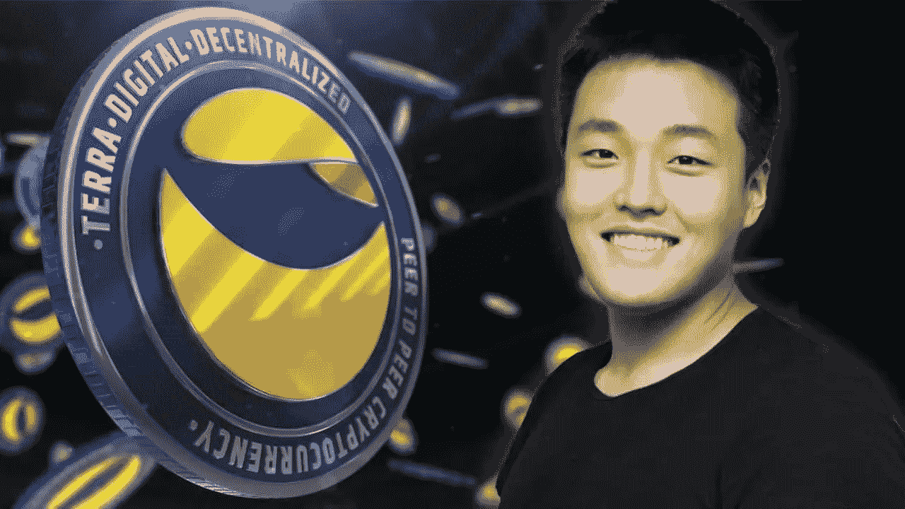

# 权打破沉默；他对卢娜坠机事件负责。

> 原文：<https://medium.com/coinmonks/do-know-break-silence-he-is-taking-responsibility-for-luna-crash-9e8a6f81958c?source=collection_archive---------32----------------------->

“我一个人有责任，”首席执行官道权在 Luna 坠机事件后的第一次采访中说。

自从 5 月份他的加密项目的惊人崩溃让许多人失去了他们一生的积蓄和对所谓的稳定密码的信心以来，Terra 的创始人 Do Kwon 接受了他的第一次采访。

“我从来没有想过如果这次失败会发生什么，”Terraform Labs 首席执行官在周一播出的 NFTV 系列节目《创造》中接受采访时说。

Kwon 说，他当时的信心是合理的，因为他的 Terra 生态系统的市场成功“接近 1000 亿美元(€980 亿)”。

**权道在他的第一次** [**采访**](https://cryptoweb.wiki/do-kwon-break-silence-and-he-is-taking-responsibility-for-luna-crash/) **中承认，在卢娜号失事后，他的信仰现在“看起来超级不理智”**

他说，Terra 不是一个庞氏骗局，因为首批投资者是受危机影响最大的人。Kwon 说他无法计算他的损失，但他认为自己已经“无限下跌”

Kwon 还讨论了 Terra 有鼹鼠的可能性。

“如果你想知道伦敦交通局是否有内奸，答案肯定是‘有’。”如果有人试图利用这个特定的机会，我会说答案是肯定的。”他陈述道。

但是，如果这些机会存在，责任就在首先提出这些漏洞的人身上。

“我，而且只有我，要对任何可能让卖空者开始获利的弱点负责。”

Kwon 在 Terra 崩塌前搬到了新加坡，理由是担心他妻子和孩子的安全。

“所以我们要做的只是公布我们所知道的事实。”“我们会去，诚实地，并处理任何影响，”他继续说。

> ***NFT、比特币、Web3.0、DeFi，以及针对初学者的加密货币指南和加密最新消息。***
> 
> *使用*[*CryptoWeb*](http://cryptoweb.wiki/)*免费的初学加密指南掌握 web3.0 世界的基础知识，在这里，我们将深入了解该领域中一些顶级的 NFT、加密和元宇宙项目，以便您在投资前获得信息。*

> 交易新手？尝试[加密交易机器人](/coinmonks/crypto-trading-bot-c2ffce8acb2a)或[复制交易](/coinmonks/top-10-crypto-copy-trading-platforms-for-beginners-d0c37c7d698c)