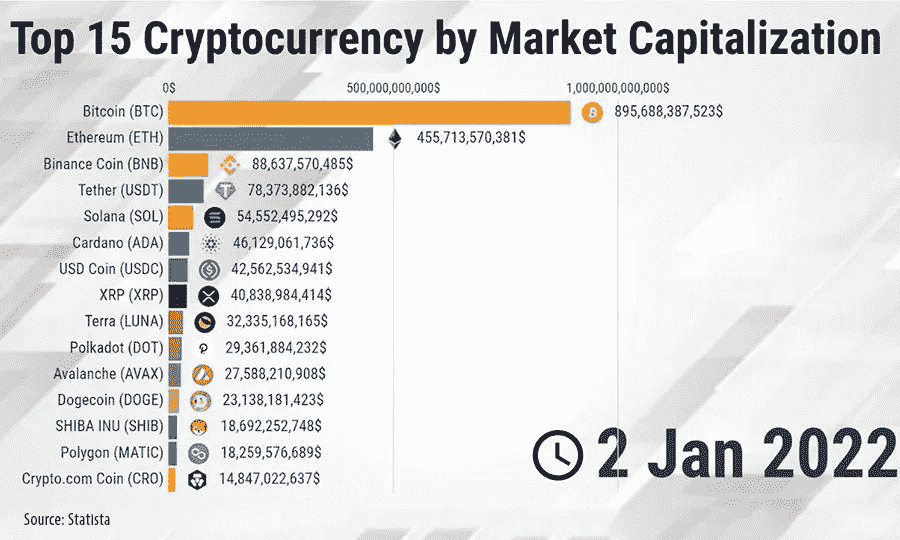
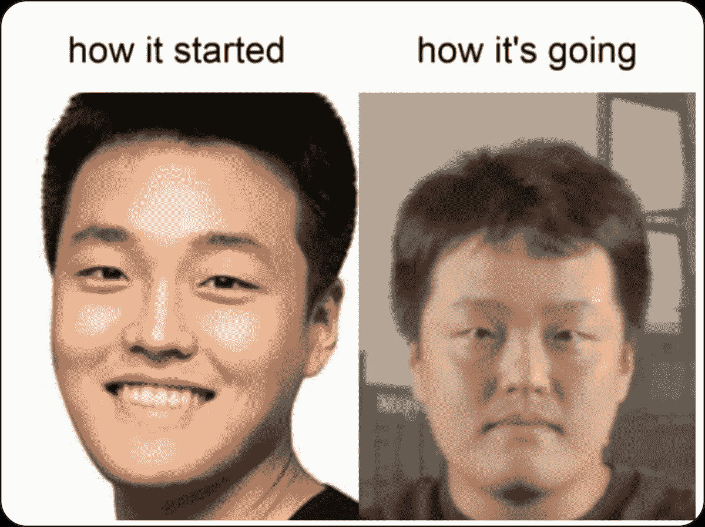

# 在月球号坠毁几个月后，权道终于开口了，但是谁在听呢？

> 原文：<https://medium.com/coinmonks/do-kwon-finally-spoke-months-after-the-luna-crash-but-whos-listening-992baf526937?source=collection_archive---------14----------------------->

Like Icarus, Do Kwon flew too close to the sun and got scorched.

我有一种预感，他会退缩，重新思考，重新参与，再次重建。

他给第一个女儿取名为卢娜。

不，他没有改变她的名字，尽管发生了什么。

他在推特上有 100 万粉丝。

他是历史上最成功的秘密邪教之一的领袖，直到它不再是。

他从一开始就培养了一支革命军，发动了一场革命。

他从卑微的开发者变成了趾高气扬，“我很聪明，大家都很穷”的推特之王。

他是发明了一种新的算法支持的稳定硬币的天才吗？

还是他只是拿了别人做过的(失败的)东西，用自己的方式去尝试？

在 2022 年 5 月的短短 6 天里，卢娜和 ust 坠毁并烧毁。

从市场上抽走了 450 亿美元，毁掉了许多人的生活。

巅峰时期，Luna 价值 119 美元，是市值最高的十大加密货币之一。

Before Terra/Luna fell, it was one of the largest cryptocurrency in the market.

仅仅一年时间，他就从一个默默无闻的开发者变成了世界范围内的秘密名人，并成为了最令人讨厌的 meme persona。

他们称他为加密界的伊丽莎白·霍姆斯。

这有保证吗？

伊丽莎白冷酷无情，骗人，不诚实，公然实施欺诈。

可以说，权道拥有许多相似的行为特征，但严格来说，他还没有犯下任何明显的罪行(至少表面上是这样)。

他声称公司里有内奸。

他身边的某个人泄露了重要信息，并协调了对卢娜/UST 的攻击，导致了德佩格和最终的死亡螺旋。

我确信随着多起集体诉讼的到来，会有更多的事情被揭露出来。

锚定储蓄协议于 2021 年 3 月启动，它被认为是吸引所有人和所有东西进入露娜生态系统的磁铁。

简单地说，你存入 UST，自动获得近 20%的年息。

它的确闻起来和听起来都像是神奇的钱。

谁在乎它是不是凭空变出来的，以及后来新用户的存款。

等等，这听起来很像庞氏骗局。

但一些人认为，如果道权没有诈骗他人钱财的意图，如果它被用作一种营销形式，这就不是庞氏骗局。

鉴于锚的吸引力和迅速获得的牵引力，它被证明是太致命了。

大公司和贷款人基本上囤积了大量的 UST，享受着丰厚的收益。

许多银行利用杠杆和巨额贷款，只是为了能存更多的 ust。

当 UST 和市场崩溃时，他们被斩首了。

You can say that Do Kwon was stressed out a fair bit.

“回想起来，如果你要问我，这些评论的表达方式是否令人生厌，答案是肯定的。”

教训:永远不要让名利冲昏头脑。

说起来容易做起来难。

你也会通过测试吗？

令人惊讶的是，你可以冲进密码市场，在新加坡自由行走。

我想知道马斯到底在做什么。

发生在道权身上的事情简直是骇人听闻。

很少有人真正面对他不得不面对的事情。

你会原谅道权吗？他应该得到第二次机会吗？

-

你相信密码吗？

-

# startups # business # startupx # growth # success # social media # culture # web 3 # strategy # hacks # Luna # ust # terraform # token # crash # dokwon # eth # BTC # crypto # Singapore

> 交易新手？试试[加密交易机器人](/coinmonks/crypto-trading-bot-c2ffce8acb2a)或者[复制交易](/coinmonks/top-10-crypto-copy-trading-platforms-for-beginners-d0c37c7d698c)