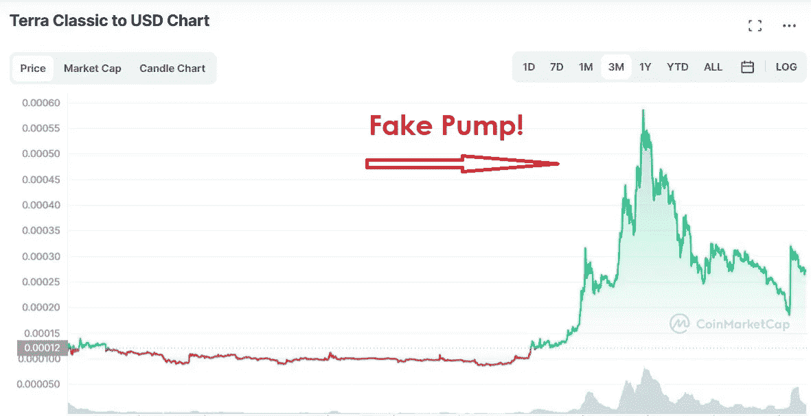

# 跆拳道对国际刑警组织的红色通知:报告

> 原文：<https://medium.com/coinmonks/do-kwon-on-interpols-red-notice-report-75915f5dac3b?source=collection_archive---------12----------------------->

跆拳道，一个曾经被所有人称赞人，现在正式成为我们时代的查尔斯·庞兹。几个月前，Terra(露娜)和 Terra USD (USDT)双双崩盘，几乎蒸发了 600 亿美元。然而，内爆让加密市场陷入了一场持续困扰我们钱包的熊市噩梦。也许，卢娜的陨落是对 altcoin 持有者的一个警醒，因为他们最终质疑了广告声明的有效性。现在，不管是管理不善还是单纯的欺诈行为，从任何标准来看，跆拳道都是一个巨大的失败。

就在那次崩溃之后，Twitter 上出现了一大批机器人来为 LUNA 加油，特别是 LUNC。虽然很难确定是 Terra 实验室还是投资者做出了这种努力，但这是另一种破坏性的尝试。在很大程度上，Twitter 上的标签趋势并不是加密货币升值的理由。但可悲的是，LUNC 确实有几个泵。

在这一点上，即使是拥有机器人的人也无法逃脱命运。说到命运，道权，骗子现在在国际刑警组织的红色通缉令上。

## 哦，道权，你在哪里？

根据[彭博](http://bloomberg.com/news/articles/2022-09-26/south-korea-says-interpol-issued-red-notice-for-terra-s-do-kwon#xj4y7vzkg?leadSource=uverify%20wall)的报告，国际刑警组织证实，跆拳道已经上了“红色通缉令”。到目前为止，国际警察组织正在要求世界各地的执法部门帮助找到跆拳道。被捕后，他将因经营庞氏骗局在韩国被起诉。

红色通缉令是国际刑警组织的一个术语，要求世界各地的执法部门帮助找到某人。红色通告也是一部由道恩·强森和瑞安·雷诺兹主演的网飞电影的名字。但是，如果网飞拍了一部关于跆拳道的电影，并把它叫做红色警戒，那就太酷了。玩笑归玩笑，对于似乎在躲藏的 Terra (LUNA)创始人来说，这是一个严重的情况。

另一方面，Kwon 不断回到 Twitter，因为没有人会离开 Twitter。根据权的说法，他“毫不掩饰”。

https://twitter.com/stablekwon/status/1574448432793538560

让我们都来欣赏一个国际刑警组织红色通缉令上的人是如何轻而易举地否认他藏匿的事实的。也许，他已经变成了一个超越所有位置性的去中心化的存在，也许还有时间的线性。

“我去散步和逛商场，在过去的几周里，不可能没有一个加密推特碰到我。”

但是当然，他没有说他住在哪里，考虑到他的情况，这是可以理解的。

尽管如此，看看这场追逐如何进行还是很有意思的。回顾国际刑警组织的声誉，赌权是不明智的。所以，为这个承诺 20%锚定协议回报的人干杯。

“[国际刑警组织红色通缉令上的跆拳道:报告](https://blog.hi.exchange/do-kwon-on-interpols-red-notice-report/)”最初由同一作者[尼玛·阿斯加里](https://blog.hi.exchange/author/nimaasgari/)发表在 HiExchange 博客上。

> 交易新手？试试[密码交易机器人](/coinmonks/crypto-trading-bot-c2ffce8acb2a)或[复制交易](/coinmonks/top-10-crypto-copy-trading-platforms-for-beginners-d0c37c7d698c)