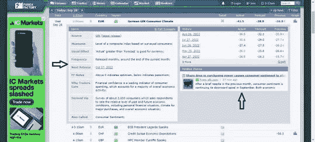
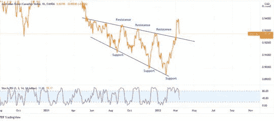
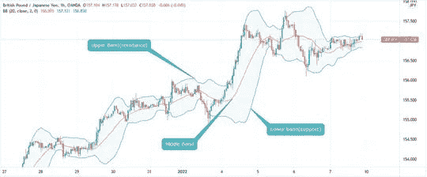
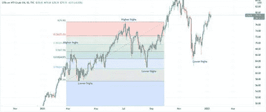

# 专业交易者用技术分析吗？

> 原文：<https://medium.com/coinmonks/do-professional-traders-use-technical-analysis-bde806a8a030?source=collection_archive---------38----------------------->

**专业交易者使用技术分析吗？**对金融世界来说，你是个新手，曾经做过兼职交易者吗？或者你正考虑辞去朝六晚九的工作，成为一名专业交易者吗？技术分析是专业交易者识别金融市场趋势的一种方式。

在这篇博文中，将详细讲解交易、技术分析、谁是专业交易者、如何专业交易、成为专业交易者需要什么、使用技术分析的技巧、在交易中使用技术分析的优势和风险等。

# 介绍

技术分析是专业交易者用来识别金融市场模式和趋势的方法。技术分析有助于交易者和投资者做出消息灵通和更有利可图的交易/投资决策。

它让你能够识别市场数据中的模式和趋势，这可能有助于他们预测商品的未来走势。

# 什么是交易？

金融界的交易被认为是买卖证券的过程。由于互联网的出现，这通常是通过电脑来完成的。它是一种允许交易者和投资者通过买卖证券来赚钱的金融活动。

# 什么是技术分析？

技术分析是使用图表平台提供的工具来研究市场行为并做出更好的[交易和投资](https://liquiditytradeideas.com/which-is-more-profitable-trading-or-investing/)决策的过程。它让你能够识别市场数据中的模式，这些模式可以暗示未来的市场趋势。

基本技术分析是技术分析的最基本类型，它专注于在数据中寻找可以暗示未来市场趋势的模式。为了做到这一点，基本技术分析使用技术分析的指标，如交易量、价格和价格行为。

# 谁是职业交易者？

世界上有很多职业交易员。他们是一群精通商品市场和不同证券交易的人。

职业交易员从事许多不同的职业，比如投资银行家、投资分析师、商品交易员和股市分析师。他们利用自己的技能交易不同的证券并赚钱。

# 交易员如何专业交易？

一些交易者认为交易是一个快速致富的计划。专业交易有很高的价格，别忘了，“高风险有高回报”。专业交易不是频繁交易，而是像做生意一样对待你的 T4 交易活动。

# 成为职业交易者需要什么？

成为一个成功或专业的交易者需要很多东西(技能)，但最重要的技能之一是经验。经验能让你学习和成长。

当你有交易经验时，你可以做出更好的决定和更好的财务决策。这就是为什么在交易领域有经验是如此重要。它会让你在交易和投资生涯中获得成功。

# 专业交易者使用什么类型的分析？

谈到交易和投资，专业交易者使用各种分析方法来分析金融市场数据。专业交易者最常用的一些方法包括基本面分析、技术分析和情绪分析。

*   **基本面分析:**简而言之，基本面分析是对影响一种商品价值和波动性的经济、社会和政治因素的研究。它可以用来帮助决定是否投资一种商品。

Fundamental analysis by [Chikwem Chinedu Ogugua](https://liquiditytradeideas.com/participant/admin/) on [Forexfactory](http://www.forexfactory.com/)

*   **技术分析**:技术分析是一个回顾市场数据并识别可能暗示短期或长期价格行为的模式的过程。对于交易者来说，它是一个强大的工具，可以用在很多方面，包括识别买卖股票的机会、预测未来趋势和分析财务报告。

Technical analysis by [Chikwem Chinedu Ogugua](https://liquiditytradeideas.com/participant/admin/) on [Tradingview](http://www.tradingview.com/)

*   **情绪分析**:这只是研究交易者和投资者对市场形势的反应，可能是乐观的，也可能是悲观的。它是用自然语言处理技术进行的。

# 专业交易者和非专业交易者的区别

虽然有许多类型的交易者，但没有一个包罗万象的交易者。专业交易者是指精通使用交易工具和策略的人，而非专业交易者是指不具备相同熟练程度的人。

1.  技术分析可以让你通过理解金融数据的模式做出更好的交易。
2.  技术分析可以帮助你识别金融数据的趋势，从而做出明智的投资决策。
3.  技术分析也可以帮助你识别市场条件下的潜在机会。
4.  技术分析可以帮助你识别与金融市场相关的潜在风险
5.  技术分析也可以帮助你识别哪些股票被高估，哪些股票被低估。

根据个人的目标和兴趣，有不同类型的交易者。一些专业交易者专注于市场分析，而另一些人则专注于二元期权或做空股票。一些交易者也对交易金属、差价合约或期权感兴趣。

专业交易者有很多不同的目标和兴趣，所以找到一个最适合你投资目标的目标和兴趣是很重要的。

1.  技术分析可能很耗时。
2.  技术分析可能不可靠。
3.  技术分析可能会误导人。
4.  技术分析可能是不准确和误导的。
5.  如果在金融市场中不正确地使用模式，会导致损失

# 在交易中使用技术分析有什么好处？

虽然技术分析用于识别金融市场的趋势和发现模式，但在交易和投资中使用技术信息技术有许多优势:

# 在交易中使用技术分析有什么风险？

虽然技术分析的优势是巨大的，但是在交易中使用技术分析也有很多风险。缺点可以总结如下:

# 那么，专业交易者用技术分析吗？

这很有趣，如果没有技术分析，在金融市场上交易或投资会非常困难。

专业交易者最常用的技术分析有布林线、斐波纳契比率、[蜡烛图](https://liquiditytradeideas.com/are-candlestick-patterns-reliable/)等。

*   **布林线**:布林线是约翰·布林杰开发的技术分析工具，主要用于交易股票、商品、证券等。这些波段包括一个波动性指标，衡量商品价格相对于以前交易的高点或低点。使用标准差来衡量波动性，因此随着波动性的增加或减少而变化。

Bollinger bands chart by [Chikwem Chinedu Ogugua](https://liquiditytradeideas.com/participant/admin/) on [Liquiditytradeideas](https://liquiditytradeideas.com/)

*   **斐波纳契比率:**斐波纳契回撤是技术投资者/分析师用来确定商品支撑位和阻力位的技术工具。它使用斐波纳契数列，其比率提供了潜在的价格水平，市场往往会在一部分运动后回撤，然后趋势继续沿其原始方向发展，这可能是上升趋势或下降趋势。

Fibonacci chart by [Chikwem Chinedu Ogugua](https://liquiditytradeideas.com/participant/admin/) on [Liquiditytradeideas](https://liquiditytradeideas.com/)

专业交易者最常用的技术分析类型有布林线、斐波纳契比率、[蜡烛图](https://liquiditytradeideas.com/are-candlestick-patterns-reliable/)等。

# 在交易中使用技术分析的技巧

要想在金融界取得成功，在交易和投资时，有几件事你应该永远记住。

首先也是最重要的，良好的交易习惯。你需要在开始交易前做研究，你需要保持专注。你还需要能够快速做出决定，你需要能够提升你的交易生涯。

另一个重要的是经验。你需要能够在不同的市场交易，你需要能够处理不同类型的风险。你还需要能够阅读市场行情并做出明智的决定。

# 职业交易员赚钱吗？

这个问题没有确定的答案。然而，一些有助于识别专业交易者是否盈利的因素可能包括他们的交易风格、经验和成功率。

此外，考虑其他因素也很重要，如当前的市场状况和与他们的交易活动相关的潜在风险。

# 结论

技术分析是一个分析市场和证券信息的过程，目的是识别模式和趋势。

技术分析师使用各种技术，包括趋势分析、价格分析和[技术指标](https://liquiditytradeideas.com/trading-indicators-explained/)。他们使用这些技术来识别市场中的机会和潜在问题。

一些交易者使用技术分析来识别市场机会。他们可以用它来识别市场的趋势、信号和模式。

其他人可能用它来识别市场中的潜在问题。技术分析师也可以用它来帮助他们找到解决市场问题的方法。

我们很乐意听到你的意见。关于这个话题，你有什么要分享的或要问的问题吗？请在[论坛](https://liquiditytradeideas.com/community/)或下面的评论中分享你的想法和经验，让我们知道你的想法，我们期待着阅读和回答你的问题！

*原载于 2022 年 9 月 28 日 https://liquiditytradeideas.com**[*。*](https://liquiditytradeideas.com/do-professional-traders-use-technical-analysis/)*

# *来自 LiquidityTradeIdeas 的消息*

*感谢您成为我们社区的一员！在你离开之前:*

*   *👏为故事鼓掌，跟着作者走👉*
*   *📰在 [**中查看更多内容**](https://liquiditytradeideas.com/)*
*   ***📈**加入我们关于外汇、加密和股票的 [**论坛**](https://liquiditytradeideas.com/community/)*
*   ***📚发现 [**最佳交易&投资电子书**](https://liquiditytradeideas.com/trading-e-books/)***

> ***交易新手？尝试[加密交易机器人](/coinmonks/crypto-trading-bot-c2ffce8acb2a)或[复制交易](/coinmonks/top-10-crypto-copy-trading-platforms-for-beginners-d0c37c7d698c)***