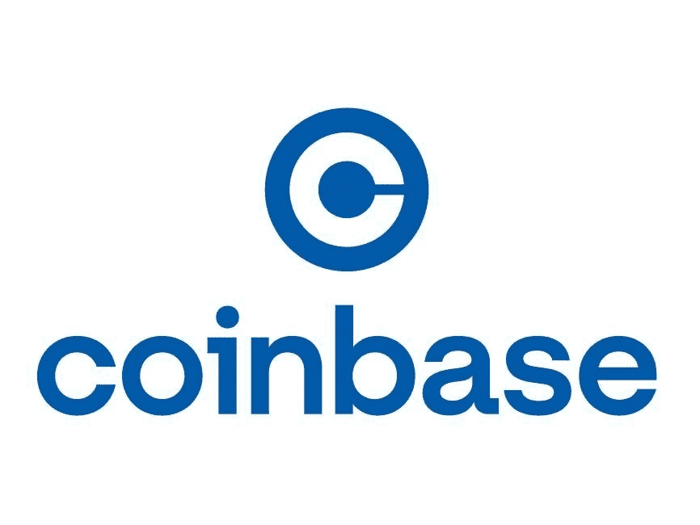

# 今天就做这 5 件事，开始使用加密

> 原文：<https://medium.com/coinmonks/do-these-5-things-today-to-get-started-with-crypto-32f541618fe7?source=collection_archive---------43----------------------->

如果你是密码新手，要做的 5 件事

Photo by [AlphaTradeZone](https://www.pexels.com/photo/men-in-business-attire-working-together-5833773/)

如果你仍然对 crypto 持怀疑态度，我将向你推荐一些只需很少甚至不需要投资就能参与进来的步骤。

[Coinbase Logo](https://logowik.com/content/uploads/images/coinbase-new4201.jpg)

# **1。创建一个集中的** …