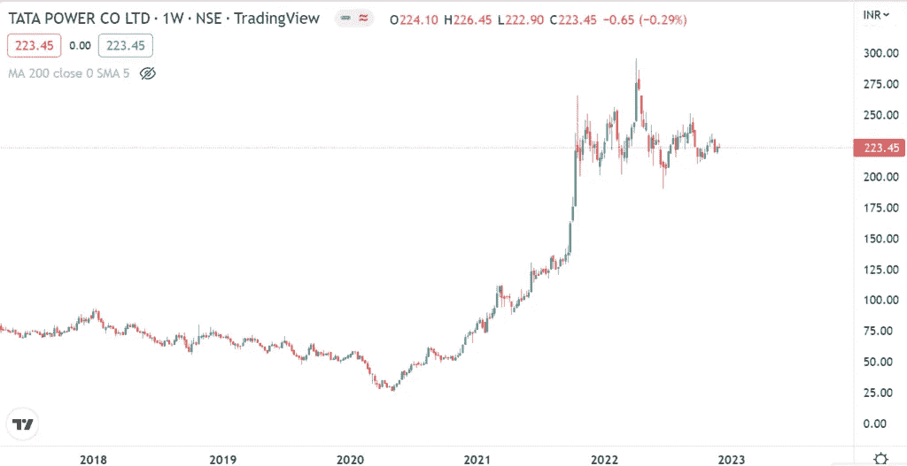
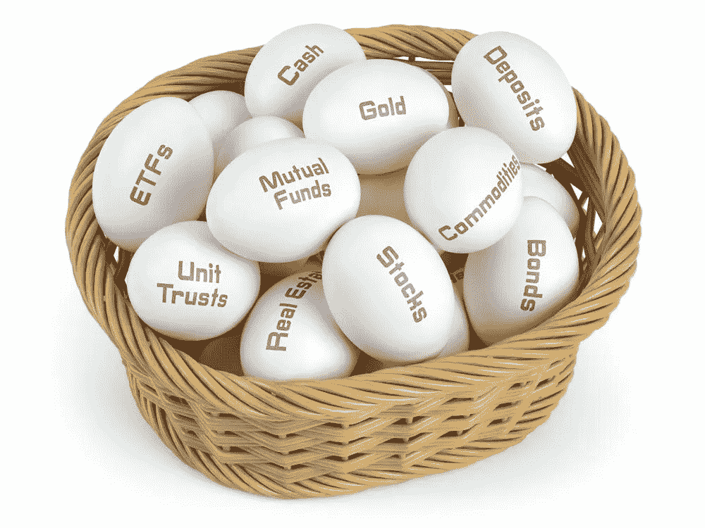

# 2023 年一定要继续投资股市吗？

> 原文：<https://medium.com/coinmonks/do-you-have-to-keep-investing-in-the-stock-market-in-2023-e29b290906aa?source=collection_archive---------63----------------------->

你一定从别人那里听说过投资股票市场是一件困难的事情，因为一个普通人无法知道哪只股票是好是坏。诚然，你应该有基本的金融知识，你应该评估自己的风险承担能力。

Do You Have to Keep Investing In The Stock Market?

讨论话题的答案是:**是的，你要一直投资股市。**投资股市有几个原因。其中一个关键原因是**良好的投资回报。**有些股票在几年内就获得了超过 100%的投资回报。

例如，covid 期间 Tata Power 的价格接近 50 卢比，2022 年 4 月触及的最高价格为 297 卢比。

Tata Power price chart

没有一个 FDs 或政府计划能给你这么大的投资回报。

投资股票，你不必是超级天才或 T4 股市的大师。只需遵循一个简单的策略，在几个月内给你带来至少 6%到 7%的投资回报。点击下面的链接了解投资策略

[2022 年，只有一种股票投资策略能帮你获得丰厚回报](https://updatedgeek.com/one-stock-investment-strategy-gain-good-returns-2022/)

一旦你决定投资股市，你必须考虑的下一个问题是你应该投资多少。

# 我应该在股票市场投资多少？

嗯！这个问题的答案是你月收入或年收入的 20%。然而，股票市场的投资金额没有经验法则，因为它完全取决于你。平均投资应该是你收入的 20%,你可以根据你的风险承受能力来增减。

我之所以陈述 20%用于股市投资，是因为风险也高。永远记住回报高的时候，风险也高。

投资的黄金法则是永远不要把所有的鸡蛋放在一个篮子里。这意味着你应该在多种投资渠道上分散你的储蓄。比如股票市场 20%，FDs 20%，国债或黄金债券 10%等。

Never keep all your eggs in one basket

你也可以从系统投资计划(SIP)开始，你可以固定每月投资 500 或 1000 卢比或更多。这样，你就能战胜市场起伏。

# 股票市场的投资类型

有几种类型的投资你可以在股票市场，像股票，期权和期货，商品，共同基金，货币，首次公开募股等。但在这篇文章中，我将讨论几个我最喜欢的投资类型在股票市场的风险较低相比，其他投资选择。

# 1.股权

股权或股票或股份是公司所有权的一种权利。即使你购买了一家公司的股票，你也有资格成为一个组织的一部分。对于每一只股票，你都有一定的权利，比如分红。股息是指公司与股东分享的那部分利润。如果公司宣布股息为 5 卢比，而你购买了 100 股，那么你有权获得 500 卢比的股息。

Equity

这是你从资本增值中获得的额外投资回报。有时，公司一年不止一次宣布分红。ITC 宣布股息 11.5 卢比，GAIL 宣布股息 10 卢比，Hindustan Zinc 宣布 2022 年股息 18 卢比，等等。

# 2.共同基金

共同基金是指由几个投资者组成的资金池，基金经理根据公司以前的盈利能力将资金分配给多个公司。整个基金由基金经理管理，他可以决定何时买入或卖出股票。投资理念类似股权，但这里是专家管理资金。

Mutual funds

例如，一个 100 人的小组每人贡献了 5000 卢比。这将产生总计 5，000，000 卢比，然后投资于属于多个部门的股票。

当你不能定期跟踪市场的涨跌时，共同基金是最好的投资方式。

共同基金在过去 3 年中已经给出了超过 80%的投资回报，尤其是那些在 covid 期间投资的基金。

# 3.金色的

黄金或数字黄金类似于股票，但它的运动方向相反。当 Sensex 指数上涨时，金价就会下跌，反之亦然。不建议购买实物黄金，因为珠宝商会征收税费。

Gold

投资数字黄金最低可从 10 卢比开始。你可以在网上买卖黄金，你不需要去珠宝店。

# 我应该什么时候投资？

投资股市的最佳时机是市场回调至少 10%或金价下跌的时候。在这个时间框架内投资将有助于你快速获得投资回报。

市场调整的一个例子是覆盖期间，Sensex 指数从 42000 点以上暴跌至 27000 点以下。

对于一个新的投资者来说，开始投资的最佳时间是今天或者越早越好。

你一定听说过复利的力量，如果你在 20 岁出头就开始投资，这种力量非常有效。

# 投资哪个平台最好？

到目前为止，我们已经讨论了有关股票市场投资的所有问题，比如投资多少、投资类型以及何时投资。现在你一定在想你应该去哪里得到你的 Demat 账户。

几乎每家银行都提供 Demat 贷款，但他们收取年费、存款费、投资费等。开始股票投资之旅的最佳选择是折扣经纪公司，如 Upstox、Zerodha 等。

[点击此处](https://link.upstox.com/DQT7YCUH7irWFzFM6)在印度最好的经纪人处开立 demat 账户

投资股市不是一个快速致富的计划。如果你想获得巨大的投资回报，你必须将你的钱投资至少 5 年。

> 从顶级交易者那里复制交易机器人。免费试用。

**免责声明**:如果你想投资股市，你应该在做出购买决定之前咨询你的理财顾问。你应该评估风险，研究公司细节。

# 常见问题

1.  你应该投资股票多久？

至少 1 至 5 年

2.你应该在什么年龄退出股市？

大约 70 年

3.我应该有多少钱投资股票？

大约 20%到 30%

4.新手应该投资哪里？

共同基金、股票和黄金

**相关搜索**

[30 岁前理财的 10 件事](https://updatedgeek.com/10-things-manage-your-finances-before-you-turn-30/)

[在亚马逊和 Flipkart 上省钱](https://updatedgeek.com/save-money-amazon-and-flipkart/)

[为什么信用卡或借记卡有有效期？](https://updatedgeek.com/why-credit-or-debit-cards-have-expiry-date/)

[为什么 2022 年你不应该现在就在印度购买电动汽车？](https://updatedgeek.com/why-not-buy-electric-vehicle-in-india/)

[为什么美元兑印度卢比汇率上升？](https://updatedgeek.com/why-dollar-rate-is-increasing/)

> 加入 Coinmonks [电报频道](https://t.me/coincodecap)和 [Youtube 频道](https://www.youtube.com/c/coinmonks/videos)了解加密交易和投资

# 另外，阅读

*   [3 商业评论](/coinmonks/3commas-review-an-excellent-crypto-trading-bot-2020-1313a58bec92) | [Pionex 评论](https://coincodecap.com/pionex-review-exchange-with-crypto-trading-bot) | [Coinrule 评论](/coinmonks/coinrule-review-2021-a-beginner-friendly-crypto-trading-bot-daf0504848ba)
*   [莱杰 vs Ngrave](/coinmonks/ledger-vs-ngrave-zero-7e40f0c1d694) | [莱杰 nano s vs x](/coinmonks/ledger-nano-s-vs-x-battery-hardware-price-storage-59a6663fe3b0) | [币安评论](/coinmonks/binance-review-ee10d3bf3b6e)
*   [加密交易机器人](/coinmonks/crypto-trading-bot-c2ffce8acb2a) | [Bingbon 评论](https://coincodecap.com/bingbon-review)
*   [Bybit Exchange 审查](/coinmonks/bybit-exchange-review-dbd570019b71) | [Bityard 审查](https://coincodecap.com/bityard-reivew) | [Jet-Bot 审查](https://coincodecap.com/jet-bot-review)
*   [3 commas vs crypto hopper](/coinmonks/3commas-vs-pionex-vs-cryptohopper-best-crypto-bot-6a98d2baa203)|[赚取加密利息](/coinmonks/earn-crypto-interest-b10b810fdda3)