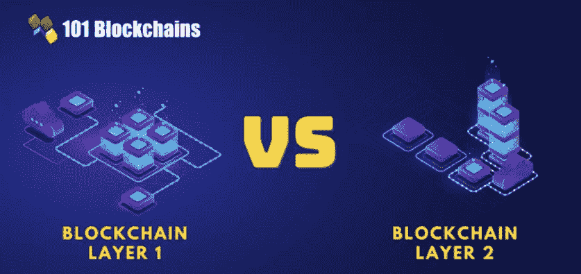

# 你知道第一层和第二层区块链项目的区别吗？

> 原文：<https://medium.com/coinmonks/do-you-know-the-difference-between-layer-1-and-layer-2-blockchain-projects-251c87aac93a?source=collection_archive---------39----------------------->

了解这些层有助于您更好地决定哪种技术最适合您的项目。

Source: [https://101blockchains.com/blockchain-layer-1-vs-layer-2/](https://101blockchains.com/blockchain-layer-1-vs-layer-2/)

区块链技术自首次推出以来已经走过了漫长的道路，并以多种方式发展，以满足不同应用和行业的需求。这种发展的一个重要方面是第 1 层和第 2 层区块链项目的开发。虽然这两层的目的相似，但它们有一些重要的不同之处，值得了解，以便对不同的应用程序使用哪种技术做出明智的决策。

第 1 层区块链项目是区块链网络的底层基础设施。它们是构建其他应用程序和服务的基础。第一层区块链项目的例子包括比特币和以太坊。这些项目为区块链网络提供了基本的构建模块，包括共识机制、网络协议和数据结构。

相比之下，第 2 层区块链项目建立在第 1 层区块链之上。它们为区块链网络提供了额外的功能和可扩展性，而无需改变底层基础设施。第二层区块链项目的例子包括比特币的闪电网络和以太坊的雷电网络。这些项目实现了更快的交易速度和更低的费用等功能，这可以使区块链在更广泛的应用中更加有用和实用。

那么哪一层更适合区块链项目，这些技术最有可能的未来是什么？答案取决于一个项目的具体需求和它要实现的目标。例如，需要高度安全性和分散性的项目可能会从第 1 层区块链中受益，而需要快速、廉价地处理大量交易的项目可能更适合第 2 层区块链。

总的来说，记住第 1 层和第 2 层区块链项目并不相互排斥，这一点很重要。他们可以共同努力，提供一个完整而强大的区块链生态系统，支持广泛的应用和使用案例。随着技术的不断发展，我们很可能会看到更多的第 1 层和第 2 层项目，它们结合了两者的优点，为用户提供了更多的功能和可伸缩性。

感谢阅读，敬请关注！

> 从顶级交易者那里复制交易机器人。免费试用。

# 另外，阅读

*   [3 商业评论](/coinmonks/3commas-review-an-excellent-crypto-trading-bot-2020-1313a58bec92) | [Pionex 评论](https://coincodecap.com/pionex-review-exchange-with-crypto-trading-bot) | [Coinrule 评论](/coinmonks/coinrule-review-2021-a-beginner-friendly-crypto-trading-bot-daf0504848ba)
*   [莱杰 vs n rave](/coinmonks/ledger-vs-ngrave-zero-7e40f0c1d694)|[莱杰 nano s vs x](/coinmonks/ledger-nano-s-vs-x-battery-hardware-price-storage-59a6663fe3b0) | [币安评论](/coinmonks/binance-review-ee10d3bf3b6e)
*   [加密交易机器人](/coinmonks/crypto-trading-bot-c2ffce8acb2a) | [Bingbon 评论](https://coincodecap.com/bingbon-review)
*   [Bybit Exchange 审查](/coinmonks/bybit-exchange-review-dbd570019b71) | [Bityard 审查](https://coincodecap.com/bityard-reivew) | [Jet-Bot 审查](https://coincodecap.com/jet-bot-review)
*   [3 commas vs crypto hopper](/coinmonks/3commas-vs-pionex-vs-cryptohopper-best-crypto-bot-6a98d2baa203)|[赚取加密利息](/coinmonks/earn-crypto-interest-b10b810fdda3)