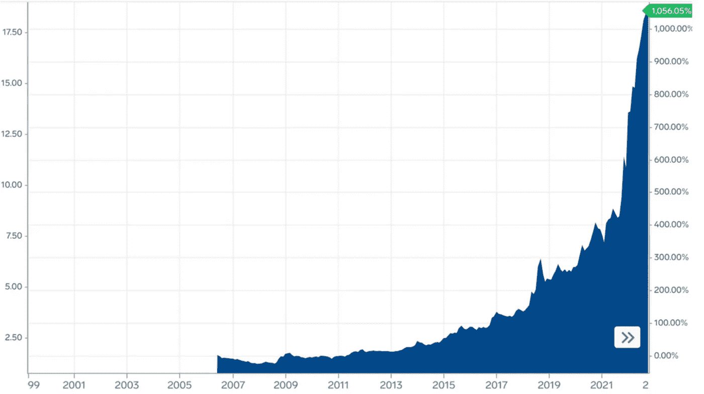
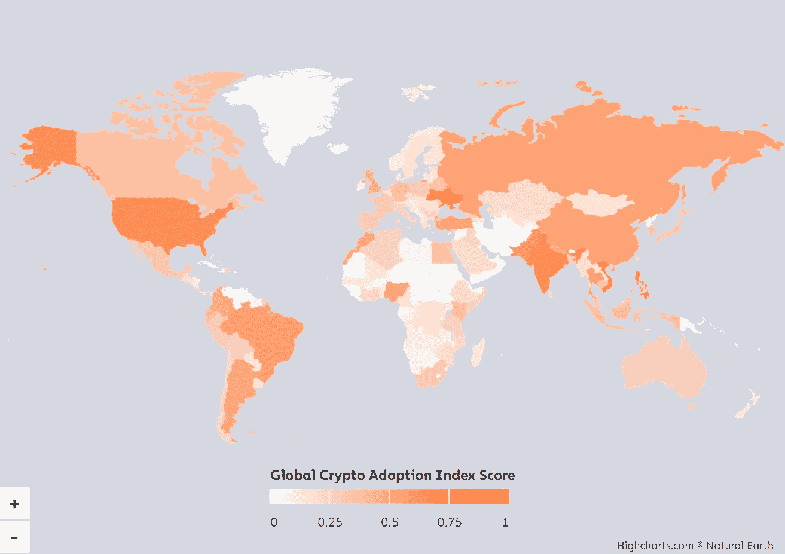
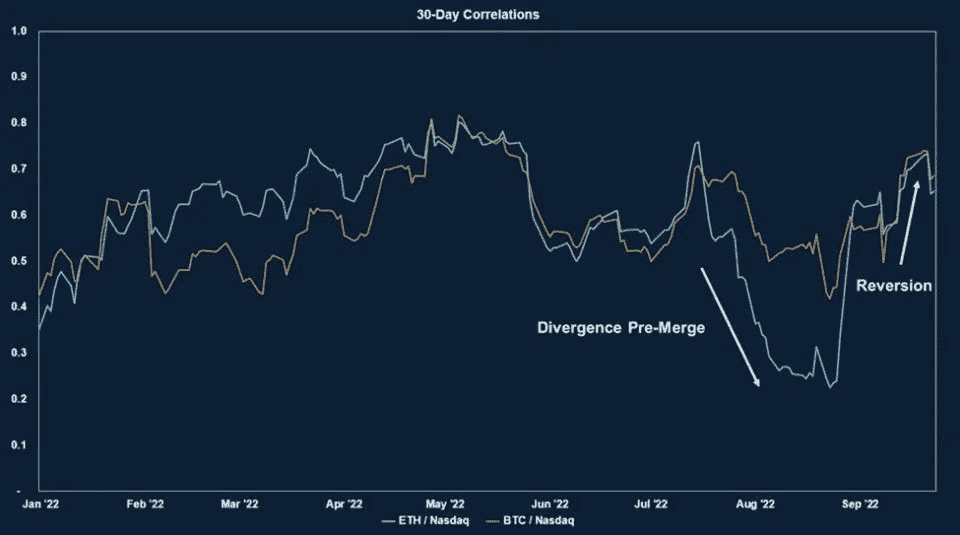

# 你交易宏观吗？

> 原文：<https://medium.com/coinmonks/do-you-trade-macro-8cc56baeacbf?source=collection_archive---------17----------------------->

主动投资组合经理:你认为基于宏观经济的交易加密是一个聪明的策略吗……它会有相关性吗？

我:它与全球事件和情绪有关，所以是的。

上周，在与一家加密资产管理公司的对话中，我收到了这个问题，并发现几个意识流正在到位。以下是当今市场中加密货币无法完全脱离全球宏观事件的四个基本原因。

**1。在本币贬值的地方，加密货币变得更有吸引力。**

我在北塞浦路斯长大，几年来一直认为我们的货币稳定是理所当然的。当我刚到美国上大一时，1 美元约合 5 土耳其里拉，到我毕业时，这个数字攀升至 16.69 土耳其里拉

Source: [Markets Insider](https://markets.businessinsider.com/currencies/usd-try)

如今，这一趋势越来越陡，每美元需要 19 先令。北塞浦路斯遭受了土耳其 83%的通货膨胀，这是 24 年来的最高水平，而且没有停止的迹象。 [BBC](https://www.bbc.com/news/world-europe-63120478) 估计这个数字被严重低估了，实际上年增长率是 186.27%。这对塞浦路斯人来说意味着什么？首先，该岛严重依赖进口，价格如此不稳定，以至于杂货店都停止了改变价格。相反，你会在货架上发现标有美元价格的进口商品。“这样，我们就不用每天打印新标签了，”一位店主告诉我。其次，塞浦路斯人正在转向加密，在过去几年中建立了 20 多个新的离线和两个在线加密交易所。而 TradFi 在 T4 有 22 家银行，在北方有 235 家分行。加密办公室的存在遍及全岛，从膨胀前的零增长到 TradFi 的十分之一左右。

**2。根据定义，加密货币是去中心化的，本质上是全球化的。**

像任何其他资产一样，加密会受到用户的影响。随着 BTC、瑞士法郎或索尔等货币的全球化，每个用户经济中发生的事情都会影响他们对该领域的投资。无论用户是面临恶性通货膨胀、经济衰退，还是寻求一个不受专制政权控制的离线钱包，国外的经济危机和全球事件都很重要。这一点简单明了，但不应该被忽视。[chain analysis](https://blog.chainalysis.com/reports/2022-global-crypto-adoption-index/#:~:text=Global%20adoption%20of%20cryptocurrency%20reached,ve%20entered%20a%20bear%20market.)提供了 2022 年国际加密采用情况的可视化描述。该报告强调，根据将最大份额的资金投入加密货币的人数，越南在基层采用方面领先，美国排名第五。

Source: [Chainalysis](https://blog.chainalysis.com/reports/2022-global-crypto-adoption-index/)

**3。投资者情绪是信心的同义词，信心不会孤立地影响投资。**

正如 NLW 在 CoinDesk 的 [The Breakdown](https://open.spotify.com/show/538vuul1PuorUDwgkC8JWF) 播客中总结的那样，

> “这并不真的是对任何细节的确信。而是坚信这些可能性值得投资。真正尝试一下加密技术，看看它能否在一个不断变化的世界中以一种对人类有益的方式扰乱工作，这是一种值得投资的可能性。”

不幸的是，在这次熊市中，我们目睹了标准普尔 500 中缺乏信念的涟漪和加密市场中强大的宏观力量，尽管这两者具有非常不同的特征和使用案例。就在美联储宣布将于 9 月 21 日再次加息 75 个基点后几个小时，BTC 兑美元汇率短暂下跌 6.5%，至 18600 美元，为 6 月以来的最低水平。本季度的通胀报告和货币政策决定支持加密和股票相关的论点。即使在以太坊合并后，ETH-USD 也回归跟踪科技股为主的纳斯达克 100 指数。随着历史通胀数据推动从燃料到食品等一切商品的价格升至创纪录高位，投资者感到有压力回避任何他们认为是风险资产的东西。

TLDR，DeFi 与 TradFi 市场预期大体一致，市场情绪已经消化。

Source: Fundstrat’s digital asset strategist Sean Farrell shows a 30-day correlation change between ether (ETH-USD) and [$QQQ](https://finance.yahoo.com/quote/%5EQQQ?p=%5EQQQ), a popular ETF that tracks the Nasdaq 100.

**4。全球采用并不意味着全球 DeFi 教育。**

去年，皮尤研究中心对 10，000 多名美国人的调查显示，16%的成年人表示他们使用过某种加密货币，43%的 18-29 岁男性声称投资、交易或使用过某种加密货币。同一年龄段的女性报告的结果较低，为 19%。今年，[双子星座的一份报告](https://www.gemini.com/state-of-crypto)调查了 20 个国家的近 3 万名成年人，报告强调，虽然职场女性人数可能超过男性，但她们正在迎头赶上。计划在未来一年内首次购买 crypto 的人中有 47%是女性。在美国，目前 32%的密码拥有者是女性。隐性性别差距正在缩小，但我们显然仍有一些进展要做。

拥有所有权的一个障碍是教育。加密技术很快从一种利基投资发展成为一种成熟的全球资产类别，在教育领域留下了一段滞后时间。

> “在全球范围内，[受访者](https://www.gemini.com/state-of-crypto)表示，更多关于加密货币的教育资源将有助于他们开始使用加密技术(40%)，这一比例是朋友推荐的两倍(22%)。”

那些已经投资的人的教育呢？不幸的是，许多散户和机构投资者对 crypto 的内部运作方式并不十分了解。当加密教育不普及时，人们依赖于他们的 TradFi 投资组合和市场头条新闻。根据 2021 年的 Cardify 调查，只有 16.9%的加密投资者“完全理解”它，而超过 33%的人知之甚少或“一无所知”。去年 2 月，超过 40%的加密投资者是乘着炒作浪潮的新手。一些人认为 DeFi 的准入门槛很高，识字率很难达到。这可能会促使当前和潜在的投资者更加依赖宏观环境……微观战略在做什么？马斯克又发微博说 Dogecoin 了吗？哪个运动员在 BTC 挣工资(或者后悔)？俄乌战争期间黄金交易如何？

虽然理解 crypto 的技术内部工作是必要的还是有争议的，但是理解它提供的解决方案是不必要的。认识到这种新的资产类别为 TradFi 系统的问题提供了一个安全阀是至关重要的。单独获得稳定的货币是独立于中央银行在全球范围内以中性轨道获得美元的重要机会。在一个理想的世界里，不同收入阶层、教育背景和风险偏好的人都会很好地理解加密的价值和它所处的定义空间。这样，它可以根据行业本身的成功和失败进行交易。L1 和 L2 协议、融资趋势、基础设施创新……这些生态系统独有的指标反映了一种信念，即这些可能性值得投资。

在秘密教育被广泛接受之前，宏观情绪将是一根拐杖。

> 交易新手？试试[密码交易机器人](/coinmonks/crypto-trading-bot-c2ffce8acb2a)或者[复制交易](/coinmonks/top-10-crypto-copy-trading-platforms-for-beginners-d0c37c7d698c)