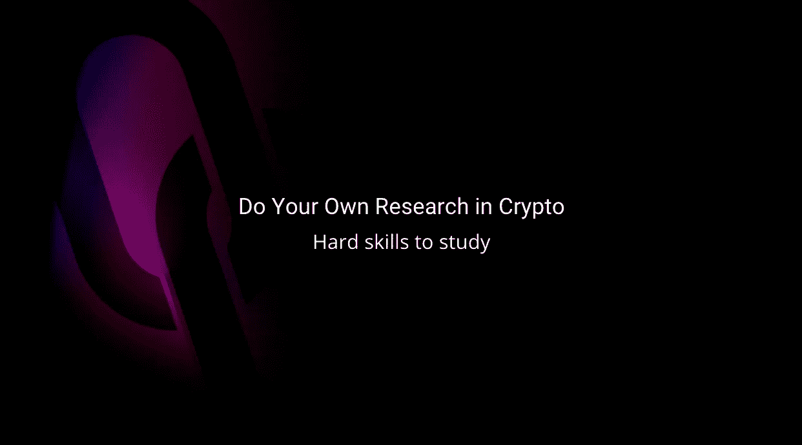

# 做你自己的加密研究，从初学者到高级，一个研究课题的列表！

> 原文：<https://medium.com/coinmonks/do-your-own-research-in-crypto-from-beginner-to-advanced-a-list-of-topics-to-master-b44d052fc392?source=collection_archive---------40----------------------->

DYOR in crypto, learn how to evaluate a crypto-project

你听过、读过、甚至见过“DYOR”这个缩写吗？如果没有，这意味着你自己做研究。这个口号出现在 20 世纪 90 年代的阴谋论圈子中，在过去十年中变得越来越受欢迎，成为加密货币爱好者使用的常用短语。

在这篇文章中，你会发现一些你可能需要研究的区块链与加密主题，以便开始你自己的研究(按照你的节奏)。虽然这篇文章将指出具体的网络 3/区块链/加密技能&的理解，我们稍后将看到一个行为技能/软技能的列表，它可以把你带到加密投资者的下一个层次！

# 加密货币中的 DYOR

DYOR 旨在减少不知情的加密货币投资者的数量。它鼓励他们在投资前研究和了解加密货币项目。它应该防止购买骗局项目、陷入 FOMO(害怕错过机会)或追随一些有毒影响者(Instagram、Twitter、Discord & more)的风险。

DYOR 进程应该会给你一些答案，告诉你为什么要购买这种加密货币并支持这个项目。

当交易者和爱好者在社交媒体上分享他们的市场/令牌分析时，这个术语也经常被用作免责声明。一个快速而聪明的方法告诉你:在投资前自己做决定。

# 研究建议以创建您的 DYOR 流程

下面的部分列出了你可能需要掌握的技能，以此来组织你的学习。我将这些技能分为两个部分:基本技能和高级技能，这样你可以很容易地探索和学习你的节奏，而不仅仅是依靠影响者。

## 基本技能和理解:

*   什么是区块链技术？*(*[*https://blog . good audience . com/区块链-解释-in-1000-words-6bb 83020 b036*](https://blog.goodaudience.com/blockchain-explained-in-1000-words-6bb83020b036)，[*https://codingclubiitg.medium.com/blockchain-e040b7402efb*](https://codingclubiitg.medium.com/blockchain-e040b7402efb)*，*[*https://medium . com/station-f/区块链-解释-to-your-祖辈-c 7 Fe 71 a9 a 339*](/station-f/blockchain-explained-to-your-grandparents-c7fe71a9a339)*)*
*   什么是比特币&它是如何工作的？([*https://medium . com/the-capital/bit coin-explained-in-simple-terms-74043 ab 9d3a 4*](/the-capital/bitcoin-explained-in-simple-terms-74043ab9d3a4)*，*[*https://bitcoinmaximalist . net/Eli 5-bit coin-explain-bit coin-like-im-five/*](https://bitcoinmaximalist.net/eli5-bitcoin-explain-bitcoin-like-im-five/)*)*
*   以太坊是什么&它是如何工作的？*(*[*https://medium . com/staking bits/ether eum-explained-what-is-ether eum-and-how-it-works-29f 335 eed 75d*](/stakingbits/ethereum-explained-what-is-ethereum-and-how-it-works-29f335eed75d)*，*[*https://medium . com/geek culture/ether eum-2-0-explained-for-absolute-初学者-190 d0 ce 907 ad*](/geekculture/ethereum-2-0-explained-for-absolute-beginners-190d0ce907ad)*)*
*   什么是智能合同？*(*[*https://medium . com/GX-blocks/smart-contracts-explained-for-初学者-56 eeac 75 ce 65*](/gx-blocks/smart-contracts-explained-for-beginners-56eeac75ce65)*)*
*   工作证明 VS 利益证明*(*[*https://www . coin base . com/fr/learn/crypto-basics/what-is-Proof-of-work or-Proof-of-stage*](https://www.coinbase.com/fr/learn/crypto-basics/what-is-proof-of-work-or-proof-of-stake)*、*[*https://www . coin desk . com/learn/Proof-of-of-work-VS-Proof-of-stage-of-of-the-difference/*](https://www.coindesk.com/learn/proof-of-work-vs-proof-of-stake-what-is-the-difference/)
*   发现 Web3，它是什么？*(*[*https://www . business insider . com/personal-finance/what-is-web 3？r=US & IR=T*](https://www.businessinsider.com/personal-finance/what-is-web3?r=US&IR=T)
*   什么是 NFT(不可伪造的代币)？*(*[*https://rockcontent.com/blog/nft-for-dummies/*](https://rockcontent.com/blog/nft-for-dummies/)*，*[*https://cryptopotato.com/what-is-nft/*](https://cryptopotato.com/what-is-nft/)*)*
*   加密货币/硬币和代币的区别？*(*[*https://www . Gemini . com/cryptopedia/crypto currency-vs-token-difference*](https://www.gemini.com/cryptopedia/cryptocurrencies-vs-tokens-difference)*，*[*https://developers . rsk . co/guides/get-crypto-on-rsk/crypto currency-vs-token/*](https://developers.rsk.co/guides/get-crypto-on-rsk/cryptocurrency-vs-token/)*，*[*https://www . fool . com/investing/stock-market/market-sections/financials/crypto currency-sto*](https://www.fool.com/investing/stock-market/market-sectors/financials/cryptocurrency-stocks/crypto-tokens/)
*   *(*[*https://medium . com/shapeshift-stories/the-ultimate-security-guide-for-ether eum-初学者-eeb713f4e9af*](/shapeshift-stories/the-ultimate-security-guide-for-ethereum-beginners-eeb713f4e9af) *，*[*https://www . coin base . com/fr/learn/crypto-basics/how-to-secure-crypto*](https://www.coinbase.com/fr/learn/crypto-basics/how-to-secure-crypto)*)*
*   https://101blockchains.com/cex-vs-dex/ vs CEX([https://www . ledger . com/academy/DEX-or-cex-your-exchange-guide](https://www.ledger.com/academy/dex-or-cex-your-exchange-guide)，[)](https://101blockchains.com/cex-vs-dex/)

## 高级技能和理解:

*   https://101blockchains.com/utility-nfts/[*https://decrypt . co/resources/what-are-utility-nfts-unique-tokens-offing-real-world-benefits*](https://decrypt.co/resources/what-are-utility-nfts-unique-tokens-offering-real-world-benefits)*、* [*、*](https://101blockchains.com/utility-nfts/) *、*[*https://wag mi . tips/guides/7-great-NFT-utility-ides-for-developers/*](https://wagmi.tips/guides/7-great-nft-utility-ideas-for-developers/)
*   *了解 token omics*(*[*https://coin telegraph . com/trading-for-beginners/what-is-token omics-a-beginners-guide-on-supply-and-demand-of-cryptocurrences*](https://cointelegraph.com/trading-for-beginners/what-is-tokenomics-a-beginners-guide-on-supply-and-demand-of-cryptocurrencies)*，*[*https://www . coin desk . com/learn/what-is-token omics-and-why-is-it-important/*](https://www.coindesk.com/learn/what-is-tokenomics-and-why-is-it-important/)*，* [*https*](https://coinmarketcap.com/alexandria/article/what-is-tokenomics)*
*   *区块链治理*(*[*https://www . makeuseof . com/what-is-区块链-治理-保持-加密-分散/*](https://www.makeuseof.com/what-is-blockchain-governance-keep-crypto-decentralized/) *、*[*https://www . Gemini . com/cryptopedia/区块链-治理-机制*](https://www.gemini.com/cryptopedia/blockchain-governance-mechanisms) *)**
*   *DeFi，Stacking，and Farming*(*[*https://decrypt . co/resources/DeFi-decentralized-finance-explained-guide-learn*](https://decrypt.co/resources/defi-decentralized-finance-explained-guide-learn)*，*[*https://blog . shrimpy . io/blog/yield-Farming-vs-staking-how-are-they-different*](https://blog.shrimpy.io/blog/yield-farming-vs-staking-how-are-they-different)*，*[*【https://learn.bybit.com/investing/yield-farming-vs-staking/*](https://learn.bybit.com/investing/yield-farming-vs-staking/)*
*   *链上分析 *(* [*、*](https://www.mlq.ai/what-is-crypto-on-chain-analysis/)[*https://www . block star . ch/post/an-introduction-to-on-Chain-Analysis*](https://www.blockstar.ch/post/an-introduction-to-on-chain-analysis)*、*[*https://www . coin desk . com/learn/what-is-crypto-on-Chain-Analysis-and-how-do-you-use-it/*](https://www.coindesk.com/learn/what-is-crypto-on-chain-analysis-and-how-do-you-use-it/)*)**

*请记住，你不会在所有事情上都成为 10/10，这绝对不是重点！确保学习足够理解大多数项目用例、创新和特性。试着找一本关于这个主题的好书，在你学习的每个领域找几个“关键人物”跟踪。*

*我推荐你主要使用 Twitter &一些很棒的播客！我会在下一篇文章中给你我最好的信息来源！*

**请随意评论，添加您的最佳灵感来源。我们都将在这里学习，发现和建立财务自由。**

> *交易新手？试试[加密交易机器人](/coinmonks/crypto-trading-bot-c2ffce8acb2a)或者[复制交易](/coinmonks/top-10-crypto-copy-trading-platforms-for-beginners-d0c37c7d698c)*