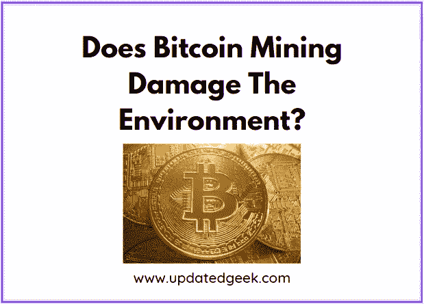

# 比特币挖矿破坏环境吗？

> 原文：<https://medium.com/coinmonks/does-bitcoin-mining-damage-the-environment-72e7883b4c60?source=collection_archive---------26----------------------->

Does Bitcoin Mining Damage The Environment?

**是的，比特币开采破坏环境。**每开采一美元的比特币会导致 35 美分的气候损害。比特币开采是一个极其耗能的过程，会影响世界各国政府减少对化石燃料依赖的能力。

比特币是一种去中心化的数字货币，可以在网络中从一个人转移到另一个人。比特币交易可以通过加密技术在网络节点的帮助下得到验证，并被记录在一个被称为区块链的公共分布式账本中。

2008 年，一群名为中本聪的人发明了这种加密货币。Currency 在 2009 年作为开源软件发布时就已经在使用了。

有 9 个国家已经完全禁止使用比特币，而另外 15 个国家已经含蓄地禁止使用比特币。然而，很少有政府在某种程度上使用加密货币。萨尔瓦多等国家已经正式宣布加密货币为法定货币。

**阅读更多:** [信用卡额度是基于收入吗？](https://updatedgeek.com/is-credit-card-limit-based-on-income/)

# 加密挖掘是如何工作的？

工作证明加密挖掘是为了消耗大量的能量而创建的。这个过程利用几百万台计算设备来解决这个复杂而无意义的问题。

在比特币的算法中，快速解决问题的计算机或采矿设备会获得一枚硬币或特定的密码。

如果奖励高，矿工的意图是快速采矿，并在提高赢得奖励的机会中解决问题。

随着越来越多的矿机试图赢得竞争，问题的难度增加，矿用电量也增加。

地下矿工的用电量呈指数级增长。

**阅读更多:** [投资 NPS 值得吗？](https://updatedgeek.com/is-investing-in-nps-worth-it/)

# 比特币挖矿破坏环境吗？

地下采矿使用的电力部分来自燃气和燃煤发电厂。天然气和煤燃烧时会产生温室气体，导致地球近地表空气温度上升。

截至 2022 年，比特币开采造成了全球 0.1%的温室气体排放。下一个环境影响是燃煤发电导致的空气污染，第三个是比特币采矿设备寿命短导致的电子垃圾。

相比比特币，以太坊耗电更少。根据剑桥替代金融中心(CCAF)对 2022 年的估计，比特币开采每年消耗近 100 万亿瓦时，相当于埃及的电力消耗。

另一项在 2016 年至 2021 年进行的研究表明，每开采一美元的比特币会导致 35 美分的气候损害，这远远高于汽油行业和牛肉行业的能源消耗。

2021 年，比特币每年产生的电子垃圾估计超过 3 万公吨。每一次比特币挖掘都会产生 270 至 380 克的电子垃圾。此外，秘密采矿装置的平均寿命约为 1.3 年。与大多数计算硬件不同，所使用的专用集成电路除了密码挖掘之外没有其他用途。

**阅读更多:**[2023 年如何申请 E Mudra 贷款](https://updatedgeek.com/how-to-apply-for-e-mudra-loan/)

# 如何减少比特币开采对环境的影响？

降低比特币开采对环境的影响很难。可能的补救办法可能是，只有在有足够数量的清洁电力的地方和时候，才开采比特币。一些政策制定者已经对秘密采矿实施了限制或禁令。

如果目前不采取正确的行动来限制这个行业的增长，那么我们可能无法实现巴黎协议的目标。

地方和州政府官员可以强制执行噪音和污染条例，这样就不会有更多的经济发展资金被用于错误的长期工作承诺上，制定谨慎的分区法规，并制定关税以确保对现有纳税人的保护。

公用事业监管机构可以说服电力购买协议，建立保护性电价或系统福利收费，以确保投机性采矿操作，以便不应该有任何标准资产的踪迹，正确评估比特币采矿设施的能源采购公用事业计划，并确保采矿设施不会增加电力消耗和成本。

公用事业公司可以制定电价，以确保不受搁浅财产的影响。它确保不应该有增加的电力容量来完成秘密开采负荷，并且费用率足以完全保护现行费率不受增加的边际生产成本的影响。

电网运营商可以创建与高密度负载互连相关的全面规则和指南，并研究加密挖掘对拥塞、资源充足性、批发市场价格的影响，以减少加密挖掘对其他客户的影响。

环境监管机构应该实施积极的监管，以减少当地的健康以及比特币采矿对附近社区的环境影响。

**阅读更多:** [特斯拉股价目标 2023 年至 2034 年](https://updatedgeek.com/tesla-stock-price-target/)

# 常见问题

**1。比特币挖矿产生了多大的浪费？**

每一次比特币开采都会产生 270 至 380 克的电子垃圾

**相关搜索**

[加密货币应该大写吗？](https://updatedgeek.com/should-cryptocurrency-be-capitalized/)

[2023 年一定要继续投资股市吗？](https://updatedgeek.com/keep-investing-in-the-stock-market/)

[HDFC 信用卡可以和 Google Pay 挂钩吗？](https://updatedgeek.com/hdfc-credit-card-be-linked-to-google-pay/)

[2023 年夏普投资划算吗](https://updatedgeek.com/is-sharp-investment-a-good-buy/)

**关注更多更新**

*在 LinkedIn* 上关注[*Raveen Chawla*](https://www.linkedin.com/in/raveen-chawla-02b3017b)

**相关搜索，点击* [*文章*](https://updatedgeek.com/) *，点击* [*网络故事*](https://updatedgeek.com/web-story-sitemap.xml)*

> *加入 Coinmonks [电报频道](https://t.me/coincodecap)和 [Youtube 频道](https://www.youtube.com/c/coinmonks/videos)了解加密交易和投资*

# *另外，阅读*

*   *[隐料斗替代品](/coinmonks/cryptohopper-alternatives-d67287b16d27) | [HitBTC 审查](/coinmonks/hitbtc-review-c5143c5d53c2)*
*   *[CBET 评论](https://coincodecap.com/cbet-casino-review) | [库科恩 vs 比特币基地](https://coincodecap.com/kucoin-vs-coinbase)*
*   *[折叠 App 审核](https://coincodecap.com/fold-app-review) | [Kucoin 交易机器人](/coinmonks/kucoin-trading-bot-automate-your-trades-8cf0ca2138e0)*
*   *[如何匿名购买比特币](https://coincodecap.com/buy-bitcoin-anonymously) | [比特币现金钱包](https://coincodecap.com/bitcoin-cash-wallets)*
*   *[币安 vs FTX](https://coincodecap.com/binance-vs-ftx) | [最佳(SOL)索拉纳钱包](https://coincodecap.com/solana-wallets)*