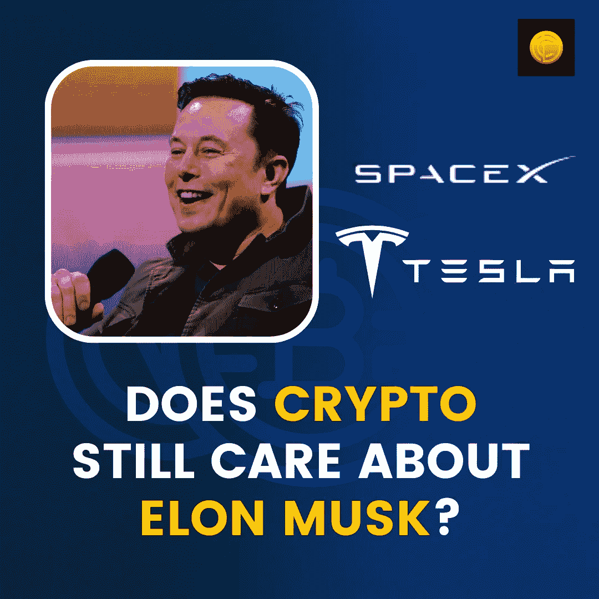

# Crypto 还在乎 Elon Musk 吗？

> 原文：<https://medium.com/coinmonks/does-crypto-still-care-about-elon-musk-58f2e715430a?source=collection_archive---------54----------------------->

[我们还记得在](https://blog.coindhan.com/2022/07/25/does-crypto-still-care-about-elon-musk/)[和](https://www.worldometers.info/coronavirus/)浪潮的时期。那是在 2021 年，密码市场正处于全盛期。在 2020 年牛市和 BTC 跌至 2 万美元和 3.5 万美元之后，又有一个令牌成为头条新闻，即 Matic。现在它被更名为 Polygon，但在当时，它是 Matic。几天之内，代币从 0.34 美元飙升至 1.57 美元。在那个时候，有另一个令牌是头条新闻，总督！

埃隆，总督的父亲几乎把它当成一个浪子；尽管如此，它在几天内就被否认了。我记得自己在周四买断了 FOMO 的股票，然后在周六离开。万一，你想知道为什么？归咎于埃隆。我就想，为什么这个杜斯不得不在 SNL 或周六夜生活上开令人畏缩的玩笑，而我的投资组合一落千丈！

这不是一个顿悟的时刻，不仅是我，而是整个加密社区都相信埃隆，这个家伙不值得信任，他可以在任何时间点掉头。它不是从多吉开始的，也不会以多吉结束。

# 为什么[密码](https://blog.coindhan.com/2022/07/24/myths-and-misconceptions-surrounding-cryptocurrencies/)社区不再信任埃隆？

# 你打开比特币

最初，埃隆为 BTC 担保，但随着时间的推移，这种担保已成为泡影。他完全改变了立场，获得了可观的利润，并在适当的时候抛出了代币。甚至他为特斯拉汽车公司生产的电池也极度破坏环境，但他对此无话可说。如果这根本不是，ESG 对特斯拉的罢黜进一步证明了一个事实，即他一直表现得很狡猾，确实是个伪君子。

# Doge 诉讼

Doge 的诉讼是创始人索赔 2 . 85 亿美元的又一个致命一击。这些事件给埃隆带来了太多的耻辱，让他再也无法树立自己作为一个秘密影响者的形象了！那是太多的 Doge 先令了狗最终的方式。

因此，一切顺利并不意味着会有好的结局。埃隆已经失去了人们对他的尊重。它确实随着时间的推移而消失，现在，密码社区会说，谁是埃隆！！

> 交易新手？尝试[加密交易机器人](/coinmonks/crypto-trading-bot-c2ffce8acb2a)或[复制交易](/coinmonks/top-10-crypto-copy-trading-platforms-for-beginners-d0c37c7d698c)