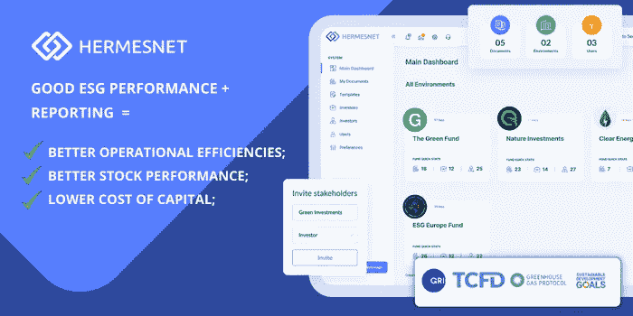
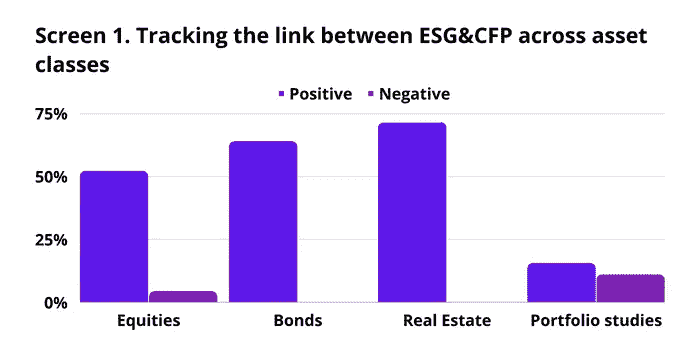
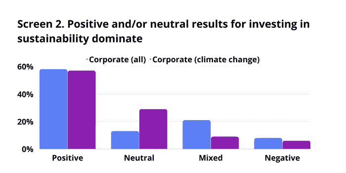

# ESG 报告是否提供了实际的经济效益？

> 原文：<https://medium.com/coinmonks/does-esg-reporting-provide-actual-economic-benefit-29bff3001ecc?source=collection_archive---------53----------------------->

> 我们确定了 **ESG** 绩效和**运营效率、股票表现和较低资本成本之间的**正相关**。**

谈到环境、社会和治理报告，在大多数情况下，对它是什么以及适用什么标准没有明确的理解。更重要的是，企业对它的实际经济效益知之甚少。

因此，即使企业已经意识到开始 ESG 之旅可能是一个好主意，可持续发展专家也很难说服决策者分配必要的资源。

我们对此事进行了调查，发现了几个解释 ESG 报告实际经济效益的可靠来源。特别是，我们确定了 **ESG** 绩效与**运营效率、股票表现和较低资本成本之间的**正相关关系**。**

## **投资者动机**

ESG 和 impact 基金每年都为投资者的资金创造新的流入记录。彭博估计，2021 年约有 1200 亿美元流入被认为具有最高环境、社会和治理资质的公司，比 2020 年 ESG 基金获得的 511 亿美元翻了一番。

理解投资者背后的动机至关重要。我们发现了一些解释投资者兴趣的外部证据。

**几项著名的**研究表明，考虑环境、社会和治理(ESG)因素的投资策略会带来更好的长期业绩。[德意志资产&财富管理(英国)有限公司发现](https://www.unepfi.org/fileadmin/events/2018/sydney/ESG-and-Corporate-Financial-Performance.pdf)**62.6%的**ESG 因素与财务绩效**正相关(见下图一)。**

****

**Source: Deutsche Asset & Wealth Management (UK) Limited has found**

## ****为什么 ESG 和 Impact 资产的表现优于其他？****

**从逻辑上讲，投资者正在寻求更好的回报。这就是他们投资 ESG 和影响资产的原因。**

**然而，问题是为什么 ESG 和影响力资产的表现优于其他资产。我们对此进行了进一步调查，发现了 ESG 和财务绩效之间的**强相关性**。例如，[NYU·斯特恩和洛克斐勒资产管理公司](https://www.stern.nyu.edu/sites/default/files/assets/documents/NYU-RAM_ESG-Paper_2021%20Rev_0.pdf)在“公司”研究的 **58%** 中发现了 ESG 和财务表现之间的正相关关系(下面的屏幕二)。**

****

**Source: NYU Stern and Rockefeller Asset Management**

**在同一篇论文中，[NYU·斯特恩和洛克斐勒资产管理公司](https://www.stern.nyu.edu/sites/default/files/assets/documents/NYU-RAM_ESG-Paper_2021%20Rev_0.pdf)强调，最近的一项研究考察了股票市场对新冠肺炎危机的最初反应，发现在“危机应对”指标(基于人力资本、供应链以及产品和服务 ESG 情绪)上得分高的公司与 1.4%至 2.7%的较高股票回报相关(吉玛-福克斯等人，2020)。**

**然而，尽管有许多证据表明环境、社会和公司治理为企业带来了真正的经济利益，但这个话题仍然存在争议。**

**在 [Hermesnet](https://www.hermesnet.co.uk/) ，我们坚信 ESG 报道是**而不是**对赚钱的真正业务**的干扰。然而，反之亦然是指更好的财务和运营效率、股票表现和更低的资本成本。****

**#ESG #经济价值# ESG 报告# ESG 绩效# GRI # TCFD #温室气体协议# SDG #范围 1 #范围 2 #范围 3 #可持续发展**

> **交易新手？尝试[加密交易机器人](/coinmonks/crypto-trading-bot-c2ffce8acb2a)或[复制交易](/coinmonks/top-10-crypto-copy-trading-platforms-for-beginners-d0c37c7d698c)**