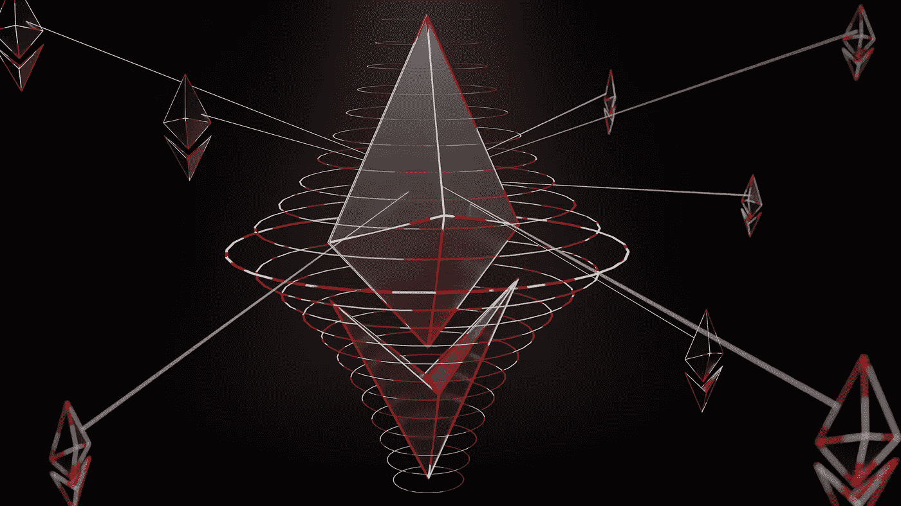
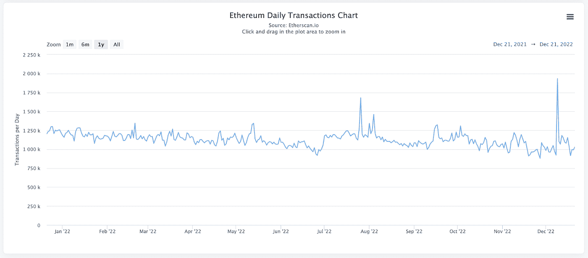
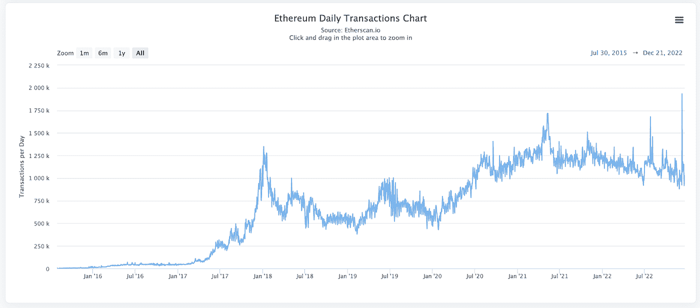
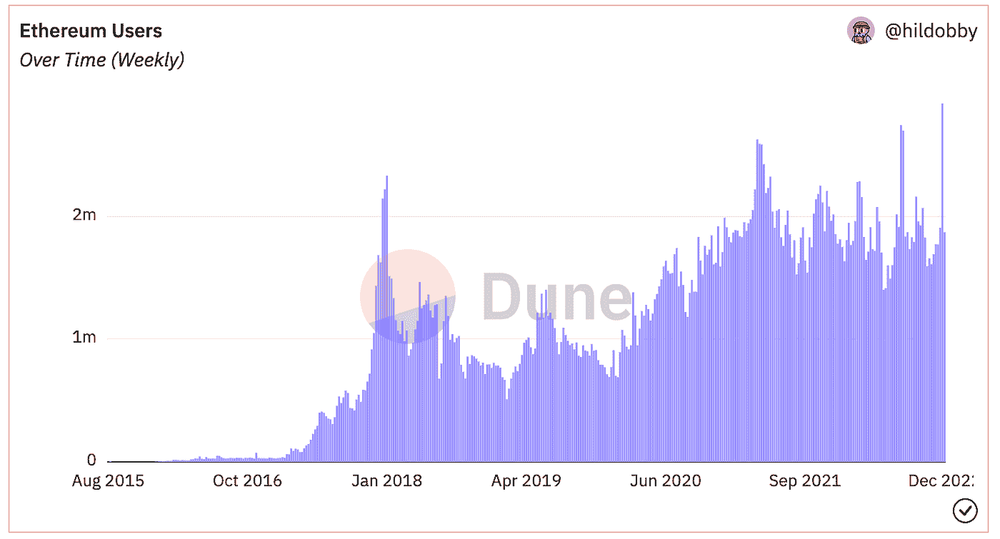
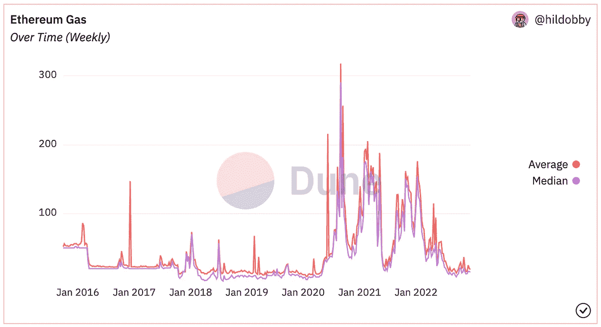
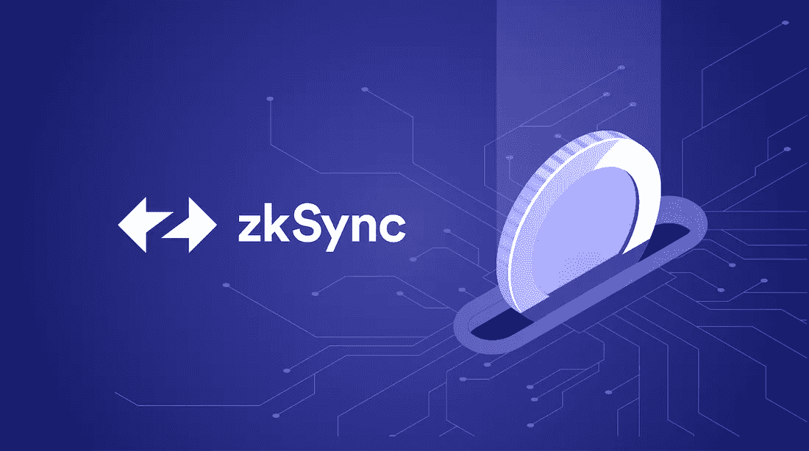

# 以太坊真的需要规模化吗？

> 原文：<https://medium.com/coinmonks/does-ethereum-really-need-to-scale-42c1aed893e4?source=collection_archive---------24----------------------->

## 以及为什么第 2 层可能走在时代的前面

Credit — [Shubham Dhage](https://unsplash.com/@theshubhamdhage)

多年来，可伸缩性一直是以太坊开发者和用户的热门话题。这是对以太坊网络的主要批评之一，也是核心开发者长期以来一直寻求解决的挑战。2021 年，随着 NFT 的繁荣和 DeFi 的迅速崛起，以太坊区块空间的需求开始上升，导致可扩展性成为一个真正的问题。需求高峰加上以太坊每秒 15 笔交易的限制，将交易成本推高至 200 美元，并导致长时间的等待。这显然是不可持续的，最终会导致用户转向不同的网络。事实上，由于交易费用低廉，许多用户在这段时间确实迁移到了 Solana 网络。有一段时间，索拉纳似乎会成为以太坊的大杀手。然而，随着以太坊的发展，这看起来不太可能，但是可伸缩性仍然是一个限制。

> 不知道什么时候买卖，试试[复制交易](http://coincodecap.com/go/bityard)。

那么，如何解决以太坊的可扩展性问题呢？

# 扩展解决方案

虽然[合并](/coinmonks/the-ethereum-merge-what-you-need-to-know-de3fe0cca236)增加了区块链以太坊的潜在容量，但网络要发挥其潜力还需要几年时间。这就是为什么 [layer-2s](/@callumcarlstrom/layer-2-the-town-square-of-blockchains-ae2c91beeb7d) 比如乐观和 Arbitrum 出现了。这些是建立在以太坊之上的辅助区块链，通过在 maninet 之外处理交易并批量结算来帮助网络扩展。这些解决方案通常被称为“汇总”，因为它们在一次结算所有交易而不是一次结算一个交易之前汇总或批处理交易。在最近的[无银行播客](https://www.youtube.com/watch?v=QXKqIIf6_AE)中，Vitalik Buterin 甚至表示，对于以太坊生态系统的未来，rollup 技术是他最感兴趣的。

你可以在这里阅读更多关于汇总的信息。

最近，我开始质疑以太坊网络在短期内的可扩展性需求。传统上，科技初创公司只有在受到快速增长和需求的冲击时，才会努力实现指数级规模。过早地扩展您的技术通常是一种资源浪费。那么，为什么我们需要如此快速地扩展以太坊呢？大规模扩张难道不应该是对大规模需求的回应，而不是对需求的预期吗？

# 让我们看看需求

大量的时间、精力和金钱花费在试图攀登以太坊区块链。在我看来，在我们知道是否需要这种程度的可伸缩性之前，这种情况就已经发生了。以太坊区块空间的需求真的那么高吗？或者至少有大规模上升的趋势？让我们看看今年以来的每日交易数据。

[Etherscan](https://etherscan.io/chart/tx)

如果我们看上面的图表，我们可以看到以太坊上的交易量徘徊在平均每天 110 万笔左右，事实上呈下降趋势。从表面上看，这似乎是一个很高的日常需求。但与每天处理数亿笔交易的 Visa 网络相比，这只是沧海一粟。

然而，在 2022 年这样一个市场遭受重创的年份，交易量的横向移动可能会被视为需求方面的一个出色结果。但事实仍然是，今年的日交易量没有增长。所以，我们能不能不要说，构建更好的产品和对公众进行以太坊用例的教育应该比可伸缩性优先得多？

公平地说，由于时间跨度有限，上面的图表可能没有描绘出最准确的画面。我们来看看以太坊自成立以来的日常交易。

[Etherscan](https://etherscan.io/chart/tx)

从增长的角度来看，这描绘了一幅完全不同的画面，对可伸缩性的需求似乎更加合理。但它看起来还不像一条指数增长曲线。即使我们看看以太坊上的每周活跃用户，我们也可以看到随着时间的推移持续增长，但这几乎不是指数增长。

Credit — [hildobby & Dune Analytics](https://dune.com/hildobby/Ethereum-Overview)

再者，我一整年都在用以太坊，还没遇到过 5 美元以上的油费。平均而言，我最终为我的交易支付了大约 2 美元的汽油费，并且只需要等待大约 20 秒钟就可以处理。因此，我们可以合理地假设这是每天 110 万次交易时使用以太坊的成本。这真的是一个大问题吗？

Ethereum Gas — [hildobby & Dune Analytics](https://dune.com/hildobby/Ethereum-Overview)

在这一点上，有人可能会说，一些最受欢迎的 [stablecoins](/block6/what-are-stablecoins-bc992bd226b7) 落户以太坊，如果我们希望我们的常规消费者交易发生在 chain 上，我们需要增加可伸缩性。

例如，如果你打算给一个朋友送 10 美元的晚餐，2-5 美元的汽油费显然是荒谬的，并且需要扩展解决方案。但是，这真的是以太坊今天的主要用例吗？如果我们实际观察以太坊上的主要用例，如 NFTs、DeFi 和 DAOs，5 美元的油费和 20-30 秒的等待时间很难成为大障碍。

出于某种原因，我们倾向于将区块链网络的能力与世界上一些最大的金融网络(如 Visa 和 MasterCard)相比较。如果我们试图通过以太坊促进这个星球上的每一个消费者交易，这是有意义的，但我们没有。如果我们做到了，我会很高兴的，但是我们离用户还很远，甚至不能接近。那么，为什么要预测如此快速的规模呢？

这让我对第二层产生了争议。

# 扩展解决方案是否领先于时代？

在我们深入这一部分之前，我想澄清一下，我认为以太坊上的第二层解决方案在未来将是一个必需品，目前的项目非常棒。整个生态系统中有才华的团队正在做着令人难以置信的大量工作，如[乐观](https://www.optimism.io/)、[仲裁](https://arbitrum.io/)和 [ZK 同步](https://zksync.io/)。虽然这些项目很棒，并将为以太坊生态系统增加很多价值，但我不禁认为他们正在抢占区块空间和廉价交易的需求。

Credit — [Storj](https://www.storj.io/blog/zk-rollup-integration-with-storj-for-host-payments)

让我们假设共同的目标是以太坊网络的大规模采用。人们真的因为以太坊的可扩展性挑战而选择不使用它吗？这是我们需要解决的主要问题，以便将主流带到以太坊吗？

开发者和工程师喜欢通过开发更好的技术来解决问题。他们想找到任何问题的技术解决方案。然而，在这种情况下，我认为问题不在于技术，而在于公众的看法。Crypto 作为一个整体有一个品牌问题。2022 年的灾难在主流消费者眼中给 crypto 打上了负面的“烙印”。像露娜，FTX，摄氏，三箭资本已经对加密和区块链技术的看法产生了巨大的负面影响。这当然也会波及以太坊的生态系统。

在我看来，我们最好专注于建立加密“品牌”,并花费大量精力来教育人们。另一个词是营销。

以太坊生态系统中有许多当前和未来的用例，将对人们的生活产生巨大的积极影响。我们应该更加努力地教育人们如何使用 web3 应用程序，而不是试图建立自己的方式。这将需要更多的营销、UX 和社区人才。能够在核心开发者和最终用户之间架起信息桥梁的人。在这方面，我们将看到主流采用方面的最大中短期收益。

教育、讲故事和可用性是需要我们关注的关键支柱。只有当人们被大规模接纳后，我们才应该专注于扩大网络规模。

所以我再一次提出这个问题，以太坊真的需要扩展吗？让我知道你是否同意或者你是否认为我错过了什么！

> 加入 Coinmonks [电报频道](https://t.me/coincodecap)和 [Youtube 频道](https://www.youtube.com/c/coinmonks/videos)了解加密交易和投资

# 另外，阅读

*   [Bookmap 点评](https://coincodecap.com/bookmap-review-2021-best-trading-software) | [美国 5 大最佳加密交易所](https://coincodecap.com/crypto-exchange-usa)
*   [加密交易机器人](/coinmonks/crypto-trading-bot-c2ffce8acb2a) | [硬币门评论](https://coincodecap.com/coingate-review)
*   最佳加密[硬件钱包](/coinmonks/hardware-wallets-dfa1211730c6) | [Bitbns 评论](/coinmonks/bitbns-review-38256a07e161)
*   [新加坡十大最佳加密交易所](https://coincodecap.com/crypto-exchange-in-singapore) | [购买 AXS](https://coincodecap.com/buy-axs-token)