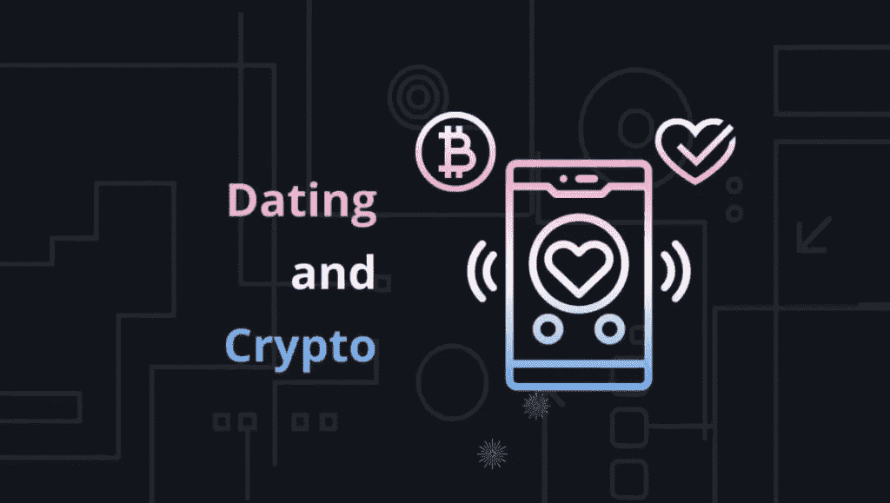
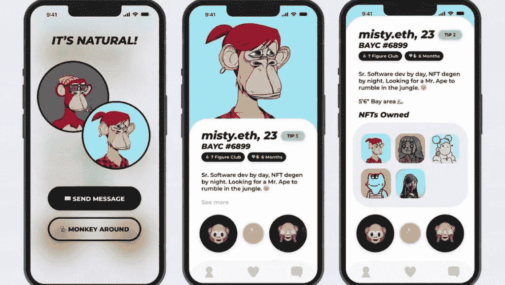

# 投资 Crypto 会让你在约会网站上更有吸引力吗？

> 原文：<https://medium.com/coinmonks/does-investing-in-crypto-make-you-more-desirable-and-attractive-on-dating-sites-c116942c089e?source=collection_archive---------57----------------------->

秘密约会网站

 [## 加密约会网站|加密货币- KOOP360

### 在这篇文章中，你会明白，投资加密技术会让你在约会网站上更受欢迎，更有吸引力。

koop360.com](https://koop360.com/blog/crypto-dating-sites/) 

> 单身男女对伴侣的要求不仅是经济稳定，而且精通技术。他们更支持在数字货币方面有专长的人，而不是没有专长的人。55%的美国人表示，他们更有可能与在网上约会资料中提到的拥有秘密资产的人约会。

***该研究还发现，约 76%的受访者表示，如果一个人的约会资料提到他们是秘密投资者，他们更有可能向右滑动。由数字资产平台 CryptoVantage 进行的*** [***调查***](https://www.cryptovantage.com/crushing-on-cryptos/) ***。***

# Crypto 有多大吸引力？

这项调查是对 1002 名美国人进行的，旨在探索投资于密码世界是否有吸引力。反应可能是惊人的。这可能会改变人们对加密货币和约会的整体看法。加密货币投资者在约会应用上收到更多**正确的】刷卡吗？用 NFT 作为你的推特个人资料图片，你会显得很酷很强大吗？加密货币交易如何影响约会之外的关系？原来，并不是一切都是阳光和玫瑰。这些是调查中探讨的领域。**

# **如今加密等同于吸引人吗？**

**从调查中发现，数字钱包的管理可以让你更受世界各地人们的欢迎。也许它能增加你在交友网站上找到匹配对象的机会。社交投资平台 eToro 的另一项调查得出结论，如果你用比特币付账，四分之三的人更有可能第二次和你出去。不仅如此，调查发现，其他数字资产，如不可替代的代币或 NFT，也是设置合意性的关键因素。**

****

**CryptoVantage 的调查发现，超过四分之三的人更有可能向简历中提到秘密投资者的人行贿。这项调查显示，74%的女性会在第二次约会时与在第一次约会时使用密码支付的人约会。**

**那么，秘密投资者有多大吸引力呢？近一半的受访者认为投资者比非投资者更有吸引力，许多人对他们的吸引力、智力和金钱也有类似的感觉。在我们的调查中，50%的女性认为加密货币投资者更有吸引力。许多餐馆已经开始接受加密货币作为支付方式，这一趋势一直在增长。**

**而 40%的男性认为他们比非投资者更聪明。虽然目前有几种著名的加密货币可供投资，但没有一种像比特币一样能增加你的吸引力。**

# **你应该把 NFT 作为你的个人资料图片吗？**

****

**由 [eToro](https://www.etoro.com/) 进行的研究显示，如果你把 NFT 作为个人资料图片，大约 20%的单身人士会对你产生兴趣。然而， [CryptoVantage](https://www.cryptovantage.com/) 的调查得出了不同的结论。**

**近三分之一的男性认为 NFT 的个人资料照片“令人畏缩”此外，根据调查结果，千禧一代最不可能认为他们是**、**或**、**有影响力的人，而是认为他们是**、**或**傲慢的人。**Z 世代更有可能相信 NFT 个人资料图片用户是****【有权有势】**这表明年轻人更看好 NFT。此外，四分之一的女性不认为 NFT 是男性的最佳头像。****

****这种二分法与大多数用户的意见是一致的。当 Twitter 首次为 Twitter Blue 用户推出经过验证的 NFT 个人资料图片选项时，人们有不同的看法:有些人认为这些图片令人不快，而有些人则认为它们是威望和权威的象征。你不可能把所有人都争取过来！****

# ****加密货币会如何影响你的爱情生活？****

********

****与非投资者相比，crypto 和 NFT 投资者对伴侣和关系幸福度之间的总联系*(包括优质时间和性生活)*的评价更高。然而，一对夫妇的加密货币资产可能会有问题:根据我们的调查，52%的参与者报告说，当加密价格下降时，与伴侣的争吵会增加。****

****许多受访者报告说，由于他们对加密货币上瘾和糟糕的投资实践，他们有关系问题。但遗憾的是，冲突只是开始。我们发现，几乎 69%的加密货币投资者因为他们的投资而结束了一段关系；42%的人甩了他们的伴侣，而 26%的人被甩了。****

******结论******

********

****加密货币的投资者可能希望仔细展示他们的习惯。除了金融风险之外，投资不稳定的加密货币市场似乎还有更多个人风险。事实证明，加密货币投资确实会让人显得比非投资者更有吸引力，尤其是在约会应用上。****

****NFT 投资者也经常在社交媒体上展示冷静、坚强和富有的形象。不过，他们个人资料照片中的 NFT 可能会让一些人畏缩。在这样一个由 cryptos 和 NFT 主导的世界里，如果你也在寻找一个设计它们的地方， [**Koop360**](https://koop360.com/) 是一个不错的选择。你可以在这个分散和开源的环境中开发和销售你的 NFT 代币和数字艺术品。这个即插即用的平台是由社区运营的。****

> ****交易新手？尝试[加密交易机器人](/coinmonks/crypto-trading-bot-c2ffce8acb2a)或[复制交易](/coinmonks/top-10-crypto-copy-trading-platforms-for-beginners-d0c37c7d698c)****