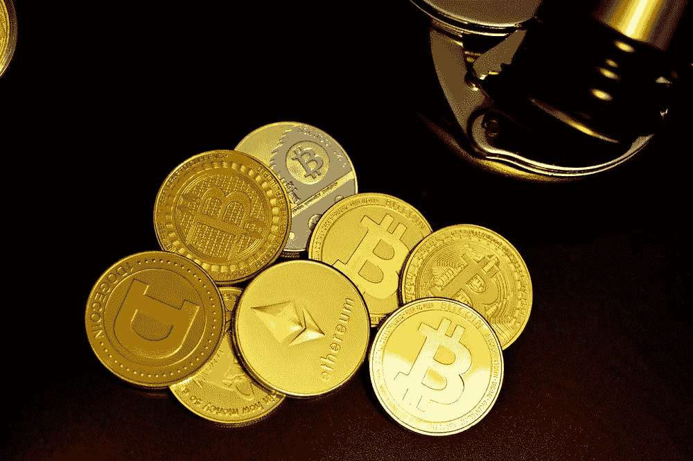

# LUNO 在加纳工作吗？

> 原文：<https://medium.com/coinmonks/does-luno-work-in-ghana-6f31aa9b8de1?source=collection_archive---------13----------------------->

Luno 是一个公认的加密交易所，为买卖加密货币提供了一个易于使用的平台。它已经运行多年，积累了大量的用户基础。Luno 还提供钱包服务，包括对桌面和移动设备的支持。该公司因其易于使用的平台和一系列功能得到了密码社区的积极反馈。目前，该公司在加纳没有任何业务。然而，该公司透露了向加纳人和肯尼亚人提供服务的计划。
加纳人正在投入精力加入快速发展的加密领域，并正在寻找替代方案来交易加密市场。对加纳人来说，一个合适的选择是币安。该平台为用户提供了一个安全、可靠且易于使用的加密货币交易环境。
币安是世界上最受欢迎的交易平台之一。其增强的安全性和多种令牌的可用性使其成为交易者的一个非常好的平台。币安已经成为寻求获得各种加密货币和数字资产的交易员和投资者的首选平台。

然而，币安有一个复杂的界面，初次交易者可能难以理解。如果你不熟悉交易选项，这一点尤其正确，因为交易所提供了广泛的交易选项。当在币安这样的平台上交易时，做好你的研究是很重要的。在进行任何投资或交易之前，最好访问他们的网站，了解更多关于这个平台及其功能的信息。通过这种方式，你会更好地了解你正在做什么，以及这是否是对你的正确投资。此外，如果您在交易时有任何疑问或问题，访问他们的支持页面也会有所帮助。

虽然在币安购买加密货币可能容易且令人满意，但出售加密资产却是另一回事。在你出售你的加密资产之前，确保你对它们在不同交易所的定价有很好的了解。比较价格，以确保你得到最好的交易。同样重要的是要记住，加密价格可能变化很快，所以不要等太久才出售你的资产。
找到合适的平台来销售加密货币可能很困难。 [Dart Africa](http://dartafrica.io) 是一个提供比任何其他平台都更优惠利率的平台，这使得它成为那些希望在加纳出售加密货币的人的理想选择。Dart Africa 也是初学者友好型的，不用担心先学会复杂的交易技术。平台支持的加密货币包括:比特币、、、戴、以太坊、币、莱特币。

> 交易新手？试试[加密交易机器人](/coinmonks/crypto-trading-bot-c2ffce8acb2a)或者[复制交易](/coinmonks/top-10-crypto-copy-trading-platforms-for-beginners-d0c37c7d698c)

当你在 [Dart Africa](https://play.google.com/store/apps/details?id=com.dartafrica&gl=US) 上出售密码时，没有附加的交易费用，并且该平台提供了广泛的功能，使得出售密码变得容易。有一个内置的速度计算器给你的密码资产的 Cedi 值。你怎么用你的密码和非洲飞镖上的加纳赛迪交换？

1.  第一步是在平台上注册，并添加您的银行账户详细信息。
2.  继续选择你要出售的密码，并输入你要兑换现金的金额。
3.  将为您生成一个钱包地址，将您的密码存入此钱包并等待确认。
4.  1-3 分钟后，您的资金将到达您的 cedis 钱包，然后您可以提取到您的银行帐户或移动资金。

加密货币正变得越来越受欢迎，因此在处理它们时小心谨慎非常重要。如果你犯了哪怕是最轻微的错误，你可能会失去所有的钱。你应该注意的事情包括:钱包地址您发送您的加密资产，通常建议您复制和粘贴。不要试图键入它。这是为了避免犯错。此外，您的登录详细信息和交易 pin 非常重要，请确保使用您不会忘记的东西，并始终保持这些信息的安全。

> 加入 Coinmonks [电报频道](https://t.me/coincodecap)和 [Youtube 频道](https://www.youtube.com/c/coinmonks/videos)了解加密交易和投资

# 另外，阅读

*   [Botsfolio vs nap bots vs Mudrex](/coinmonks/botsfolio-vs-napbots-vs-mudrex-c81344970c02)|[gate . io 交流回顾](/coinmonks/gate-io-exchange-review-61bf87b7078f)
*   [CoinFLEX 评论](https://coincodecap.com/coinflex-review) | [AEX 交易所评论](https://coincodecap.com/aex-exchange-review) | [UPbit 评论](https://coincodecap.com/upbit-review)
*   [AscendEx 保证金交易](https://coincodecap.com/ascendex-margin-trading) | [Bitfinex 赌注](https://coincodecap.com/bitfinex-staking) | [bitFlyer 点评](https://coincodecap.com/bitflyer-review)
*   [Bitget 回顾](https://coincodecap.com/bitget-review) | [双子座 vs BlockFi](https://coincodecap.com/gemini-vs-blockfi) cmd| [OKEx 期货交易](https://coincodecap.com/okex-futures-trading)
*   [AscendEx Staking](https://coincodecap.com/ascendex-staking)|[Bot Ocean Review](https://coincodecap.com/bot-ocean-review)|[最佳比特币钱包](https://coincodecap.com/bitcoin-wallets-india)