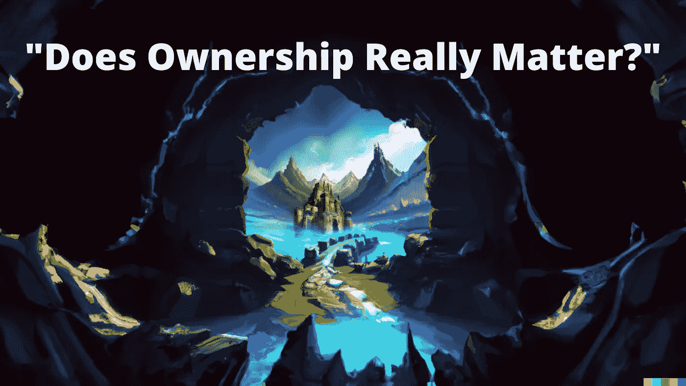

# “所有权真的重要吗？”社区讨论

> 原文：<https://medium.com/coinmonks/does-ownership-really-matter-a-community-discussion-c352b41bcd63?source=collection_archive---------25----------------------->

本周，我们有了一个惊人的机会，与许多社区思想领袖一起主持了一个 Twitter 空间。

本周作为嘉宾加入我们的有 Cryptofolk， [Safrootics](https://twitter.com/safrootics) 的创始人，和 [GaspodeWD](https://twitter.com/GaspodeWD) ，一个 Web3 内容创作者。

这篇文章将作为一个总结，并强调我们在对话中提出的一些要点[“所有权真的很重要吗？”](https://twitter.com/i/spaces/1OwGWwjrYPeGQ?s=20)，在那里我们加入了许多其他发言者。

Before you keep reading- what do you think?

**货币化**

出现的一个关键主题是将您的资产货币化的能力，作为拥有“真正”所有权的延伸(拥有使用和转售资产的完全权限，而不是将其存储在配置文件中)。货币化策略可以包括在 OpenSea 等平台上出售 NFT，将资产出租给他人使用，甚至将 NFT 细分并出售单个组件。

后者是通过 [fractional.art](https://fractional.art/) 等平台进行的，允许个人分割并转售 NFT 的一部分以获利。

事实上，这些策略通常对社区有益，因为它们增加了可访问性并降低了进入成本，同时回报了最初的 NFT 持有者。

**社区驱动的增长**

许多 Web3 游戏和平台目前使用 NFT 所有权作为奖励持有人的方式(如通过空投)，允许独家访问或促进社区反馈，以确保项目的支持者可以塑造其方向。

虽然这可能符合一些 Web2 的概念，如众筹或拥有公司股份，但独特的元素是，Web3 社区是一个用户社区，并不(至少不是全部)纯粹为了赚更多的钱而拥有发言权——他们对构建一个伟大的产品充满热情。

> “与 Web2 不同，Web3 是一个社区”——Safrootics

**启用所有权是否有助于“为赢得胜利而付出？”**

与数字所有权的好处相对应的一个有趣现象是，它促进了游戏行业内的“付费赢”社区，用户可以更容易地购买“最佳”资产，从而使那些可以投入更多资金的人在游戏中更加成功。这与纯粹依赖化妆品的游戏形成对比，后者通常没有任何游戏内的商业模式。

然而，这种观点也有一些反对意见:

首先，在许多游戏中，拥有经验和对游戏的深刻理解比经验有限但更有价值的人更能获得成功。这可能是由于游戏中的细微差别，这可能会使更有经验的玩家获胜。

其次，在许多行业中，Web3 最大的价值驱动力之一是版税。在许多“Web2”环境中，创作者无法从二次销售(如 DVD、视频游戏、服装等)中获利。).然而，将版权费附加到数字资产上，允许创作者(包括游戏创作者、音乐人等等)赚取尾随版权费，这将使二次销售成为可取的。

最后，这种转售资产的能力使得除了游戏玩家、收藏家和鲸鱼之外，还有一种不同类型的用户——“脚蹼”。玩家可以通过购买和转售资产来获得收益，这在许多“Web2”游戏(如交易卡游戏(TCGs))中往往至关重要。这些用户和版税的结合可以通过促进额外收入来支持许多 Web3 项目的增长。

> “如果做得好，你可能会有很棒的东西。如果做得不好，就不会被采纳”。—[allall gaming](https://twitter.com/AllinAllgaming)

**“所有权”是下一个“P2E”吗？**

在熊市开始之前，P2E，或称玩赚，是 Web3 领域最流行的词汇之一。从那时起，它经历了许多变化，如“玩了就赚”或“玩了就拥有”，以适应当前的市场趋势，并成为新的“解决方案”。

加斯波德接着承认，“所有权”可能只是下一个时髦词，最终将淡出人们的视线。

**Web3 走反方向**

Web2 中一个有趣的趋势是从“真实所有权”到基于账户的所有权(也称为 SaaS 模式；例如代替 DVD 的流服务或者代替游戏的物理副本的数字游戏平台)。这似乎与 Web3 形成了鲜明对比，在 web 3 中，拥有资产所有权并能够转售资产是核心价值。

所有权“足够了”吗？

在讨论的最后(这里有完整的[和](https://twitter.com/i/spaces/1OwGWwjrYPeGQ?s=20))，围绕 Web3 的创新进行了详细的讨论，特别是与 Web2 游戏相比，这表明所有权不足以让用户从 Web2 转移到 Web3。

事实上，随着时间的推移，P2E 模式必须改变，因为游戏玩家通常会更多地投资于有趣的游戏，而不是让他们赚钱的不太有趣的游戏。这导致对更“有趣”和创新的 Web3 游戏的需求增加，以使它们成为游戏玩家的理想选择。

> “在一天结束时，人们玩伟大的游戏”。— [WolvesOfRomeTCG](https://twitter.com/WolvesOfRomeTCG)

然而，这种创新可能不仅仅来自“真正的所有权”。这可能会是另一个讨论的主题。

**关闭思路**

最终，这一讨论并不是数字所有权角色的终结，它将随着 Web3 空间的发展而不断演变。这场讨论还主要集中在 Web3 的游戏垂直市场，与其他垂直市场相比，它可能具有不同的所有权价值。

完整的空间(持续 90 分钟以上)可以在这里找到[。](https://twitter.com/i/spaces/1OwGWwjrYPeGQ?s=20)

感谢所有参加我们第一次会议的演讲者和听众。我们期待下周 9 月 19 日(星期一)再举办一次！

如果您有希望我们在未来探讨的话题，请随时联系我们！

**如何加入我们的生态系统**

通过举行我们的 NFT 并玩他们各自的 P2E 游戏( [Flappy Pigeon](https://projectpigeon.io/FlappyPigeon) 或 [Eggsplorer](https://projectpigeon.io/EggGame) )，或者通过积极参与我们的 [Discord](https://medium.com/@ProjectPigeon/discord.gg/YGx3sVFWa9) ，您将能够赢得我们的实用工具代币$VIVE。 [$VIVE](/@ProjectPigeon/using-a-token-to-shape-an-ecosystem-e3870b305ccb) 目前可用于购买 NFT 升压包，但也将在我们的元宇宙体验内外提供额外的实用工具。

为了参与我们即将到来的[索拉纳薄荷和贝塔元宇宙体验](/@ProjectPigeon/profile-pigeons-your-ticket-to-our-metaverse-cfd6a6e1d600)，请留意我们的[推特](https://twitter.com/ProjectPigeons)或 Discord 的更新和赠品！

24 美元买一个鸡蛋，今天支持我们@[https://projectpigeon.io/landing](https://projectpigeon.io/landing)

鸽子:[https://opensea.io/collection/projectpigeon](https://opensea.io/collection/projectpigeon)

增压包:[https://projectpigeon.io/landing](https://projectpigeon.io/landing)

这就是我们本周的全部内容，如果您有任何问题，您知道在哪里可以找到我们:

网址:[http://projectpigeon.io/](http://projectpigeon.io/)

Twitter: [https://twitter.com/ProjectPigeons](https://twitter.com/ProjectPigeons)

电报: [https://t.me/+CaAO7HZYImIyOWIy](https://t.me/+CaAO7HZYImIyOWIy)

Discord: [discord.gg/YGx3sVFWa9](https://t.co/nIS4leETX0)