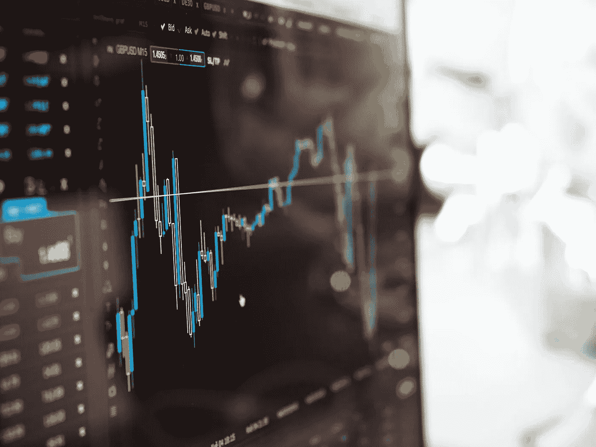
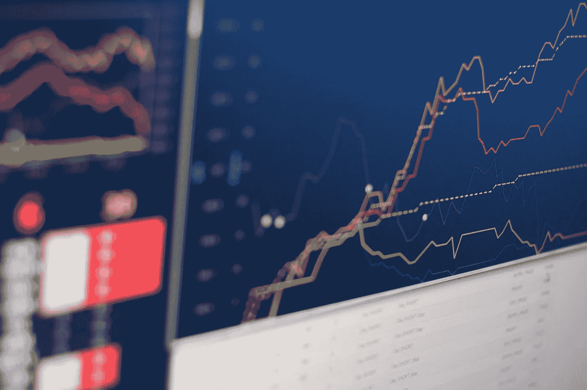
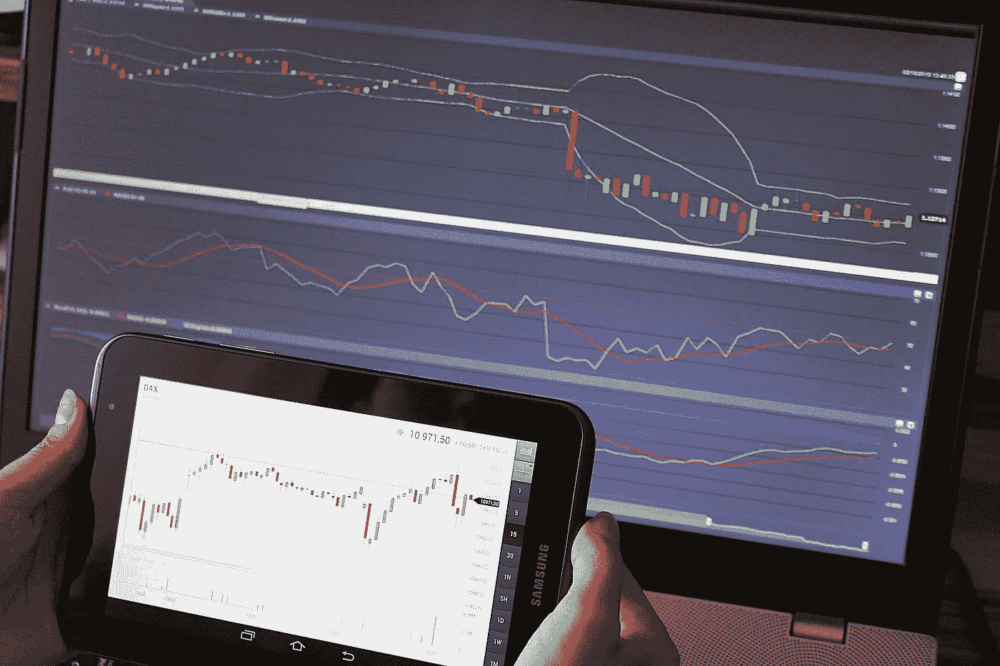
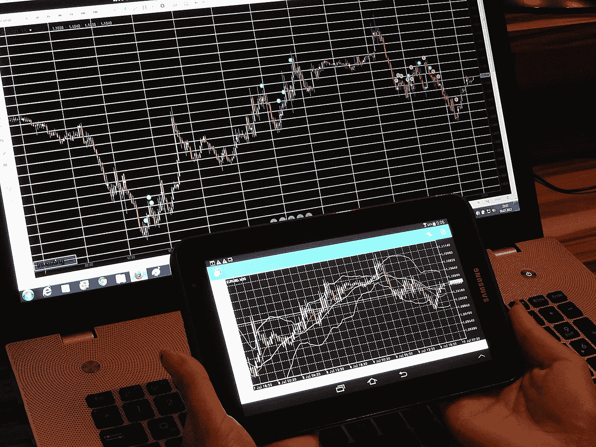

# 技术分析能成为优秀的交易者吗？(新手技术分析)

> 原文：<https://medium.com/coinmonks/does-technical-analysis-make-a-good-trader-technical-analysis-for-beginners-72946c53df29?source=collection_archive---------22----------------------->

Photo by [Chris Liverani](https://unsplash.com/@chrisliverani?utm_source=unsplash&utm_medium=referral&utm_content=creditCopyText) on [Unsplash](https://unsplash.com/s/photos/technical-analysis?utm_source=unsplash&utm_medium=referral&utm_content=creditCopyText)

**技术分析解释。**

技术分析使用数学指标来分析统计趋势，以预测市场价格的未来走向。它是通过分析过去的价格波动和交易量数据来确定市场如何运作，并预测它将如何影响未来的价格波动。

技术分析方法使用价格趋势和图表模式来评估加密市场和发现交易机会。技术分析师认为，资产以前的交易活动和价格变化是预测未来价格活动的有用指标。

换句话说，它被描述为基于过去的价格信息预测特定资产未来方向的技术。

技术分析包括根据过去的价格数据预测给定资产的未来方向。技术分析只关注价格水平、趋势和交易量，与基本面分析相反，基本面分析研究的是基础资产本身。

技术分析师认为，价格趋势往往会重演。他们的分析基于大众心理和投资行为模式。技术分析可以应用于许多资产类别，从加密到股票到商品市场和外汇交易。

为了在加密交易中获得持续的成功，你必须进行技术分析。为了预测交易中的价格变动，你必须进行一些计算。假设你完全基于直觉或猜测下买入或卖出订单。在这种情况下，交易变成了赌博，技术分析是交易者收集市场信息的重要工具。

> **另见:** [**熊市求生:6 个实用步骤。**](/coinmonks/surviving-a-bear-market-6-practical-steps-888e2b61c79d)

技术分析依赖于三个基本假设。

Image by [Pexels](https://pixabay.com/users/pexels-2286921/?utm_source=link-attribution&utm_medium=referral&utm_campaign=image&utm_content=1853262) from [Pixabay](https://pixabay.com//?utm_source=link-attribution&utm_medium=referral&utm_campaign=image&utm_content=1853262)

技术分析基于三个假设。

1.  **市场自贴现。**

这一假设表明，所有可能影响加密货币价格的市场因素都已经反映在它们的价格中。加密资产的价格揭示了所有相关信息。在确定价格变动时，您不需要评估影响加密资产价格的潜在变量。

技术分析师使用烛台模式、价格下跌幅度和其他技术指标等工具来确定是否是投资特定资产的最佳时机。

**2。价格变化形式通常形成一种趋势。**

价格行为总是显示趋势，不管你用的是什么时间框架，尤其是在随机的市场波动中。绿色和红色烛台显示趋势模式和价格方向。

技术分析师认为，未来价格变化更有可能遵循既定趋势。价格趋势可能是上升、下降或水平。

**3。历史会重演。**

因为加密市场是重复的，检查先前的模式可以帮助你预测未来的市场走势。市场参与者对市场事件的反应通常是不变的。即使一些图表模式是很久以前形成的，它们仍然被认为是重要的，因为它们可能会再次出现。

市场参与者对市场事件的反应通常是不变的。即使一些图表模式是很久以前形成的，它们仍然被认为是重要的，因为它们可能会再次出现。

**技术分析的局限性。**

Image by [StockSnap](https://pixabay.com/users/stocksnap-894430/?utm_source=link-attribution&utm_medium=referral&utm_campaign=image&utm_content=2616931) from [Pixabay](https://pixabay.com//?utm_source=link-attribution&utm_medium=referral&utm_campaign=image&utm_content=2616931)

技术分析的一个主要反对理由是历史不会完全重演，这使得技术分析是错误的。

对技术分析的进一步批评是，它只适用于特定的环境，产生不一致的结果。

此外，技术分析仅限于研究图表模式和市场趋势。它忽视了研究影响定价的其他基本因素的重要性。

只有当市场向特定方向波动时，技术分析才是有用的，有启发性的。它无法预测需要基础背景研究的运动。

> **参见:** [**比特币的故事:一个看不见的创造者制造的新奇技术。**](/illumination/the-story-of-bitcoin-the-novel-technology-made-by-an-invisible-creator-a58e2423063d)

**技术分析是否充分？**

Photo by [Nicholas Cappello](https://unsplash.com/@bash__profile?utm_source=unsplash&utm_medium=referral&utm_content=creditCopyText) on [Unsplash](https://unsplash.com/s/photos/chart?utm_source=unsplash&utm_medium=referral&utm_content=creditCopyText)

许多交易者基于技术分析做出交易决定。事实上，有些人完全坚持技术分析。但是，把技术和基本面分析结合起来，才是更全面更合理的交易策略。

技术分析提供市场模式的信息，尤其是短期趋势，而基本面分析通常为长期投资理念提供指导。基本面分析也为投资者和交易者提供市场短期情绪的信息。将技术分析和基本面分析结合起来会给交易者和投资者带来更好的交易结果。

**技术与基本面分析。**

与研究密集型的基本面分析相比，技术分析至少有两个优势。

1.  **技术分析主观性较小，争议较小**。

基于基本投入的外部研究结果的主观性往往要高得多。如果你根据一些不同的标准(经济增长、行业增长等)对股票或加密货币的长期前景做出结论，那将是最好的。).

这些比一系列绝对可证明的价格点要主观得多。当试图分析图表时，你的分析是唯一重要的因素。

**2。更有利于风险管理。**

投资者根据基本面分析建仓，是基于他们对资产公允价值的估计。这意味着他们通常会长期持有该物品，认为价格最终会反映这一点。

问题在于，他们在分析中不允许有任何出错的机会。他们不太可能放弃交易，即使交易对他们不利，因为他们在研究中投入了时间和精力。

另一方面，技术分析师大多是止损交易者。通常，他们的止损、限价和止盈都是基于技术水平。因此，如果趋势不能证实他们的研究，他们将有必要的保护措施。

技术交易者在这方面可以算是比较细致的。如果看起来他们可能错了，他们会毫不犹豫地放弃交易，并立即将损失最小化。

最后，基本面分析使用金融数据、行业趋势、竞争对手的表现和经济前景来确定资产的价格和表现，而技术分析则关注价格变动和市场心理。换句话说，当交易者专注于技术分析时，投资者更倾向于对他们的资产采用基本面分析方法。

> **另见:** [**区块链在加密货币之外的惊人用途。**](/illumination/surprising-uses-of-blockchain-outside-cryptocurrencies-7a59bfdb2699)

**技术分析如何在 Crypto 中工作。**

Image by [Csaba Nagy](https://pixabay.com/users/pix1861-468748/?utm_source=link-attribution&utm_medium=referral&utm_campaign=image&utm_content=643723) from [Pixabay](https://pixabay.com//?utm_source=link-attribution&utm_medium=referral&utm_campaign=image&utm_content=643723)

在有几个交易所的流动性大、交易量大的市场中，技术分析更容易成功。试图解释某些中盘和小盘硬币的走势图是不太有效的。

这是因为较小市值的硬币容易受到大量的市场操纵。有一些“抽水转储”团体和“加密鲸鱼”试图在一种货币中制造波动和利益，这样他们就可以从缺乏经验的投资者那里获利。

你可能认为价格违反了趋势线，这可能只是不道德的交易者引诱没有经验的交易者的行为。作为一个新的交易者，坚持交易量大且不容易操纵市场的硬币总是更安全的。例如，按市值排名前 10 位的硬币可能是最安全的，不会被鲸鱼和抽水和倾倒集团操纵。

**技术分析仪器。**

1.  **烛台图表。**

交易者使用蜡烛图，因为它们提供了更多的价格变动信息。每根蜡烛线描绘了围绕交易分析所选择的时间段的活动。因此，如果你在四个小时的时间段内工作，每个烛台每四个小时显示一次价格变化。

身体和灯芯组成烛台。身体可能是绿色(增加)或红色(下降)。

绿色烛台展示了一笔交易，收盘价格高于开盘价。底部代表初始价格，顶部代表最终价格。

另一方面，红色烛台表示收盘价低于开盘价。

**2。阻力和支撑**

支撑位是价格停止下跌的位置，阻力位是市场价格不再上涨的位置。

一旦市场跌破支撑位，就出现反弹。另一方面，一旦价格到达阻力位，阻力位是一个较高的障碍，价格就会下跌。技术分析师使用这两个级别来确定价格图表上当前趋势更可能停止或反转的区域。

换句话说，支撑位是市场中有足够的需求或购买兴趣来暂时停止下跌趋势的点。支撑线是由资产或证券价格下跌而需求上升形成的。相反，当价格上涨时，抛售压力导致价格触及阻力位。

当价格接近支撑位或阻力位时，它要么从该位反弹，要么突破该位并继续其方向，直到到达下一个支撑位或阻力位，在这一点上它将反转方向。因此，这些价格水平可以作为潜在的进场点或出场点。

确定这些价位后，技术分析师可以利用它们来创建市场价格预测。

**3。趋势线**

它们被用来识别可能的市场趋势。交易者也利用许多趋势线来说明更复杂的模式。趋势线连接各种价格高峰和低谷。趋势越强，价格点离线越近。

**4。移动平均线**

该指标使您能够通过在预定的时间范围内平均加密资产的过去价值来跟踪价格趋势。均线提供了对市场方向的洞察，并有助于确定最佳进场价格。

投资者可以根据他们的交易目标，使用不同长度的周期来计算移动平均线。通常，较短的移动平均线用于短期交易，而较长的移动平均线更适合长期投资者。

有两种流行的移动平均线类型:基本移动平均线，它表示给定时期内总价格的平均值；指数移动平均线，它倾向于最新的值，而不考虑早期的价格波动。最常用的移动平均线是 10、20、30、50、100 和 200 天移动平均线。

**5。相对力量指数**

RSI 是一个振荡指标，指示证券是超买还是超卖。0 到 100 是测量范围。当加密资产的 RSI 值低于 30 时，该资产超卖，当 RSI 值超过 70 时，该资产超买。超买状态意味着可能的卖出信号，而超卖状态提供了可能的买入机会。

**6。布林线**

这个指标也可以让你衡量资产的价格波动。通常，波段是使用 20 天简单移动平均线，通过从平均值中加上和减去标准偏差来计算的。当市场价格升至较高的布林线上方时，被认为是超买，当低于较低的布林线时，被认为是超卖。

> **参见:** [**为什么比特币是发展中经济体货币的未来。**](/coinmonks/why-bitcoin-is-the-future-of-money-in-developing-economies-72d953d79e60)

**怎样才能成为优秀的技术分析交易者？**

Image by [Csaba Nagy](https://pixabay.com/users/pix1861-468748/?utm_source=link-attribution&utm_medium=referral&utm_campaign=image&utm_content=840331) from [Pixabay](https://pixabay.com//?utm_source=link-attribution&utm_medium=referral&utm_campaign=image&utm_content=840331)

技术分析是工具；像大多数工具一样，它可能被恰当地使用，也可能被不恰当地使用。

如果你在没有系统和深思熟虑的情况下进行技术交易，你就是在赌博。如果你根据一两个你认为可以验证你观点的水平来交易，那么你就是不系统的。

特别要注意的是，在交易和技术分析中，情绪应该被完全忽略。你应该完全根据图表和分析的结果进行交易。

你永远不应该执行一个糟糕的交易，拿掉止损去追亏损。你应该在规定的水平上获利，不要让“连胜”的心态扭曲你的研究。

市场非常系统，但偶尔也有特殊性，需要一丝不苟、勤奋的交易者来利用它的低效率。

**有效调研。**

不管你认为自己在技术分析方面有多精通，寻求他人的意见和研究都是有用的。这也可以帮助你避免阅读模式的主观偏见。

有各种资源可以用来获得合理合理的分析。最佳位置通常是以图表为中心的论坛，如 Tradingview 或其他类似性质的论坛。他们通常为提供分析的技术人员提供可验证的跟踪记录。

**结论。**

交易者可以利用技术分析，通过适当的风险管理从市场中获得稳定的利润。然而，交易者应该用各种附加指标和基本面研究来补充他们的技术分析，以最大化他们的交易利润。

> 交易新手？试试[密码交易机器人](/coinmonks/crypto-trading-bot-c2ffce8acb2a)或者[复制交易](/coinmonks/top-10-crypto-copy-trading-platforms-for-beginners-d0c37c7d698c)