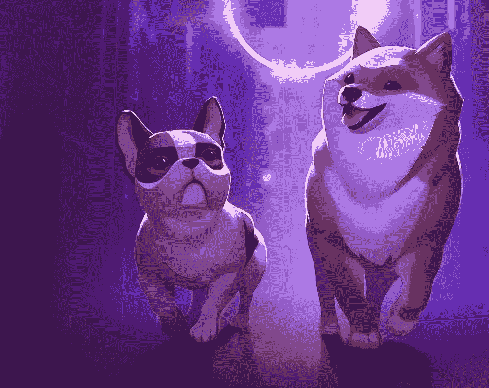

# Dogami —花瓣形

> 原文：<https://medium.com/coinmonks/dogami-petaverse-9b4b7edaef55?source=collection_archive---------38----------------------->

还记得 Tamagochi——一只来自过去的数码宠物吗？或许，这种在今天看来相当原始的玩具的流行，在于可以领养一只宠物，甚至对于那些无论什么原因都无法领养的人来说。

例如，许多人喜欢狗，但很少有人有足够的时间和宠物在一起，并能够创造一切必要的条件来照顾它们。很快这个问题就可以被一个相当逼真且色彩丰富的 petaverse——Dogami 解决了。

玩家(Dogamers)可以领养虚拟狗，玩游戏，和别人比赛。它将有可能通过增强现实使用 Dogami 应用程序与宠物互动，适用于 iOS 或 Android 上的任何类型的智能手机。

据开发者称，Dogami petaverse 路线图包括土地销售和狗杂交的实施——将有机会从两个虚拟宠物 NFT 中随机选择性别，铸造一只新的小狗 NFT。

这款游戏是基于 Tezos 区块链开发的，它提供了低汽油费、快速的数据处理，并且正如开发者所保证的那样，清洁的 NFTs——由于采用了最节能的区块链技术，碳足迹非常低。petaverse '$DOGA '的实用令牌可用于饲养您的狗、购买活动门票、消耗品和创建您的数字衣柜，在市场上购买虚拟配件和奢侈品，如帽子、斗笠、大学运动夹克、头巾、床、床枕、帽衫和皮带包。

顺便说一下，美国全球服装和配饰零售商 Gap Inc .与 Dogami 合作，在 petaverse 推出了首次时装合作。游戏中的每一件物品都可以为你的虚拟宠物创造出独特的风格。

当然，值得一提的是 Dogami 的先玩后赚概念。你可以通过完成每日挑战赚取“$DOGA ”,并在连续多日的游戏中获得奖励。收入的多少很大程度上取决于你的游戏级别——在 1 级时，你每天最多只能赚 5 $DOGA，但到了 10 级，你就可以赚到 50 $DOGA 了。

9 月 14 日，前 100 名 Dogamers 获得了参与游戏早期阶段并支持 Dogamí开发的机会。

尽管 Dogami 尚未完全推出，但它已经获得了大量的关注和积极的反馈，因为这个游戏的主题拥有大量的观众。在这种情况下，你只能想象猫元宇宙的潜力！

> 交易新手？试试[加密交易机器人](/coinmonks/crypto-trading-bot-c2ffce8acb2a)或者[复制交易](/coinmonks/top-10-crypto-copy-trading-platforms-for-beginners-d0c37c7d698c)