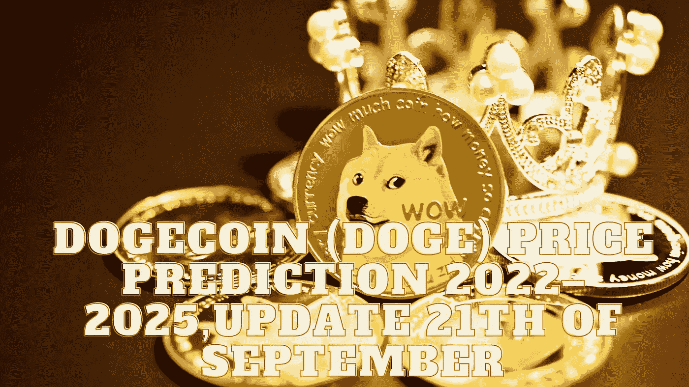

# DOGE coin(DOGE)2022–2025 年价格预测，9 月 21 日更新

> 原文：<https://medium.com/coinmonks/dogecoin-doge-price-prediction-2022-2025-update-21th-of-september-dcc9d56a611a?source=collection_archive---------14----------------------->

Source photo Unsplash.com

# 什么是 Dogecoin (DOGE)？

Dogecoin 于 2013 年 12 月 6 日发布，是一款以初学者为设计理念的加密货币。它是由几个钱包和交易平台支持的莱特币的分叉。它的主要用途是购物，最近，它也作为一种小费而受到欢迎。对…有用