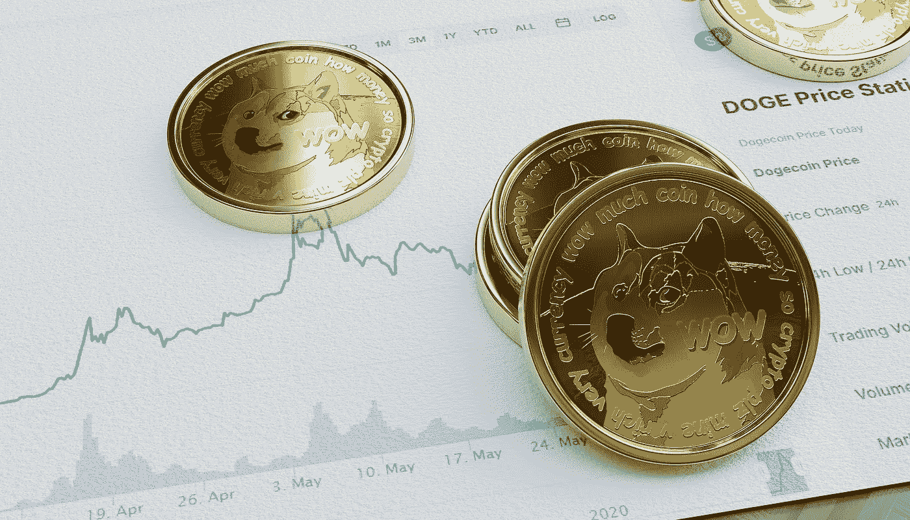

# DOGE coin(DOGE)2022–2025 年价格预测，11 月 2 日更新

> 原文：<https://medium.com/coinmonks/dogecoin-doge-price-prediction-2022-2025-update-2nd-of-november-d7f817e4f23b?source=collection_archive---------15----------------------->

Source photo [Dogecoin Coins Cryptocurrency — Free photo on Pixabay](https://pixabay.com/photos/dogecoin-coins-cryptocurrency-6363104/)

## Dogecoin (DOGE):什么事？

Dogecoin 于 2013 年 12 月 6 日开发并发布，是一种幽默、平易近人的加密货币。它是在莱特币分叉时创建的，现在在大量钱包和市场中被接受。它的主要应用是购物，最近，它也作为一种…