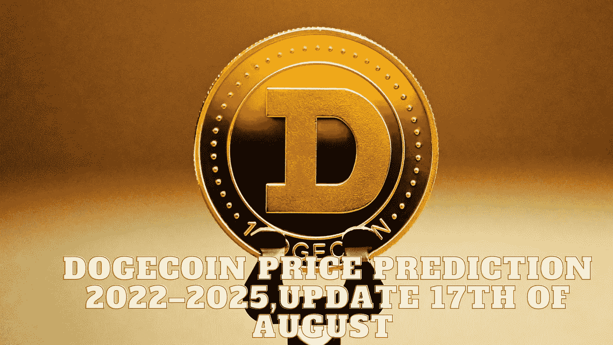

# DogeCoin 价格预测 2022–2025，8 月 17 日更新

> 原文：<https://medium.com/coinmonks/dogecoin-price-prediction-2022-2025-update-17th-of-august-bf9a9ba262ab?source=collection_archive---------31----------------------->

Source photo Unsplash.com

# 什么是 Dogecoin (DOGE)？

Dogecoin 于 2013 年 12 月 6 日发布，是一款以初学者为设计理念的加密货币。是被钱包和交易平台广泛接受和支持的莱特币的一个分叉。付款处理是主要用途，而小费近年来变得越来越普遍。作为一种展示的方式…