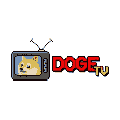
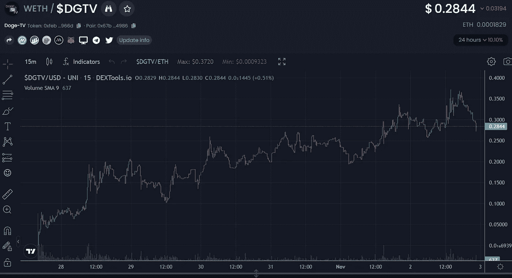
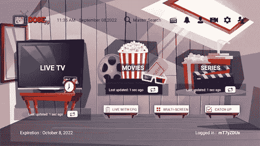

# DogeTV 现在是一个东西

> 原文：<https://medium.com/coinmonks/dogetv-is-now-a-thing-a9eb71ad4eb6?source=collection_archive---------6----------------------->

Dogecoin 本周脱链，并随之点燃了迷因经济。你可能已经明智地问过自己，“我怎样才能受益？”

显而易见的答案是，你可以买 Dogecoin，交叉手指，相信未来三个月的宏观经济会比过去三周的宏观经济更好。如果全球各地的好消息(甚至只是稍微好一点)进入冬季，你很可能会从本周的 Doge 涨势中看到一些利润。

另一方面，有一种 ETH token 有着熟悉的名字和独特的概念，在不久的将来可能会比 Doge 从自己的上涨中受益更多。我说的是 DogeTV。是的，这是一件真实的事情，让代币持有者能够真正接触到真正的按次付费活动、流行的流媒体服务、国际体育赛事和所有不同消费者价位的传统有线电视产品。

除了获得更低成本的家庭娱乐账单，DogeTV 计划拍卖其 NFTs，这将代表订阅费的收入份额。如果这项服务被证明对人们来说是一个可行的选择，早期购买者实际上可能最终会因为看电视而获得报酬。

Snapshot taken at 4:43 a.m. UTC Thursday, Nov 3, 2022

Snapshot taken at 4:54 a.m. UTC Thursday, Nov 3, 2022

# **好人**

对于 DogeTV token 来说，这是一个不错的第一周。价格已攀升至每枚 0.30 美元，市值达到 300 万美元。他们刚刚在[钱币市场上市](https://coinmarketcap.com/currencies/doge-tv/)。他们的电报充满了对 moonshot 的兴奋，但使 DogeTV 区别于所有其他代币的 99.9%的是用户/持有者在实际使用代币提供的服务时的参与程度，代币提供的服务与他们的日常生活融为一体。仅仅基于卓越的服务提供，它的小用户群似乎已经对 week old 服务产生了好感。

# 坏消息(包括许多没有根据的猜测)

目前，DogeTV 征收 8%的交易税。当你购买、出售或转移到另一个钱包时，你会损失当前代币价值的 8%(所以，至少不要做最后一件事)。他们的[网站](https://dogetv.app/)对税收的解释是:

*“所有交易将产生 8%的税收，其中 2%分配给流动性池，6%分配给项目钱包，项目钱包将用于支付营销费用，以将 DogeTv 推向更高的高度，并用于 DogeTv 平台的进一步开发和维护，确保我们的持有人获得专业品牌的精英服务。”*****发布后注意:目前撰写本文时的税率仅为 6%。***

我总是说要从代币的买卖行为之外寻找资金进入项目，因为这些计划是不可持续的。幸运的是，DogeTV 可能有这样的收入来源来抵消代币购买量的需求，代币购买量会更快地被合同销售给市场所抑制。但是，每个项目都必须从某个地方开始，随着收入从合同功能之外进入，DogeTV 似乎准备将这些税收下调。这一点已经在 Telegram group 中讨论过，有人猜测，契约税函数被编码为只下降，永远不会超过 8%(对我来说听起来很可疑，因为我认为代码可能会被更改)。

这就把我们带到了下一个不好的地方。可能是拉地毯。如果开发者的蜜罐或黑名单钱包出售和/或做所有我们听说过的发生在人们身上的邪恶事情，或者成为我们自己的受害者，会怎么样？嘿，是 crypto。审计是要花钱的，由专业人士完成的可靠的审计如今可以得到很好的支持。该合同目前尚未审核，但据机构群体了解，其中一项正在进行或即将进行。谁将进行这样的审计还没有公布。调查 DogeTV 购买必须要有清醒的头脑，要知道你可能会失去你投入的一切，但这对于世界上每一周的低市值宝石都是一样的。同样，审计需要时间和金钱，开发人员必须始终考虑到他们将需要做出改变，以微调合同功能内的某些内容，在 DogeTV 的情况下，开发人员可能会降低税收，因为收入涵盖了运营成本。

# **月亮**

从目前的图表来看，DogeTV 并没有看到我们在选择从我们的加密月球照片中获利时所期待的抛物线状活动高峰。事实上，CMC 的上市目前似乎已经不为人知，DGTV 可能会在进入太空之前进行最后一次收购。当然，宏观环境仍然适用。总督需要守住防线，世界不能陷入混乱。代币失败总是有原因的，但是承担适当的风险是整体失败的关键。我看不到任何迹象表明$DGTV 上涨势头已经见顶。恰恰相反。鉴于利润分成杀手级应用程序加密电视服务这一独特且目前正在运作的产品，它可能有很大的上升空间。在网站上已经做了一些坚实的建设和证明，用户对这项服务的报告是积极的。这缩小了负面的潜力，并提高了积极的几度，与本周推出的典型合约相比。

访问 mooniemoonstein.com查看 PDF 版本的 Up Only。

 [## 如何登月而不死交易加密数字 pdf 版

### 编辑描述

www.mooniemoonstein.com](https://www.mooniemoonstein.com/product-page/copy-of-copy-of-how-to-moon-and-not-die-trading-crypto-digital-pdf-edition) 

> 交易新手？试试[加密交易机器人](/coinmonks/crypto-trading-bot-c2ffce8acb2a)或者[复制交易](/coinmonks/top-10-crypto-copy-trading-platforms-for-beginners-d0c37c7d698c)