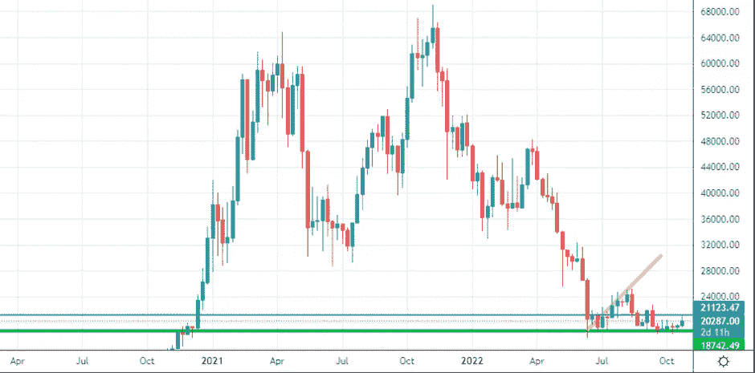
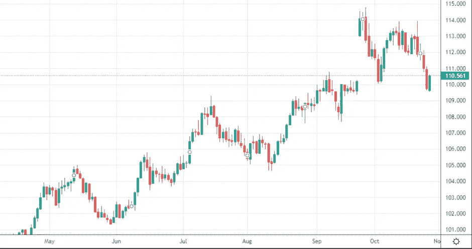
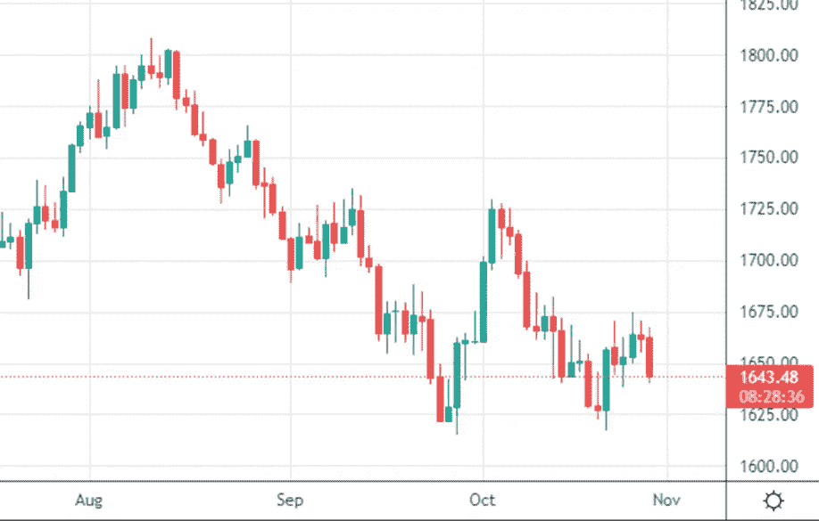
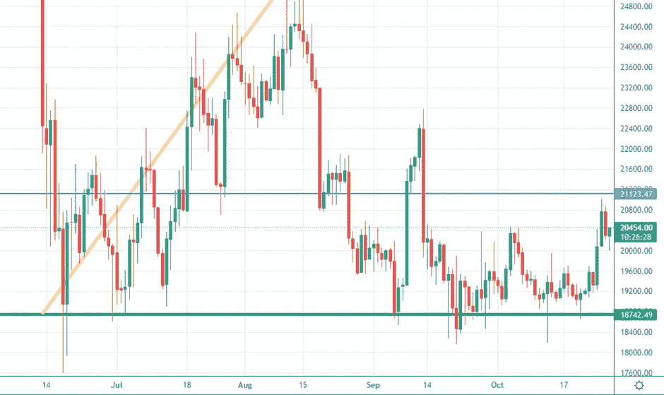
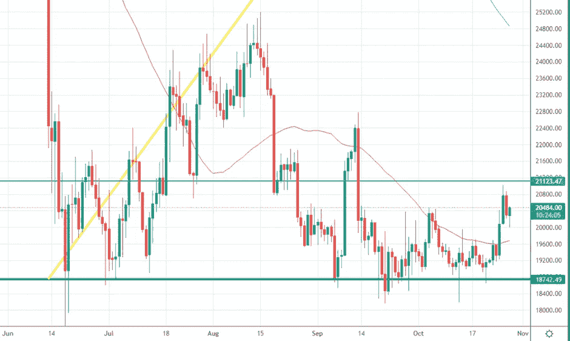
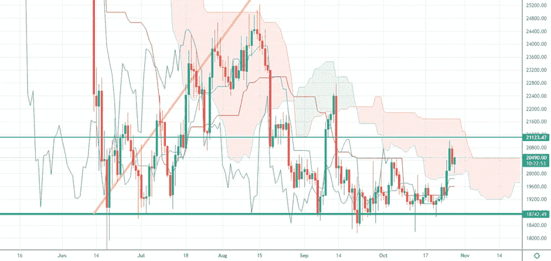

# 美元货币指数 DXY 下跌和我的狙击分析

> 原文：<https://medium.com/coinmonks/dollar-currency-index-dxy-drop-and-my-sniper-analysis-fdadf21e4b3d?source=collection_archive---------20----------------------->

我们将进入什么样的市场阶段一直是我们上次约会的开场白问题。我们要听牛市还是熊市？我们会看到牛市还是熊市？
欢迎来到“市场冲浪”,我们已经进行了第 26 次约会，我希望通过这些简单的技术分析，我们已经在某些方面帮助了你，甚至只是评估不同的市场观点。

让我们从我们通常的每周视角开始

Weekly Chart — Source: Tradingview

价格已经从绿色支撑上起飞，两天后将触及蓝色阻力，看到一些回调，主要与 DXY 的恢复有关，一些人获利了结。

经过三天的广泛疲软后，价格受到了美元货币指数的强烈反应。

DXY 疲软的第一天是 10 月 21 日星期五，当时比特币价格没有表现出太大的反应。我认为这是因为 DXY 图上的熊市吞没可能是一个简单的虚假波动。
周一，多奇在 DXY 上出现了一个小蜡烛体，而 BTC 和那里发生了一场真正的比特币熊市。
周二 25 日和周三 26 日是 DXY 的爆发日，DXY 打破了 10 月 4 日和 5 日的最新最小值，比特币向蓝色阻力跃升。
周三晚上，当比特币价格徘徊在 20.800 美元时，我在一次公开交易教育会议上发短信说:“我正在卖出 BTC 的一部分，试图以更低的价格获得一些利润，购买更多的比特币。这是一个高风险/高回报的职位。较低的风险/较低的回报将在明天等待，看看价格将如何表现，如果运动将继续向上或我们将看到下跌，进一步获利了结和 DXY 指数的潜在看涨反应”。嗯，实际上我两个职位都拿了。这就是我所做的

我将继续引用我自己的话:
“如前所述，在我个人看来，如果出现重大坏消息，如巨大的电力危机、移动网络危机或来自俄罗斯的天然气限制，比特币价格只能跌至 15000 美元。”

Source: Screenshot on a D-TimeFrame of the Dollar Currency Index

Source: Screenshot on a D-TimeFrame of Gold ($/oz)

黄金也与 DXY 完全相关，这意味着比特币的上涨也不完全是资产本身的价值，但它更有可能与更广泛的金融时刻有关。

## **从日常角度来看，我期望什么？**

Daily Chart — Source: Tradingview

我们现在在这个区域看到一些不确定性，但是交易量仍然在这里，仍然有一些能量可以导致价格在未来几天突破蓝线。无论如何，今天是周五，这意味着在周末我们应该期待更低的交易量，周一美国股市开盘时会有更大的推动力。

Daily Chart — Source: Tradingview

50MA 和 200MA 给价格的阻力相当于黄油给热刀的阻力。这里没有消息。

Daily Chart — Source: Tradingview

市云已经被价格穿透，我们现在已经接近云层的水平，未来几天。

## 有什么特别要注意的？

我认为蓝色水平是短期趋势的潜在转折点。

我最近收到一个问题，美元和加密市场是否受到 CBE(欧洲中央银行)利率上升的影响。

以下是我对此事的两点看法:“自上周五 CBE 昨日正式宣布加息以来，加密市场几乎没有对 BCE 和美元的利率进行测试，这意味着没有直接的相关性。”

让我知道你对这个新的每周约会的想法，以及你希望更多地考虑(或甚至解释)哪些指标。

请继续关注，当我的内容出来时，请务必关注。

## 促销建议

还有一点:如果你真的不关心技术分析，或者你不喜欢花时间在市场上，一定要去看看 [Zignaly](https://zignaly.com/app/signup/?invite=mikezillo) 平台，这是一家币安官方经纪合作伙伴，管理着大量的交易量。他们提供很好的利润分享交易服务，你可以模仿其他专业交易者，与他们分享利润！一定要给个眼神！

如果您有兴趣提前了解我们合作伙伴的指标发布情况，请在此留下评论，以便我们了解您是否有兴趣！

> **我写的任何东西都不能代表任何形式的财务建议。所以，在采取任何行动之前，先做好自己的研究。**

> 交易新手？尝试[加密交易机器人](/coinmonks/crypto-trading-bot-c2ffce8acb2a)或[复制交易](/coinmonks/top-10-crypto-copy-trading-platforms-for-beginners-d0c37c7d698c)