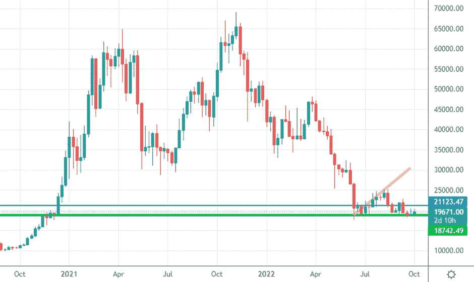
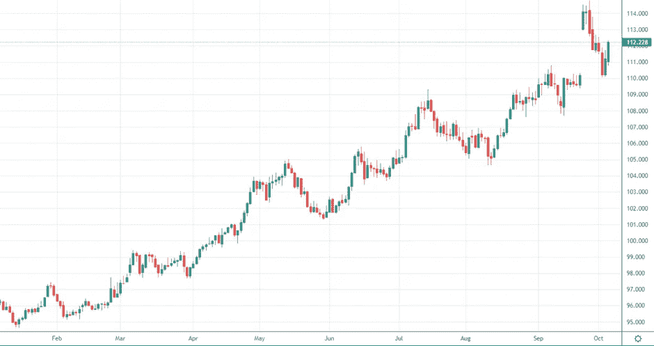
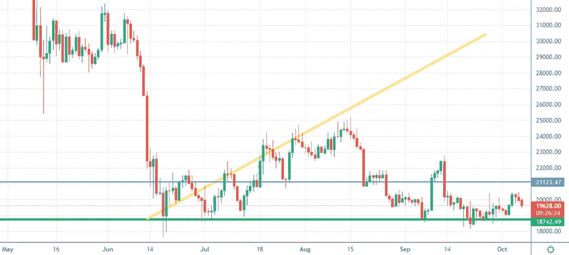
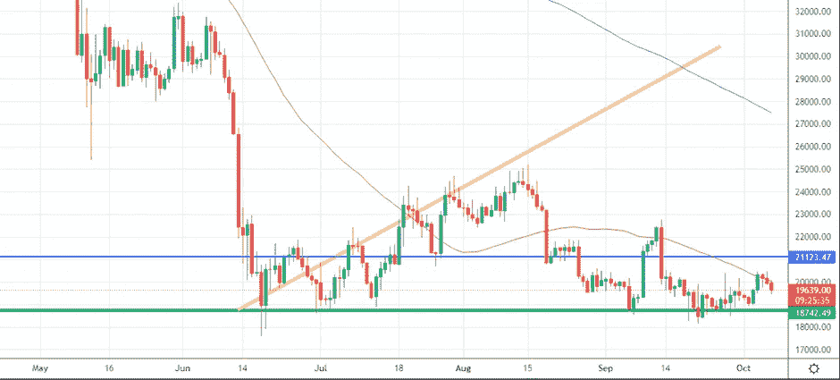
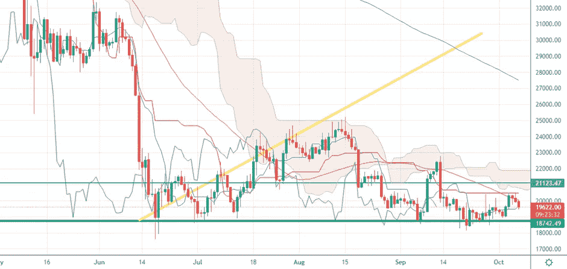

# 美元货币指数显示强势，比特币遭遇反弹

> 原文：<https://medium.com/coinmonks/dollar-currency-index-shows-strength-and-bitcoin-suffer-a-bounce-back-a851f2a58f11?source=collection_archive---------18----------------------->

我们将进入什么样的市场阶段一直是我们上次约会的开场白问题。

> 我们要听牛市还是熊市？
> 
> 我们会看到牛市还是熊市？

欢迎来到市场冲浪，我们已经进行了第 23 次约会，我希望通过这些简单的技术分析，我们已经在某些方面帮助了你，甚至只是评估不同的市场观点。

# 让我们从我们通常的每周视角开始

Weekly Chart — Source: Tradingview

价格再次测试了仍然作为支撑的绿线价格区域。从上周的分析来看，我认为这个演讲仍然有效，也看到了核攻击和更糟糕的威胁。

> **如前所述，我个人认为，如果出现重大坏消息，如巨大的电力危机、移动网络危机或俄罗斯的天然气限制，比特币价格只能跌至 15000 美元。**

Screenshot on a D-TimeFrame of the Dollar Currency Index

美元强势指数已经大大恢复了之前的几根蜡烛线，我们仍然可以看到美元货币指数和比特币之间强烈的反相关性。

*你知道为什么我的交易目标是获得高于 0.003 BTC 的 BTC 吗？请在评论中给出你的答案。*

## **从日常角度来看，我期望什么？**

Daily Chart — Source:Tradingview

比特币价格不断逼近绿色水平，但美元指数不允许它喘息。
目前来看，我还是保守看涨。

Daily Chart — Source: Tradingview

就像我一周前写的那样，50MA 充当了一个阻力，使得价格反弹，加上美元货币指数的作用。

Price 曾试图接近云，但从我之前提到的两个方面来看，它都遭到了拒绝，并且未能实现云。

Daily Chart — Source: Tradingview

## **特别观察什么？**

我们仍然在一个不稳定的范围内，所以我会等待采取进一步的立场！但如果信号保持稳定，我将(再次)略微乐观。我现在做的是最多持有几个小时的短期头寸。

我正在等待蓝色级别的突破，以看到更多的向上运动。

让我知道你对这个新的每周约会的想法，以及你希望更多地考虑(或甚至解释)哪些指标。

请继续关注，当我的内容出来时，请务必关注。

## 促销建议

还有一点:如果你真的不关心技术分析，或者你不喜欢花时间在市场上，一定要去看看 Zignaly 平台，这是一个币安官方的经纪合作伙伴，管理着大量的交易量。他们提供很好的利润分享交易服务，你可以模仿其他专业交易者，与他们分享利润！一定要给个眼神！

如果您有兴趣提前了解我们合作伙伴的指标发布情况，请在此留下评论，以便我们了解您是否有兴趣！

> 我写的任何东西都不能代表任何形式的财务建议。所以，在采取任何行动之前，先做好自己的研究。

> 交易新手？试试[密码交易机器人](/coinmonks/crypto-trading-bot-c2ffce8acb2a)或者[复制交易](/coinmonks/top-10-crypto-copy-trading-platforms-for-beginners-d0c37c7d698c)