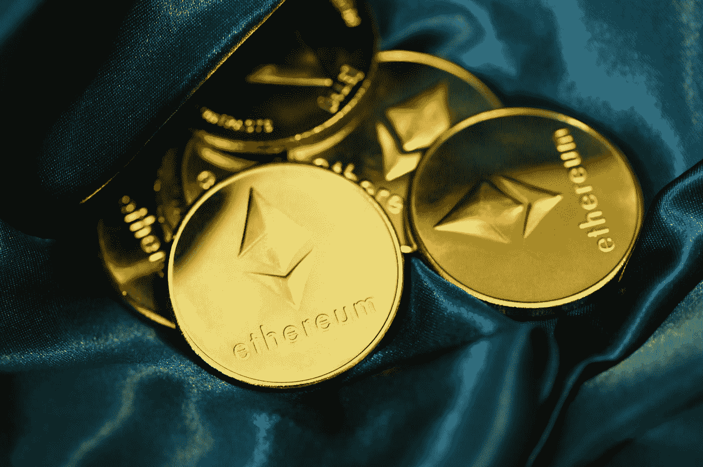

# 不要被骗了。区块链仍然是中央集权的。

> 原文：<https://medium.com/coinmonks/dont-be-fooled-blockchains-are-still-centralized-7181fb98fc4f?source=collection_archive---------19----------------------->

Photo by [Quantitatives](https://unsplash.com/@quantitatives?utm_source=medium&utm_medium=referral) on [Unsplash](https://unsplash.com?utm_source=medium&utm_medium=referral)

没有听到“去中心化”、“权力在每个人手里”、“你不必相信任何人”这个词，很难谈论区块链但这是真的吗？大概不会。

要实现真正的去中心化，系统的每一部分都必须去中心化。有很多所谓的“去中心化”的区块链，它们根本不是真正的去中心化。