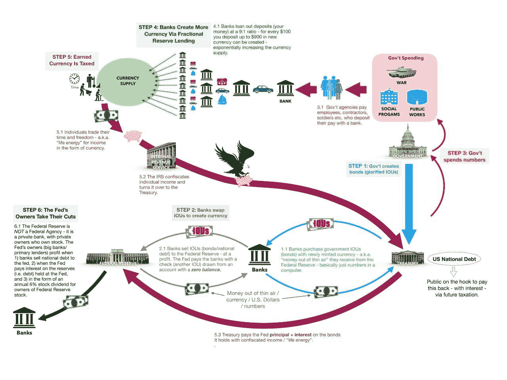

# 不要为避税而难过

> 原文：<https://medium.com/coinmonks/dont-feel-bad-about-avoiding-taxes-6d356abe939?source=collection_archive---------16----------------------->

From: [https://twitter.com/iTruth84/status/1414997328071561216/photo/4](https://twitter.com/iTruth84/status/1414997328071561216/photo/4)

周末我会见了一些朋友，他们大多数是自由职业者，所以我们的话题之一是关于纳税。这次谈话提醒我，在法定货币的现代时代，虚假税收实际上是如何运作的。"为什么政府向我们征税，而这些钱是它自己可以印刷的？"这是因为税收只是政府最大的庞氏骗局的一部分，但却是非常关键的一部分。这是一个让银行和社会精英受益的庞氏骗局，与我们将税收视为财富再分配机制的观点相反。让我试着尽可能简单地把它分解，希望到最后，你不会因为逃税而感觉很糟糕！

首先，这是我们大多数人认为税收如何运作的过于简单但严重不完整的画面:国家拿走我们的钱，并用它来支付公共产品和服务。在法定货币出现之前，情况可能是这样，但自从我们采用了基于债务的货币体系后，情况就不再是这样了。国家借钱支付公共产品和服务；它不重新分配收集的钱。

这些钱是通过发行债券或借条(字面意思是“我欠你的”)从银行借来的，无论是私人银行还是国有银行。对银行来说，这只不过是一种会计伎俩，它们接受这种做法作为抵押品，只是因为有政府会偿还的承诺。这就是我们税收的来源，税收只是为了偿还债务及其利息。所以，不，你实际上不是在付钱给政府，你是在付钱给贷款给政府的银行！

骗局还在继续，白条随后被银行使用。你看，白条构成了银行自身债务发行的另一面，因为银行在一个被称为“细分储备贷款”的系统中创造了更多的货币。这基本上就是说，对于银行发行债券时创造的每一单位货币，它只需要在国库中拥有其中的一小部分。这有点像买一送一，只不过银行金库里的钱不是真的钱，而是以借条形式存在的政府债务。

换句话说，银行可以购买的政府债券越多，银行可以印的二合一钞票就越多。政府不印钱，他们发行债务，让银行可以印钱。除了猜猜谁最先得到银行新印的钞票？你猜对了:银行！这些新创造的资金被投入到他们自己的企业以及他们已经持有股份的其他资产和房产中，推高了它们的价格，让派对继续下去。你可能知道这是通货膨胀。

因此，如果整个过程从政府债务开始，那么银行的游戏就很简单:我们需要政府增加支出，这样它就能借更多的钱。因此，这个政权，在这里指的是私人和政府利益之间的邪恶联盟，利用媒体和宣传(它控制的)，为政府支出提出越来越多的存在主义理由。有趣的事实:这整个腐朽的系统最初被认为是对战争的回应，当然是“最崇高的事业”，然而却被鼓励为精英阶层的利益而发生。今天，我们为这一盗窃辩护的理由远没有那么高尚，但却越来越多。

但是这些问题难道不是真实存在的，政府不应该解决吗？我不会说这些问题纯粹是捏造出来的，但这些问题出现得越糟糕，政府就获利越多。猜猜谁在出售这些被夸大的问题的解决方案？你又猜对了:银行！(或者至少是银行拥有的企业)。与此同时，这在菲律宾非常明显，老实说，我很震惊我们是如何忍受这种错觉的，这些钱甚至没有花在解决方案上，而是直接被政客和官僚们装进了口袋。你可能知道这是腐败。

让我们回顾一下。该政权利用一个问题大肆宣传；然后解决问题，政府向银行借钱，为银行提供的解决方案买单；然后银行收到借条，用它来创造新的法定货币；然后，银行用这些新的钱来提升他们的资产，并对公众意识施加力量和影响；最后，以税收形式对公众及其所有后代进行理论上永恒的债务奴役，只不过是建立在整个庞氏骗局基础上的一种幻觉。好消息是——你已经知道了——比特币解决了这个问题。哈哈哈！

—

*这种对现代资本主义的批判来自奥地利经济学家。我的比特币社区将于下周三(9 月 7 日晚 9 点)在 Lex Fridman 的节目中进行播客讨论，由奥地利经济学教授 Saifedean Ammous 主讲。请加入我们和其他东南亚&菲律宾对比特币好奇的人，这是完全免费的，我们在这里一起学习！邀请链接:【https://discord.gg/XvxYuS2WF6】*