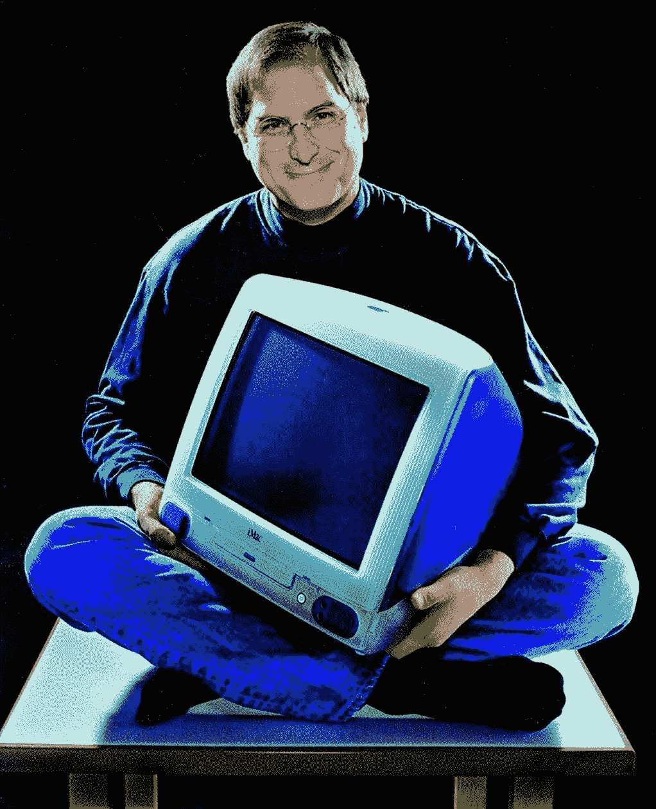

# 不要对创业公司失去信心。

> 原文：<https://medium.com/coinmonks/dont-lose-faith-in-startups-ec66f0c90a92?source=collection_archive---------35----------------------->

Steve Jobs founded Apple in 1976 and literally changed the world there after.

如果你不相信创业公司，你就不相信创新。

如果你不相信创新，你明天就不会有进步的地方。

我们在成功商业领域看到和听到的一切，都源于人们的创造。

创造，建造，构造，设计，做一些事情来表现别人无法察觉或者根本不想要的东西。

坚持自己的信仰，即使面对批评和嘲笑。

不仅仅是坐以待毙。

愿意去战壕弄脏自己的手。

为值得解决的问题建立解决方案。

他们愿意为了更好的明天而冒一切风险。

它不仅仅是十亿美元的估值，嬉皮士的合作工作室和浮华的头条新闻。

很简单，他们想要改变。

这是许多人追求的心态，但很少有人真正采纳。

当然，创业公司在过去的几十年里已经采取了多种形式。

并不是所有的都光彩照人，有些失败了，有些则是彻头彻尾的骗局。

我们已经对初创公司不再敏感。

> 交易新手？试试[加密交易机器人](/coinmonks/crypto-trading-bot-c2ffce8acb2a)或者[复制交易](/coinmonks/top-10-crypto-copy-trading-platforms-for-beginners-d0c37c7d698c)

当然，对于每一个史蒂夫·乔布斯和布莱恩·切斯基，我们会得到一个伊丽莎白·霍姆斯和多姆·霍兰德。

Domm Holland burned through more than $165 million in venture capital funds only for his business to collapse.

但是不要让少数黑羊玷污了整个群体。

创业公司是希望。

他们代表真理。

每天，创业公司都在挺身而出，不顾艰难险阻，为自己的信念而奋斗。

纯粹而简单。

创业公司是组成我们今天看到的一切的原子。

我们所拥有的一切都来自某个人，某个地方，从零开始。

即使是今天最大的公司也可以追溯到几十年前的小公司。

我们今天喜欢使用的所有最好的工具和技术都源于创业想法。

我们只有那碗美味的一碗面，因为几十年前在日本，店主决定开办自己的拉面摊。

我们只有 FaceBook，因为马克决定启动一个“热或不热”的克隆来排列朋友。

Mark Zuckerberg in 2005, talking about FaceBook long before it became a multi-billion dollar unicorn.

我们只有优步，因为特拉维斯厌倦了在街上打车，想要去一些地方享受贵宾待遇。

问题不会自己解决。

初创公司解决问题(至少是好的问题)。

我们应该一直培养和鼓励创业。

不要对创业公司失去信心。

如果你喜欢这个，和我联系。

-

你相信创业吗？

-

#创业#商业#创业#创业故事#创业#激情#动力#成功#社交媒体#文化#创业#战略#创新#创业