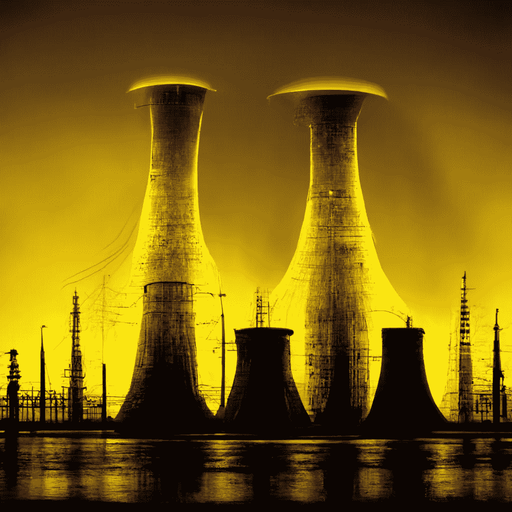
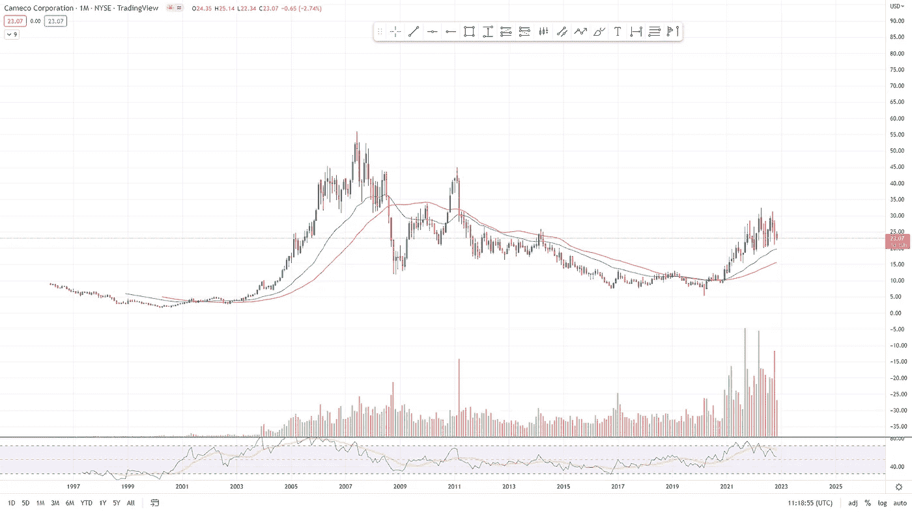
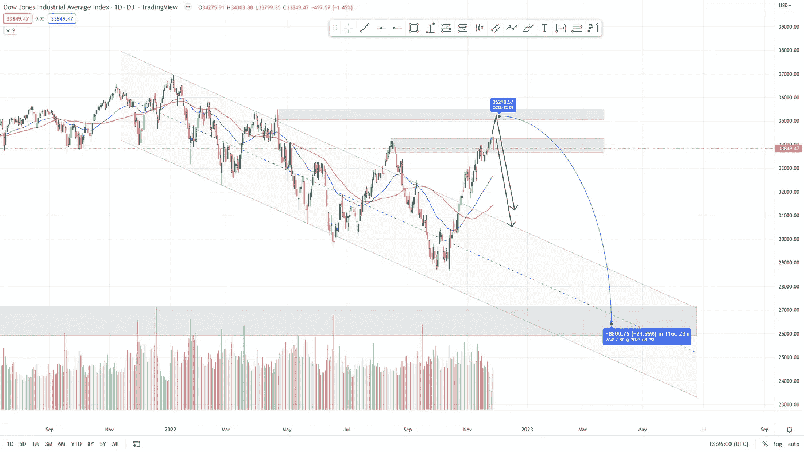
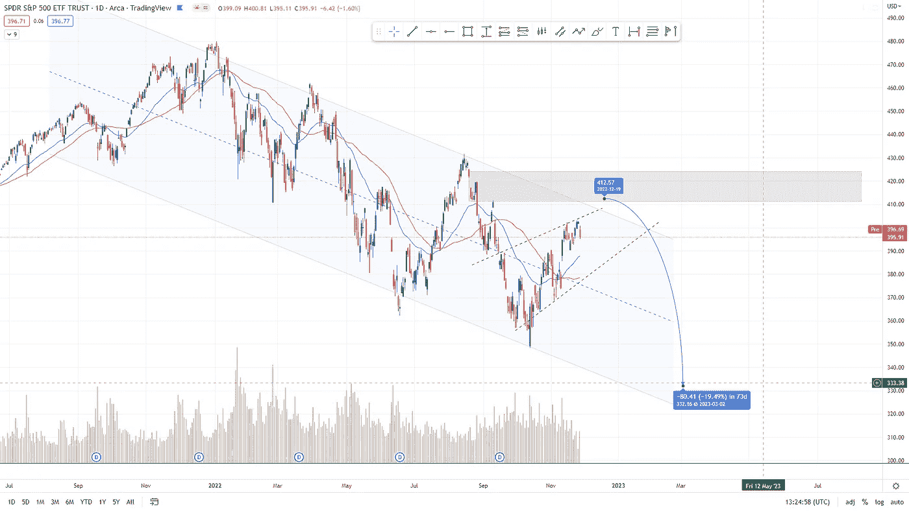
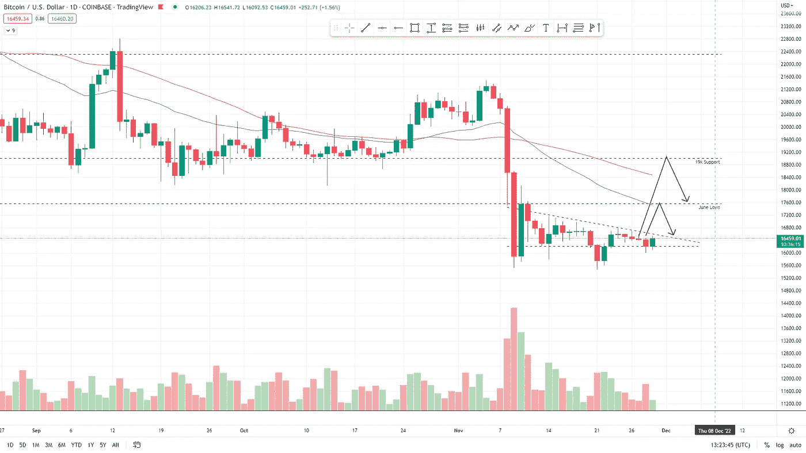

# 不要错过…衰退时期为投资者创造了被忽视的金融机会

> 原文：<https://medium.com/coinmonks/dont-miss-out-recessionary-times-create-overlooked-financial-opportunities-for-investors-839f65b028c1?source=collection_archive---------45----------------------->

# 在本周的报告中

*   未来一周展望。
*   年初至今出现的最佳可行市场机会。**铀**。
*   **US30** 价格分析。
*   **S & P 500** 价格分析
*   **BTC** 价格分析。

‍

# 本周股票市场有什么可期待的

‍

在过去的几周里，我们看到了市场的大幅反弹。

‍

除了由于 FTX 局势导致的主要加密货币崩溃，大多数市场都出现了广泛的反弹。

‍

随着包括 CPI、PPI 和美国失业率在内的众多经济指标出现正数，投资者在整个 10 月和 11 月对过去的前景恢复了积极的看法。

‍

过去几周，随着 12 月份的到来，几乎没有高影响力的经济指标公布，更多的经济数据即将公布。

‍

考虑到这一点，如果美联储决定继续加息，这在当前的经济状况下看起来肯定是正确的策略，我们可以看到大幅波动和近期反弹的回调。

‍

目前美国 30 指数/道琼斯工业平均指数的反弹创下了 40 年来最快和最高的反弹记录。回调似乎是必要的。
‍

‍
尽管回调是必要的，但如果美联储发布更多积极的经济数据，反弹的延续将是可能的结果。

‍

经济数据仍然是市场走向的核心。

**即将公布的高影响力经济数据包括:**

*   美国 PCE 指数，12 月 1 日。
*   美国失业率，12 月 2 日。
*   美国核心生产者价格指数，12 月 9 日。
*   美国消费者物价指数，12 月 13 日。
*   美国 FOMC 经济预测，12 月 14 日。
*   美国联邦基金利率，12 月 14 日。

‍

# 铀储备分析

‍

铀。核反应堆。
‍
‍

太多了，这些话听起来很消极。

‍

但是对其他人来说，这些词和这些概念暗示了一代人的机会。

‍

随着 2000 年代末福岛事件的发生，所有铀矿公司和铀股遭到大规模抛售。

‍

一个常见的误解是，核反应堆是有害的，事实上，它们是目前世界上最清洁的能源供应形式之一。

‍

这种误解很大程度上是由于将核武器和核能以及核裂变能量供应混为一谈。

‍

这些事件导致全球许多核反应堆被拆除，其中一些只是在去年才被关闭。

‍

例如，德国的核电占了 2021 年德国电力供应的很大一部分，由六个电厂产生。
‍

‍
2021 年底，这些电厂中的三个被关闭。

‍

根据 2011 年完成的核电淘汰计划，另外三座核电站将于 2022 年底停止运行。

‍

这个“逐步淘汰核能计划”对全球社会有害无益。

‍

为什么？

‍

由于核能发电的“有害影响”,德国已努力停止其所有的核电站，并从此完全依赖俄罗斯的天然气和石油，这使得德国和许多欧洲国家更容易受到我们目前所处的情况的影响。

‍

许多试图继续探索核电站及其全球潜力的政治家批评了“逐步淘汰核能计划”。

‍

同样是这些政客批评了拆除这些核电站的危险，以及让这些欧洲国家依赖俄罗斯天然气和石油的危险。这是“逐步淘汰核能计划”的一个可预见的明显结论。

‍

那么铀和这个有什么关系呢？

‍

嗯，铀是核裂变的核心，核裂变是一个原子核分裂成两个或更多更小的原子核的反应。

‍

这就是核电站产生能量的过程。

自 21 世纪头三年深岛崩盘以来，铀价格在过去三年里出现了大幅反弹。并且正在形成一个很大的突破形态，有很多原因可能会爆发(见图 1)。

尤其是当各国开始意识到在全球范围内废除死刑所犯的严重错误时。

‍

中国计划在未来几年建造 50 多座核电站，更确切的计划是每年建造 12 座以上的核电站。

‍

当所有这些核电厂运行时，将需要大量的铀。

‍

中国已经与 Cameco Corporation (CCJ)达成协议，该公司是一家铀矿开采公司，将在未来几年购买其大部分铀供应。

‍

考虑到中国的持续需求，铀需求将会很大。

免责声明:不是财务建议，只是综合观察。

*图 11m CCJ 1996–2022(trading view)*

‍

> [*今天就获取我们的免费电子书吧！按这里！*](https://www.boomish.org/free-e-books)

# 美国 30 / DJIA 分析

道琼斯工业平均指数(DJIA)也就是美国 30 指数一直表现良好，事实上，在过去的几个月里创下了历史新高。

‍

看起来是时候回调了。但在不断公布的良好经济数据中，回调仍未出现。

‍

美国 30 指数的走势似乎比以往任何时候都更依赖于纳斯达克 100 指数和标准普尔 500 的走势，这两个指数在过去两个月中不如美国 30 指数强劲，而且自各自 8 月份的高点以来尚未创下新高。

‍

US30 已经大大突破了其长达一年的通道，目前位于前期高点的阻力处，目前价格行为上方还有一个前期高点的阻力。

‍

图 2 1D DJIA 1 月至 11 月

# ‍
S & P 500 分析

正如 US30 分析中所述，标准普尔 500 的表现不如 US30，并且尚未创下新高和/或重新测试市场 8 月份的高点。

这些高点也与下降三角的上边界相吻合，S&P500 已经整整跟踪了一年多。

对这些高点进行适当的重新测试似乎是每一种可能的情况，应该是对 US30 空头的警告。

如果 S&P500 在拉回新低之前推动对前期高点的适当重新测试，我们可能会看到 30 美元的上涨。

*图 3 1D S&P500 1 月—11 月(交易视图)*

# 比特币分析

自 6 月至 11 月跌破长达五个月的通道后，比特币发现自己处于新低。

价格行为目前正在形成一个紧缩区间，形成一个下降三角形，预示着新的低点即将到来。

这种情况是否会发生，就像美国 30 国的价格行为取决于 S&P500 的价格行为和将于 12 月前两周公布的经济数据一样。

由于 FTX 的惨败和其他破产事件，包括加密和比特币贷款机构 BlockFI 本周申请破产，加密市场的整体概况已经相对看跌了许多周。

‍

‍

*图 4 1D 比特币 1-11 月(交易视图)*

[**三篇必读文章
‍
‍**](https://zwobrd.clicks.mlsend.com/te/cl/eyJ2Ijoie1wiYVwiOjExMjYzMSxcImxcIjo3MzExNjMwNTY5MjAzNDkxNixcInJcIjo3MzExNjMwNjU0MzQ3ODQ5N30iLCJzIjoiNGUyNjIzYTJkZTE5NjA1ZiJ9)[ftx 怎么了？
‍
‍](https://zwobrd.clicks.mlsend.com/te/cl/eyJ2Ijoie1wiYVwiOjExMjYzMSxcImxcIjo3MzExNjMwNTcwMDQyMzUyNyxcInJcIjo3MzExNjMwNjU0MzQ3ODQ5N30iLCJzIjoiZWYyMTIwN2Q0NDc5MzQ3ZCJ9)

[‍](https://zwobrd.clicks.mlsend.com/te/cl/eyJ2Ijoie1wiYVwiOjExMjYzMSxcImxcIjo3MzExNjMwNTcxMTk1Nzg2OSxcInJcIjo3MzExNjMwNjU0MzQ3ODQ5N30iLCJzIjoiM2ZlOTM2MDJjOWRiNTgxNCJ9)

或者在这里获得我们的免费电子书！\/

 [## 免费电子书

### 我们向公众开放所有的交易工具、交易指南和电子书。我们绝对没有什么可…

www.boomish.org](https://www.boomish.org/free-e-books) 

> 交易新手？尝试[加密交易机器人](/coinmonks/crypto-trading-bot-c2ffce8acb2a)或[复制交易](/coinmonks/top-10-crypto-copy-trading-platforms-for-beginners-d0c37c7d698c) ‍