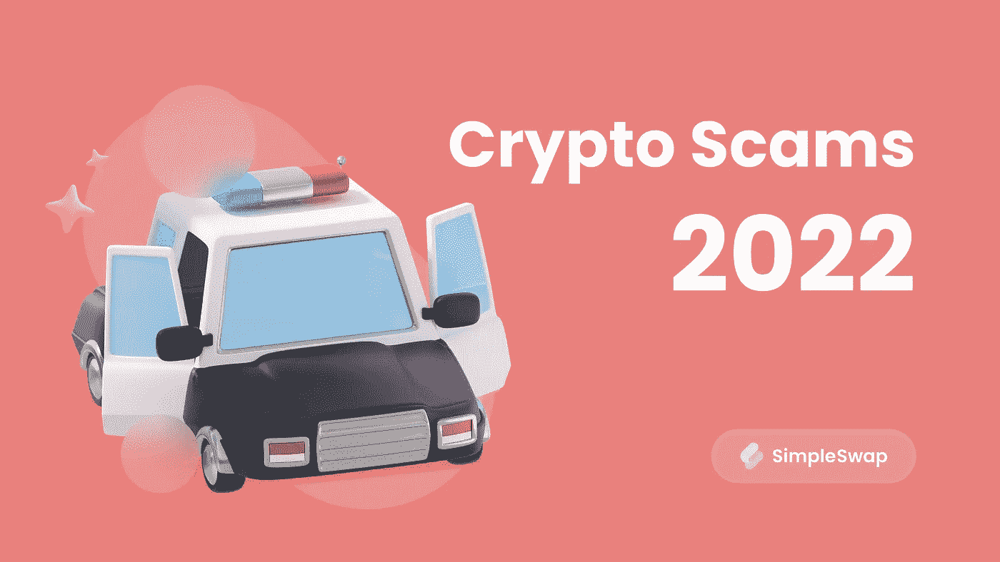

# 别动，这是秘密抢劫！2022 年的加密货币骗局

> 原文：<https://medium.com/coinmonks/dont-move-this-is-a-crypto-robbery-cryptocurrency-scams-in-2022-41775752bfdc?source=collection_archive---------21----------------------->

2022 年在许多方面对加密货币世界来说都是一个挑战。跌宕起伏，一系列惊人的破产，当然还有备受瞩目的欺诈案件。现代黑客越来越关注密码行业。有着黑暗过去的人会忍不住想从万亿市值的馅饼上分一杯羹。今天我们就来聊聊 2022 年最受瞩目的加密货币骗局。系好安全带，我们要开始了！

# “无聊的猴子”的可悲案例

NFT 的一个名为[的无聊猿游艇俱乐部](https://boredapeyachtclub.com/#/)已经成为一个惊人成功的例子。不用说，许多密码爱好者梦想成为这个著名的 NFT 系列的所有者。BAYC 在 [OpenSea](https://opensea.io/rankings?sortBy=one_day_volume) 的顶级收藏中排名第二。

当然，骗子不能只是 camly 通过它。2022 年，他们定期[盗窃](https://twitter.com/BoredApeYC/status/1509770607759540229?cxt=HHwWioCq_cuX5PMpAAAA)昂贵的代币，结果导致 BAYC 和相关藏品损失数百万美元。让我们来看看最臭名昭著的案例:

*   3 月 31 日，Discord 服务宣布 NFT 项目[的服务器被黑客攻击](https://twitter.com/BoredApeYC/status/1509770607759540229?cxt=HHwWioCq_cuX5PMpAAAA)。几乎就在同时，8662 号变种人猿游艇俱乐部不再属于所有者。
*   用户还没来得及回过神来，就在同一个月，该社区的 Instagram 页面被黑了。这导致了一个[网络钓鱼攻击](https://www.trmlabs.com/post/trms-analysis-of-recent-surge-in-discord-hacks-shows-some-attacks-are-connected)，从上当的人那里窃取了总价值 280 万美元的 NFT。
*   五月，知名演员和机器鸡的创造者赛斯·格林成为一场骗局的受害者。这位艺术家一下子失去了四件独家 NFT，包括他收藏中的明珠——8398 号无聊猿。他已经损失了大约 30 万美元。由于这个骗局，格林被迫推迟推出新的喜剧系列“白马酒馆”。因为 NFT #8398 本来应该成为这个项目的主角。后来，这位演员设法以 297，000 美元买下了令牌。
*   6 月初，一次网络钓鱼攻击再次产生了结果。骗子使用了一个标准的方案:一个[黑掉的不和谐服务器](https://fortune.com/2022/06/04/bored-ape-yacht-clubs-discord-server-was-hacked-with-360000-in-nfts-stolen-blame-debated/)和恶意邮件。另一次突袭以 36 张 NFT 失窃告终。可以确定的是，其中有一个 BAYC，两个变种人猿游艇俱乐部代币和一个无聊的猿窝。损失至少价值 36 万美元。

需要注意的是，提到的黑客攻击的事实只是最响亮的插曲。专家们谈论 T4 在 BAYC 和类似收藏品所有者中数百万美元的损失。

鉴于 2022 年还远未结束，NFT 项目应该为持续的攻击做好准备。

# arbix Finance:1000 万美元退出骗局的故事

当谈到垃圾池现象时，许多加密用户开始体验眼睛抽搐。这个犯罪计划包括创建一个与众所周知的数字货币相关联的代币，然后通过 [DeFi](https://simpleswap.io/blog/what-is-defi?utm_source=publish0x&utm_medium=portal&utm_campaign=scams2022) 进行分发。

一旦轻信的交易者将他们的血汗钱投资于一种新硬币，加密货币的创造者就会迅速撤出资金，然后消失。换句话说，骗子从受害者身上“拉出地毯”。结果，用户没有得到承诺的高额利润，反而一无所有。

2021 年底，一个名为 Arbix Finance 的新[产量养殖](https://simpleswap.io/blog/top-cryptocurrency-farming-projects-2022?utm_source=publish0x&utm_medium=portal&utm_campaign=scams2022)平台积极推进。它是在[币安智能链](https://www.bnbchain.org/en)的基础上打造的，甚至通过了 [Certik](https://www.certik.com/projects/arbix) 的验证。Certik 专门从事加密审计，没有发现 Arbix Finance 有任何问题。

该平台以低风险高收益的承诺吸引投资者。正如预期的那样，有足够多的感兴趣的交易者购买了 [ARBX 代币](https://cointelegraph.com/news/certik-identifies-arbix-finance-as-a-rug-pull-warns-users-to-steer-clear)。但是 Arbix 的创造者制造了一个退出骗局。

2022 年 1 月，投资者受到了糟糕的冲击。使用对令牌的[智能合约](https://simpleswap.io/blog/what-is-a-smart-contract?utm_source=publish0x&utm_medium=portal&utm_campaign=scams2022)的访问权限，管理层批准了未经授权的硬币发行。该平台的创建者迅速将 1000 万条 ARBX 发送到 8 个不同的地址。接下来，骗子通过 AnySwap 交易所将硬币转换成以太币，并使用 Tornado.cash 协议清洗资产。当所有人都发现这个骗局时，Arbix Finance 的创始人切断了所有的渠道。

# 火箭人金:价值 10 亿美元的偷来的密码和一枚给朝鲜的核导弹

长期以来，朝鲜黑客一直是无处不在的无形威胁的象征。人们开始到处看到他们，就媒体水平而言，甚至好莱坞的名人都可以羡慕这些家伙。正如我们所知，无风不起浪。

6 月底，和谐平台[被黑](https://www.cnbc.com/2022/06/24/hackers-steal-100-million-in-crypto-from-harmonys-horizon-bridge.html#:~:text=NurPhoto%20%7C%20Getty%20Images-,Hackers%20have%20stolen%20%24100%20million%20in%20cryptocurrency%20from%20Horizon%2C%20a,identified%20the%20theft%20Wednesday%20morning.)。作为骗局的结果，黑客获得了 1 亿美元的加密货币。最大的数字资产盗窃案之一是通过黑入[地平线以太坊桥](https://bridge.harmony.one/busd)实现的。

三家专业公司立即着手调查这起引人注目的犯罪。这些都是数据分析和打击网络欺诈的知名专家:[chain analysis](https://www.chainalysis.com/)、[椭圆](https://www.elliptic.co/)、 [TRM Labs](https://www.trmlabs.com/) 。

这三家公司的员工都得出结论，朝鲜是地平线大桥网络攻击的幕后黑手。更准确地说，这条线索引出了最著名的黑客组织之一——拉扎勒斯集团。专家们在分析了黑客的本质和洗钱的方法后得出了这个结论。

美国国防部[认为](https://www.bbc.com/news/world-asia-60281129)拉扎勒斯集团窃取的所有资金都被用于资助朝鲜的导弹计划。

这是 2022 年三大密码骗局。外面还有更多吗？毫无疑问。你知道哪些有趣的加密欺诈？请在评论中告诉我们！

SimpleSwap 希望您保持安全。 [**在这篇文章中**](https://simpleswap.io/blog/how-to-avoid-crypto-scam-schemes?utm_source=medium&utm_medium=portal&utm_campaign=scams2022) **你可以学习如何避免加密骗局。别忘了，购买或交换加密硬币最简单的方法是使用** [**SimpleSwap 服务**](https://simpleswap.io/?utm_source=medium&utm_medium=portal&utm_campaign=scams2022) **。**

**原载于我们的** [**Publish0x 博客**](https://www.publish0x.com/simpleswap-blog/don-t-move-this-is-a-crypto-robbery-cryptocurrency-scams-in-xgjnqvy) **。**

> *交易新手？试试* [*密码交易机器人*](/coinmonks/crypto-trading-bot-c2ffce8acb2a) *或* [*复制交易*](/coinmonks/top-10-crypto-copy-trading-platforms-for-beginners-d0c37c7d698c)
> 
> *分散密码持有量，了解* [*币安替代品*](https://coincodecap.com/binance-alternatives)
> 
> *加入 Coinmonks* [*电报频道*](https://t.me/coincodecap) *和* [*Youtube 频道*](https://www.youtube.com/c/coinmonks/videos) *获取每日* [*加密新闻*](http://coincodecap.com/)

# 另外，阅读

*   [复制交易](/coinmonks/top-10-crypto-copy-trading-platforms-for-beginners-d0c37c7d698c) | [加密税务软件](/coinmonks/crypto-tax-software-ed4b4810e338)
*   [网格交易](https://coincodecap.com/grid-trading) | [加密硬件钱包](/coinmonks/the-best-cryptocurrency-hardware-wallets-of-2020-e28b1c124069)
*   [密码电报信号](/coinmonks/top-3-telegram-channels-for-crypto-traders-in-2021-8385f4411ff4) | [密码交易机器人](/coinmonks/crypto-trading-bot-c2ffce8acb2a)
*   [最佳加密交易所](/coinmonks/crypto-exchange-dd2f9d6f3769) | [印度最佳加密交易所](/coinmonks/bitcoin-exchange-in-india-7f1fe79715c9)
*   [面向开发人员的最佳加密 API](/coinmonks/best-crypto-apis-for-developers-5efe3a597a9f)
*   最佳[密码借贷平台](/coinmonks/top-5-crypto-lending-platforms-in-2020-that-you-need-to-know-a1b675cec3fa)
*   [免费加密信号](/coinmonks/free-crypto-signals-48b25e61a8da) | [加密交易机器人](/coinmonks/crypto-trading-bot-c2ffce8acb2a)
*   [杠杆代币终极指南](/coinmonks/leveraged-token-3f5257808b22)