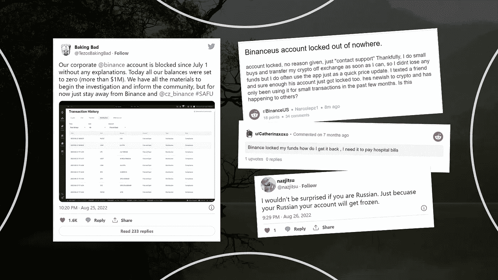
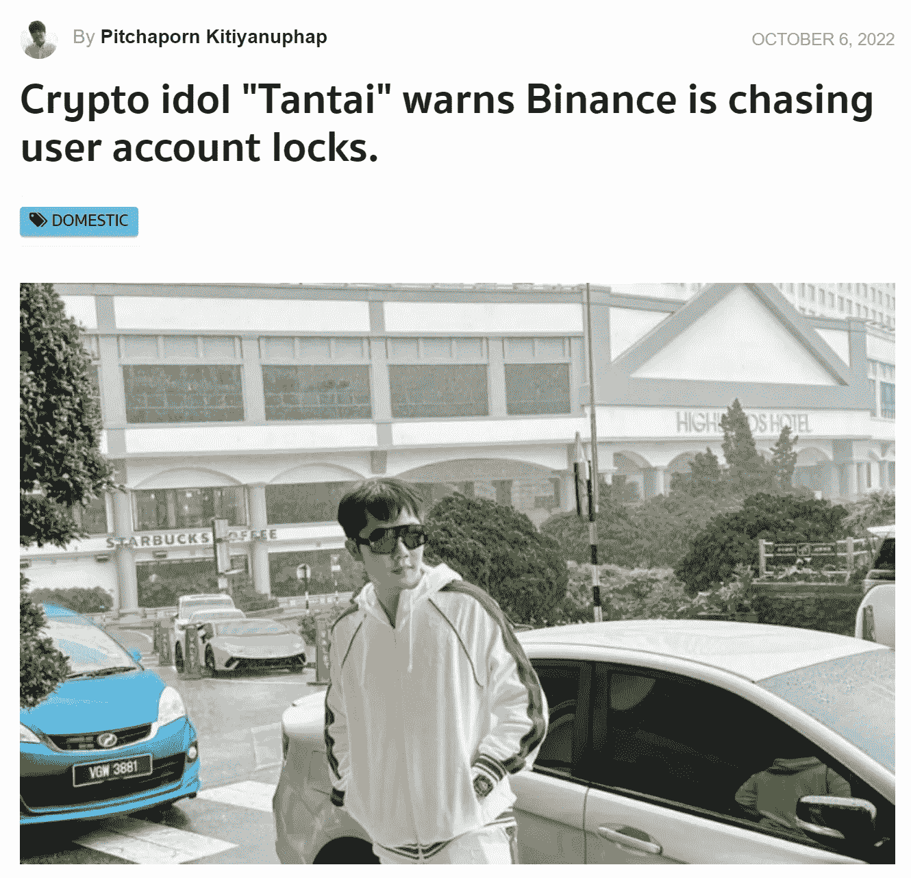
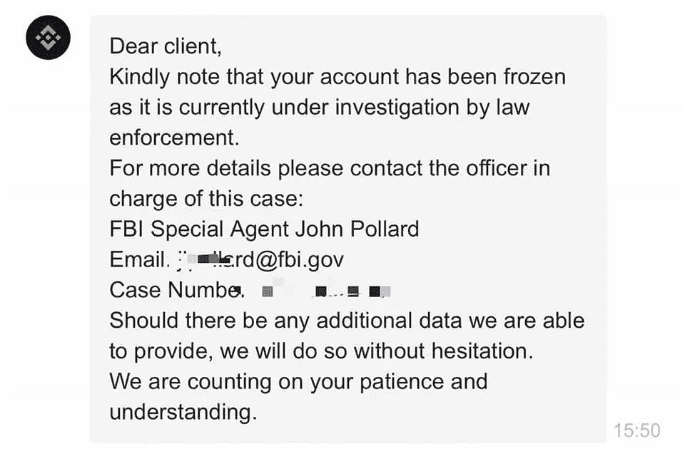
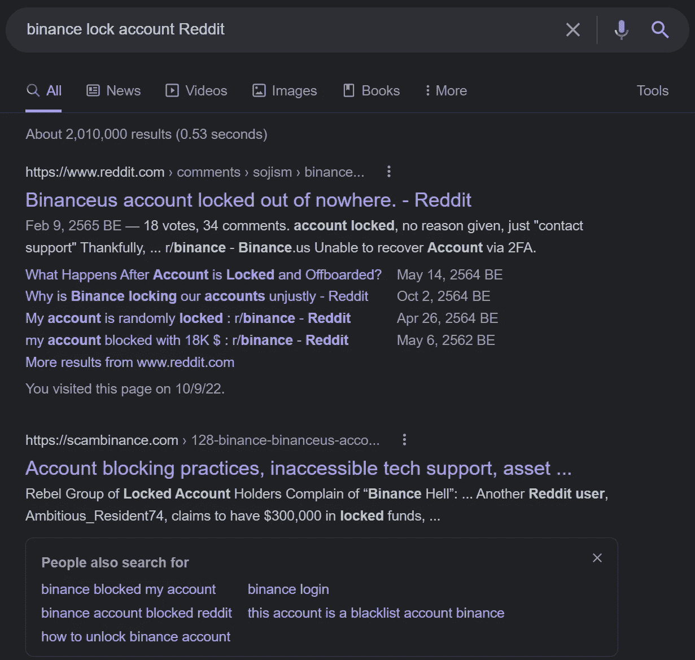

# 不要把你一生的积蓄都放在你的币安账户里！请在为时已晚之前读完这篇文章。

> 原文：<https://medium.com/coinmonks/dont-put-your-entire-life-savings-in-your-binance-account-please-read-this-before-it-s-too-late-a73aa3a598d9?source=collection_archive---------10----------------------->

许多人把一生的积蓄都投入到他们信任的交易所，币安。当某个实体负责保护他们的资金并在发生意外资金损失时偿还资金时，他们会感到安全。你可能就是这些人中的一员。在这里，我们将向您展示使用币安账户存储您一生积蓄的相关风险。

# 币安安全吗？

**是和否**币安类似于中央银行。在用户体验上是有优势的。很好用，有人在替你保护你的基金。你不用担心泄露的私钥问题会在几秒钟内窃取你一生的积蓄。万一你的资金被盗，你也可以去警察局找人赔偿你的损失。

**不利的一面是，像联邦调查局这样的政府机构可以迫使币安在任何时候毫无理由地封锁和查封你的账户。**想象一下，你一生的积蓄都在你的币安账户里，而联邦调查局强迫币安封锁你的账户进行调查。您将完全失去访问您的帐户的权限，尽管您没有做错任何事情。在调查期间，你必须向其他人借钱生活。联邦调查局和币安根本不关心你。他们完全没有同理心。在最坏的情况下，如果调查结果表明你有罪，联邦调查局可能会没收你所有的辛勤劳动所得，把你关进监狱，你就无事可做了。

# 既然我没做错什么，我为什么要担心联邦调查局？

交易追踪是一门复杂的艺术。如果你是 FBI，被赋予解决币安洗钱问题的任务，你可以做的是怀疑任何有巨额交易的账户以及与可疑账户相关的所有账户。

由于币安类似于中央银行，为了标记具有巨额交易的账户，联邦调查局可能使用中央银行系统的临界值来标记报表是否涉嫌洗钱。然而，如果联邦调查局可以追踪所有交易到传统银行账户，你不应该被标记。

当一个帐户被标记时，FBI 可能会标记任何与该帐户有过交互(发送/接收资金)的帐户。所以，如果你和一个被标记的账户有过交易，你也会被标记。

99%的标记账户可能不涉及任何洗钱活动。但联邦调查局不在乎，因为他们首先希望人们远离加密。FBI 只关心查封 1%涉嫌洗钱的账户。

# FBI 能封锁你的账户多久？

[https://imgflip.com/memegenerator](https://imgflip.com/memegenerator)

简而言之，你的账户将被锁定，直到联邦调查局完成调查。

等等，调查要多久才能结束？可能要花很长时间。万一永远花不完，那就等于失去你的基金。

你有证据证明调查可能会持续很久吗？是的，这家伙的账户在一月份被锁定了。现在，九个月过去了，币安也没有提供任何有用的信息。

# 帐户锁定仅限于美国币安吗？

不，有证据表明币安锁定了一组来自泰国的鲸鱼账户。坦泰，一个著名的泰国秘密偶像，和他的朋友的账户被币安锁定。他们从币安得到消息的唯一原因是联邦调查局正在调查他们的账户。引用自一篇[暹罗区块链新闻](https://siamblockchain.com/2022/10/06/crypto-idol-tantai-warns-binance-is-locking-their-accounts-beware-who-keeps-crypto-in-it/)。

[https://siamblockchain.com/wp-content/uploads/2022/10/tantai-740x492.jpg](https://siamblockchain.com/wp-content/uploads/2022/10/tantai-740x492.jpg)

[https://siamblockchain.com/wp-content/uploads/2022/10/mail-binance.jpeg](https://siamblockchain.com/wp-content/uploads/2022/10/mail-binance.jpeg)

# 币安锁定账户的历程与证明

币安总是无缘无故地锁定账户。你可以在谷歌上用关键词“币安锁定账户 Reddit”搜索这种可耻的行为其中一些也出现在推特和当地新闻网站上。这里我们将重点介绍币安锁定账户的重要事件。

Google search result for “binance lock account Reddit”

2021 年 5 月，币安在没有任何进一步通知的情况下，强迫所有美国客户在 48 小时内从其中提取所有资金。严重的是，提款被限制为每天 2 BTC，因为所有美国帐户 KYC 状态重置。所有拥有超过 4 个 BTC 的账户最终都会失去他们的基金！引用自[这篇 reddit 帖子](https://www.reddit.com/r/binance/comments/nchek0/what_happens_after_account_is_locked_and/)。

【2021 年 10 月有报道称，币安锁定了一名在币安拥有账户超过四年的企业主的账户，并完成了高级验证。那个账户被无故锁定了。

另一个人把她一生的积蓄都存进了她的币安账户。突然，币安锁定了她的账户。她在紧急情况下需要资金支付医院账单。如此令人心碎的故事！

另一批账户锁定起源于 2022 年 2 月。这篇 [Reddit 帖子](https://www.reddit.com/r/BinanceUS/comments/sojism/binanceus_account_locked_out_of_nowhere/)记录了币安锁定账户的历史。但这批可能与 FBI 无关。相反，币安错误地向这些账户发送了价值不到 5 美元的 ALGO 代币。币安只应暂停收回 ALGO 代币。因为这不是用户的错，币安不应该锁定他们的账户。

2022 年第三季度，著名人士 Baking Bad 报告称，他的公司账户因执法部门的调查请求而被锁定。结果，币安和联邦调查局把他们所有的资金都存入了他的账户。

许多人还报告说，币安在烘焙坏的推文评论中锁定了他们的账户。有的还因为非感官原因损失了资金！

其中一则报道称，币安正在禁止俄罗斯账户。等等，俄罗斯人民与这场战争无关，可能不同意普京的决定。

最近，币安账户被锁定的消息不胫而走。泰国鲸鱼 Tantai 和他的朋友们的账户被币安锁定了。币安只是说，联邦调查局正在调查他们的账户，没有进一步的理由。引用自一篇[暹罗区块链新闻](https://siamblockchain.com/2022/10/06/crypto-idol-tantai-warns-binance-is-locking-their-accounts-beware-who-keeps-crypto-in-it/)。

[https://siamblockchain.com/wp-content/uploads/2022/10/tantai-740x492.jpg](https://siamblockchain.com/wp-content/uploads/2022/10/tantai-740x492.jpg)

[https://siamblockchain.com/wp-content/uploads/2022/10/mail-binance.jpeg](https://siamblockchain.com/wp-content/uploads/2022/10/mail-binance.jpeg)

# 我还能用币安吗？

你仍然可以使用币安进行交易，并且只持有一部分资金。你在币安的账户里不应该有超过你一生积蓄的 50%。将你币安钱包里的资金限制在 10 万美元以下也是一件好事。

如果你考虑多种替代方式来保存你一生的积蓄，那将是最好的。请继续关注我们下一篇关于这个和钱包安全的博客。记得关注 [UpIntern 的](https://twitter.com/upIntern) Twitter 和 [UpResearch 的](/@upResearch) Medium。

# 摘要

不要把你一生的积蓄都放在你的币安账户里！一个人在紧急情况下需要她的资金来支付医院账单，但币安突然锁定了她的账户。如此令人心碎的故事！账户锁定不仅限于美国账户。由于联邦调查局的调查，币安还锁定了一个著名的泰国鲸鱼账户。

此外，他朋友的账户也被币安锁定了。然而，你仍然可以使用币安进行交易，但是不要在你的币安账户中持有超过你一生积蓄的 50%。如果你考虑多种替代方式来保存你一生的积蓄，那将是最好的。请继续关注我们下一篇关于这个和钱包安全的博客。记得关注 [UpIntern 的](https://twitter.com/upIntern) Twitter 和 [UpResearch 的](/@upResearch) Medium。

> 交易新手？尝试[加密交易机器人](/coinmonks/crypto-trading-bot-c2ffce8acb2a)或[复制交易](/coinmonks/top-10-crypto-copy-trading-platforms-for-beginners-d0c37c7d698c)