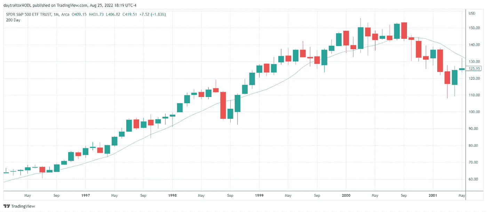
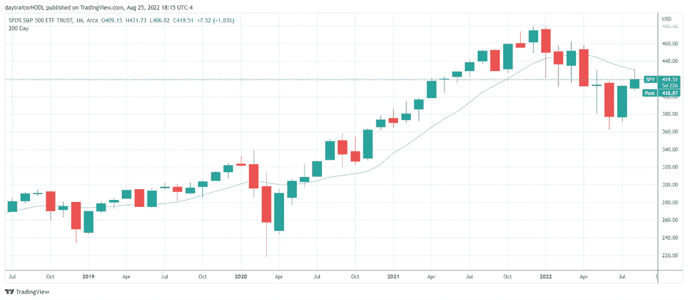
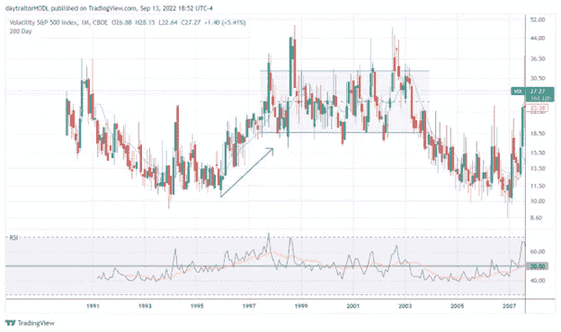
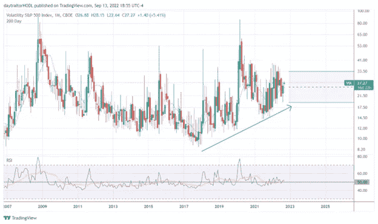
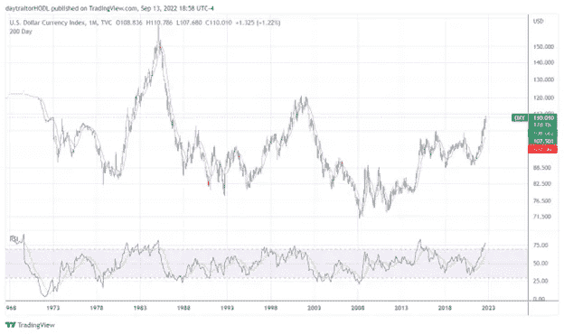
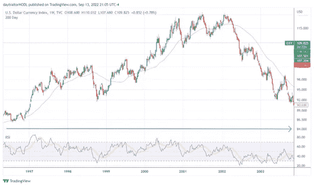
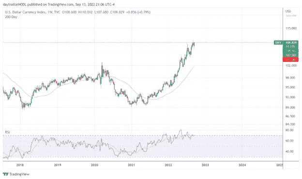
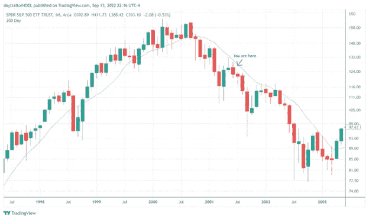
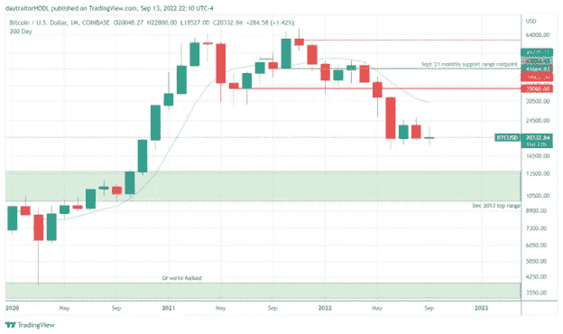
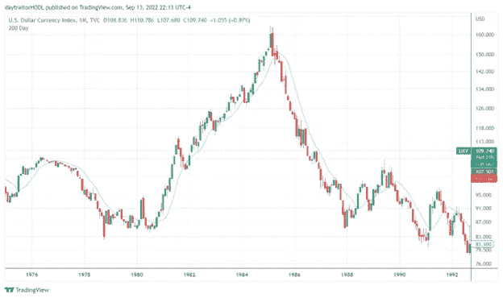

# 得了吧，没那么糟

> 原文：<https://medium.com/coinmonks/dot-cmon-its-not-that-bad-437bc6e02ec2?source=collection_archive---------4----------------------->

鉴于宏观经济和地缘政治变化带来的波动性，人们对之前的冲击进行了大量比较，比如 2008 年的衰退恐慌和 20 世纪 70 年代的通胀。我不同意这两种观点，但我认为 1970 年的通胀模型比 2008 年的衰退模型更准确。

我注意到跨资产类别的一些模式，这些模式将我引向一个不同的时间段，这是最有帮助的路线图。从长期月度 VIX 图上看，VIX 只有两次多年上涨趋势。第一次大约从 1996 年开始，持续到 2003 年；另一次，我们现在所处的阶段，从 2018 年开始。在之前的上涨趋势中，VIX 在高位盘整了几年才开始下跌。

文章开头的图表显示了 96-03 年和 18 年的间谍价格走势。我在杰克逊霍尔之前一天发表了这些文章，当时市场正在反弹，我注意到现在和 2001 年第三季度/第四季度的相似之处，2001 年市场只到了最终底部的一半。

VIX 和间谍价格模型都表明，熊市可能会延续到 2024 年。VIX 将有一年多的时间在更高的区间(20-35)进行盘整。

考虑到波动足迹和这些时间段之间的价格行为之间的交汇，有理由问条件是否相似。这只是巧合还是有类似的力量在起作用？96 年至 03 年期间，互联网泡沫破灭，以技术为基础的投机泡沫围绕着一种新的破坏性技术，然后美联储开始加息，泡沫破裂。地缘政治紧张随着反恐战争和 9/11 爆发，美国进入衰退。这有什么符合或听起来熟悉的吗？

所以现在我们必须谈谈房间里的宏观大象:美元。

我不会试图描述其中的机制，因为有更多合格的消息来源(布伦特约翰逊)，但一般来说，在较高的时间框架内，美元在压力和不确定性时期是强劲的。我强烈建议更多地研究这个话题以及间谍:TLT 相关性石油美元体系及其与美国通胀的关系(见我的 TLT 耸耸肩文章)。美元封顶是风险回归的必要条件，但还不够。在 96-03 年期间，美元花了一年多一点的时间才进入顶部形态，再次指向 1-2 年的熊市

即使从金元的角度来看，这两个时期之间也有交汇之处。美元开始走低，开始反弹，在投机性股票反弹期间巩固了几年的小幅上涨趋势(随着时间的推移，与 RSI 一致背离)，在外部冲击期间下跌(LTC 在 98 年爆发，Covid 在 2020 年爆发)，导致美元强劲而持久的上涨趋势。结构当然是不同的，前一段时间美元波动更大，但总体趋势是一致的。

让我们直接切入正题:这一模型随着时间的推移保持得很好，从内部市场的角度以及宏观经济的角度来看都是合适的。它并没有囊括所有的东西，也不是一个完美的路线图，但是与这个模型的差异应该提供可操作的交易信息，所以它仍然是有帮助的。

这表明股票还没有跌入底部(在 SPY 上，模型会指向 350 点，而我的心理水平是 300 点)；

这一框架表明，美元可能比其他任何货币都更接近顶部，但顶部不足以导致风险回归，顶部过程可能需要数月时间。那么 crypto 呢？

加密货币是在这个投机牛市中出现的新技术，我完全迷上了加密，但我愿意打赌，很大一部分加密货币是由完全不记得或没有经历过 96 年至 03 年这样的市场状况的人持有的。问题将是:隐藏的本土财富能否承受未来 18 个月遗产破坏的痛苦，还是也会越位？我认为，这足以让我们认真对待这样一种观点，即我们可能会更明显地下降到以前的周期水平。

看看 9 月月蜡烛线如何收盘将会很有趣，如果它以红色收盘，我最好在 14k-10k 之间开始让我的水平更清晰。我将留给你们一张最可怕的宏观图表，它不符合我的基本宏观或市场间框架，但不时看看这个布吉人是有益健康的。

Mount Doom

一如既往:玩得开心，待久一点，直到下次…

*   埃罗尼乌斯

> 交易新手？试试[加密交易机器人](/coinmonks/crypto-trading-bot-c2ffce8acb2a)或者[复制交易](/coinmonks/top-10-crypto-copy-trading-platforms-for-beginners-d0c37c7d698c)