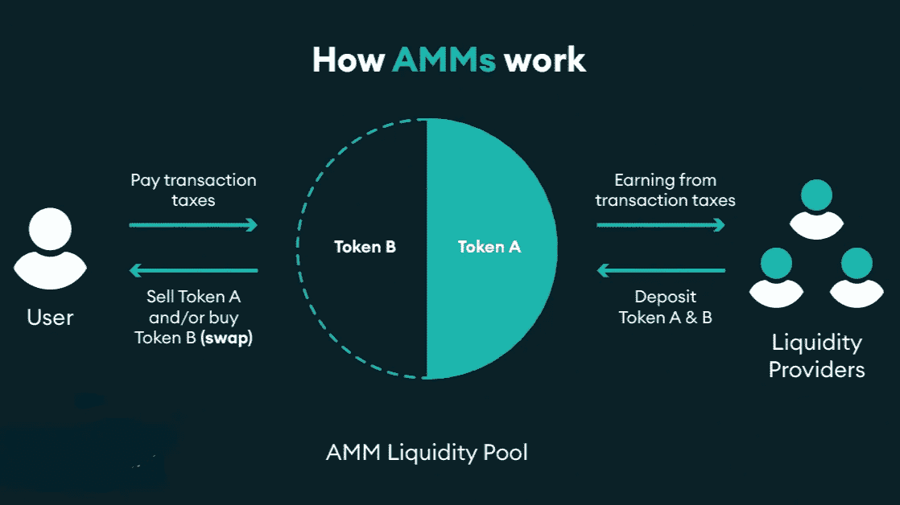

# DSR——自动做市商(AMM ),他们是什么，他们如何工作以及如何在 DeFi 中使用

> 原文：<https://medium.com/coinmonks/dsr-automated-market-makers-amm-what-they-are-how-they-work-and-how-they-are-used-in-defi-5429a60dc156?source=collection_archive---------17----------------------->

# **订单簿**

在为了理解自动做市商是如何工作的，有必要记住指令簿是什么以及交易者如何使用它。

订单簿是买卖资产的所有订单的列表，按升序排列。