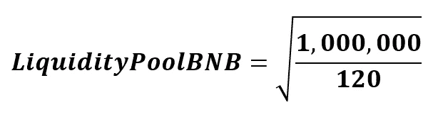

# DSR——DeFi 揭秘:非永久性损失是什么以及如何防御它

> 原文：<https://medium.com/coinmonks/dsr-defi-secrets-revealed-impermanent-loss-what-is-it-and-how-to-defend-against-it-d74c859c2da0?source=collection_archive---------40----------------------->

我们听到很多关于 DeFi 环境中的非永久性损失，为了将其保持在可感知的范围内，建议使用稳定硬币。
但是它到底是什么，为什么稳定硬币能帮助我们？

# 流动性池

我们非常清楚，为了激活一个 DeFi 平台，主要部分是流动性池。
这个流动性池是由智能合约管理的代币储备。请注意，代币不会转移到另一个帐户/钱包，而是锁定到自己的钱包。
通过这种流动性，AMM 能够管理交易对并计算价格，而无需订单簿。
通过提供流动性，您可以参与根据所提供的流动性计算的交易佣金奖励。
很容易看出，流动性池越大，交易所越多，回报越高。那么，稳定硬币与此有什么关系呢？的确如此，而且非常有用，但让我们继续前进吧。
正如我们所知，市场不是静态的，相反，在某些情况下，它是极其动态的，而且易变的。
尽管资产管理公司尽最大努力将代币价格保持在一个操作范围内，但市场低迷也随之而来。
事实上，我放入流动性池的代币价值可能不再相同；它可能升值或贬值了。
让我们在数学层面上更仔细地看看互换协议如何处理交易。

基本上，流动性必须在各种代币的所有池中保持不变。
根据上述公式，对于与资金池相关的小额交易，您可以通过以下计算来计算价格:

根据这两个公式，我们可以计算每个池的大小

既然我们已经很好地集中了公式，让我们试着用数字来代替它们，让概念变得非常清楚。
假设流动性提供者使用 Pancakeswap 提供 1 和 100 DAI(在 BSC 上，费用非常低，因此在示例中可以忽略不计)
如果池为 100，DAI 池为 10，000，则提供者提供该池的 1%。

所以用这个公式:

硬币 _ 价格= 100 戴

因此，1 BNB 等于 100 戴。众所周知，市场是不断变化的，经过一系列的交易，1 BNB 的价格会涨到 120 戴。
让我们在上面的公式中输入数字；首先我们计算池常数:

100 X 10.000 = 1.000.000(池常数)。

现在我们开始计算(硬币)和戴(代币)的流动性:

流动性 _ 池 _BNB = 91.2871

Liquidity_Pool_DAI = 10.954，4511

正如我们刚才所说，供应商提供的流动性等于 1%；因此，如果他决定解除对和戴的封锁，他将撤回的 0.9129 元和的 109.54 元。
为了充分理解 BNB 上的这种价格变化带来了什么，一旦这对货币被解锁，让我们将一切都转换成美元(DAIs 大约相当于 1 美元)。
先把换算成戴:
0.9129 x120 戴= 109.54

我们将投资组合中的 109.54 DAI 加上 109.54 DAI，得到 219.09 DAI。

如果我们的提供者把他的代币放在钱包里，而不把它们锁在池子里，他将有(通过把 1 BNB 转换成戴)220 戴。

实际上，损失为 0.91 戴。

显然如果 1 的价格回到 100 戴，亏损就会消失；显然，当代币从池中取出时，它就生效了。
这种损失是基于存款和取款之间的价格差异；因此，它可以被称为发散损失，它比称为非永久性损失更准确。
根据我们之前定义的公式，我们还可以计算发散损失:

正如我们从图表中看到的，与 hodl 相比，价格上涨 5 倍(500%)我们的损失略高于 25%:这是一个非常重要的损失。

# 结论

这种类型的损失非常重要，在决定锁定 DeFi 中的金额时，必须绝对考虑在内。

现在非常清楚为什么稳定硬币交易对在 DeFi 中更受欢迎:价格差异减少到最小。

由于稳定硬币有很低的下跌，在 DeFi 中使用它们是一个很好的方法，使它们以足够低的风险获得回报。

至少作为流动性提供者的费用不会被价格差异侵蚀。

这个数字例子充分证明了价格背离意味着损失；事实上，如果代币被持有，我们将获得 220 戴，而不是 219.09

> 交易新手？尝试[加密交易机器人](/coinmonks/crypto-trading-bot-c2ffce8acb2a)或[复制交易](/coinmonks/top-10-crypto-copy-trading-platforms-for-beginners-d0c37c7d698c)