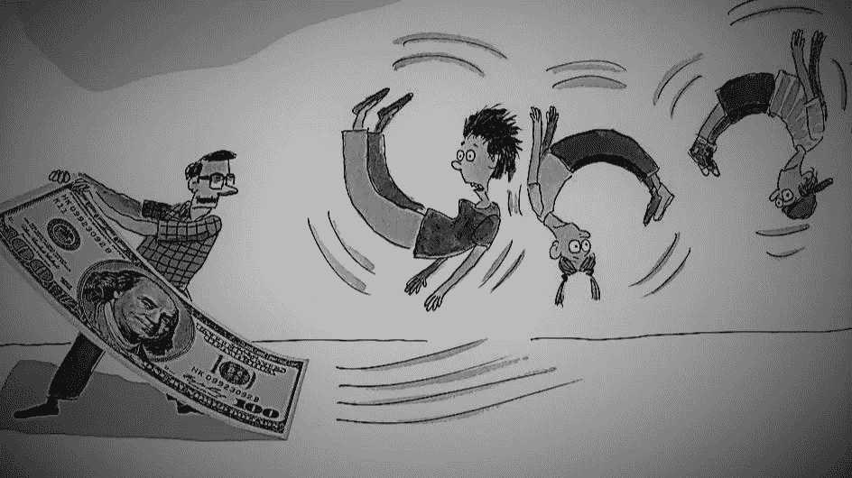

# DSR DeFi 揭秘——->地毯拉毛，它是什么以及如何预防。

> 原文：<https://medium.com/coinmonks/dsr-defi-secrets-revealed-rug-pull-what-it-is-and-how-to-prevent-it-3633418746fd?source=collection_archive---------30----------------------->

ICOs 在 2017 年几乎接管了整个加密领域，现在已经过时，正在让位于 DeFi。

基于与庞氏骗局相同的原理，欺诈性的 DeFi 平台带来了天文数字的回报和惊人的收入可能性。