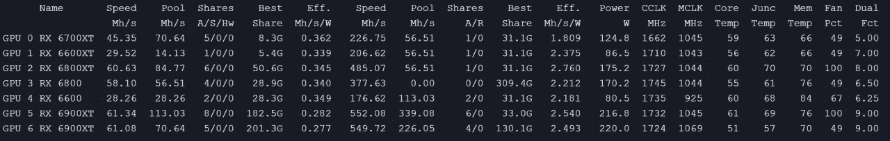

# 双重采矿 ETH/ETC + KASPA

> 原文：<https://medium.com/coinmonks/dual-mining-eth-etc-kaspa-4870f0a8119f?source=collection_archive---------0----------------------->

## 最有利可图的双重采矿方案 ETH/ETC+KASPA:

## 卡斯帕是什么？

Kaspa 是一种工作可靠的加密货币，实现了 GHOSTDAG 协议。与传统的区块链不同，GHOSTDAG 不会孤立并行创建的块，而是允许它们共存并一致排序。我们的区块链实际上是一个 blockDAG 您可以在实时 blockDAG 可视化工具中看到 GHOSTDAG 的运行。Nakamoto 共识的这种概括允许安全操作，同时保持非常高的块速率(目前每秒一个块，目标是每秒 10 个块，梦想是每秒 100 个块)和由互联网延迟控制的极小的确认时间(参见本文第 6 章的一些初始基准)。Kaspa 实施包括许多很酷的功能和子协议，包括查询 DAG 拓扑的可达性、块数据修剪(具有块报头修剪的近期计划)、SPV 证明和后来的子网支持，这些将使第 2 层解决方案的未来实施更加容易。

创建钱包的位置:

[https://wallet.kaspanet.io/](https://wallet.kaspanet.io/)或者使用兑换钱包

兑换 Kaspa 的地点:

TXBIT:【https://txbit.io/Trade/KAS/USDTT2
EXBITRON:[https://www.exbitron.com/trading/kasusdt](https://www.exbitron.com/trading/kasusdt)

要添加到 lolMiner 的行:

-dual mode KASPA dual-dual POOL KASPA _ POOL-dual user YOUR _ KASPA _ WALLET

Pools
欧盟:acc-pool.pw:16061 或 162.55.7.43:16061
美国:ca.acc-pool.pw:16061 或 144.217.11.196:16061
俄罗斯:ru.acc-pool.pw:16061 或 185.200.240.114:16061
亚洲:hk.acc-pool.pw:16061 或 103.161.224.217:16061

例如:
-dual mode kaspa dual-dual pool ACC-pool . pw:16061-dual user kaspa:QR 3y 4 tvkatkr 4 ujytr 89 MNE 202 sc 43 zvwpn 4 vkywgctq a4 jznv 0 v0 qkm 9 p 3d

记住 lolMiner 1.53 是需要它的。

mmpOS:

-algo ETHASH % pool _ protocol %-pool % pool _ server % % % pool _ port %-user % user %-pass % password %-worker % rig _ name %-API port % API _ port %-注销-dual mode kaspa dual-dual pool % pool _ server:KAS % % % pool _ port:KAS %-dual user % user:KAS %

HiveOS:

拉韦奥斯:

调谐大约需要 4-5 分钟，您也可以使用 dualfactor。记住卡斯帕主要是核心，所以增加核心和电压核心来挖掘更多的卡斯帕，但是那也会增加瓦特。

