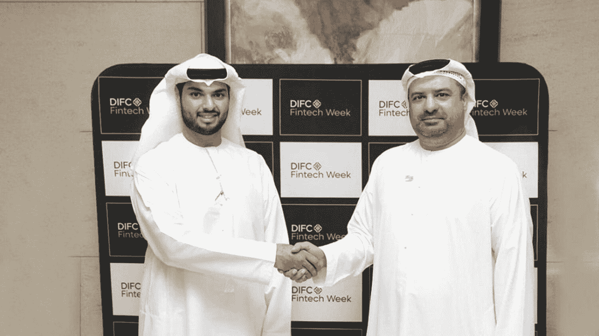

# 迪拜区块链中心和 Chaintech 实验室签署战略合作伙伴关系，以促进创新

> 原文：<https://medium.com/coinmonks/dubai-blockchain-center-and-chaintech-labs-sign-strategic-partnership-to-foster-innovation-39a6fb0102c8?source=collection_archive---------48----------------------->

迪拜通过其各种机构，致力于区块链工业的进步和发展。四年前，当迪拜的统治者谢赫·穆罕默德·本·拉希德·阿勒马克图姆打下基础时，阿联酋政府就盯上了区块链技术。

因此，两个组织之间的新伙伴关系促进了战略和工作关系。此外，它还将关注政府机构、代理机构和全球企业的入职培训。

这两个实体将向公共和私人机构展示区块链、不可替代令牌(NFT)和智能合同的概念。

此外，迪拜区块链中心旨在汇集行业专家、投资者、教育者和开发者。该组织计划用阿拉伯语和英语组织介绍区块链技术的课程。

双方将进一步努力举办用例场景、区块链创新的现场演示和创业竞赛。还有一项支持区块链部门公共和私营企业的规定。

另一方面，Chaintech Labs Ltd .是一家区块链研发公司，是迪拜国际金融中心的子公司。该平台由来自迪拜、旧金山、斯德哥尔摩和纽约的区块链专家和软件开发人员团队运营。

此外，Chaintech Labs 拥有 10 多个 NFT 项目，遍布全球，其社区人口超过 100 万。该公司的另一个有趣之处是其近 10 亿美元的市值。

迪拜政府成立了一个任务小组，负责监督虚拟生态系统的发展和扩张，以加速数字经济的扩张。

据 DBCC 首席执行官 Marwan Alzarouni 称，该中心已与各种组织合作，确保该酋长国希望实现的宏伟计划的进展。数字经济是迪拜的主要优先事项，因为该地区已准备好跟随技术创新的方向。

Alzarouni 进一步解释说，DBCC 提供了一种模式，在初始阶段向参与者免费提供区块链和元宇宙教育。

考虑到 DBCC 和 CLT 与其行动区域的联系，这两个伙伴有着共同的愿景和目标。该伙伴关系的重点是在区块链舞台上为公共和私人利益服务。

同时，谅解备忘录将加强双方作为相互商业伙伴的合作。迪拜制定了完善的计划，旨在加速区块链生态系统的发展。两家公司都承诺支持数字资产行业，以确保这一愿景得以实现。

国际加密和区块链投资者将迪拜视为他们项目的熔炉。将区块链项目设在迪拜，可以让投资者接触到全球志同道合的人才。

点击这里关注我们了解更多故事[。](http://t.me/etellworld)

> 交易新手？试试[密码交易机器人](/coinmonks/crypto-trading-bot-c2ffce8acb2a)或者[复制交易](/coinmonks/top-10-crypto-copy-trading-platforms-for-beginners-d0c37c7d698c)