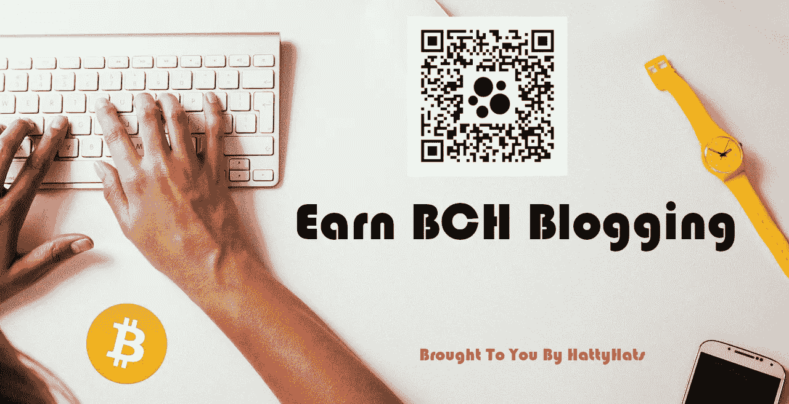
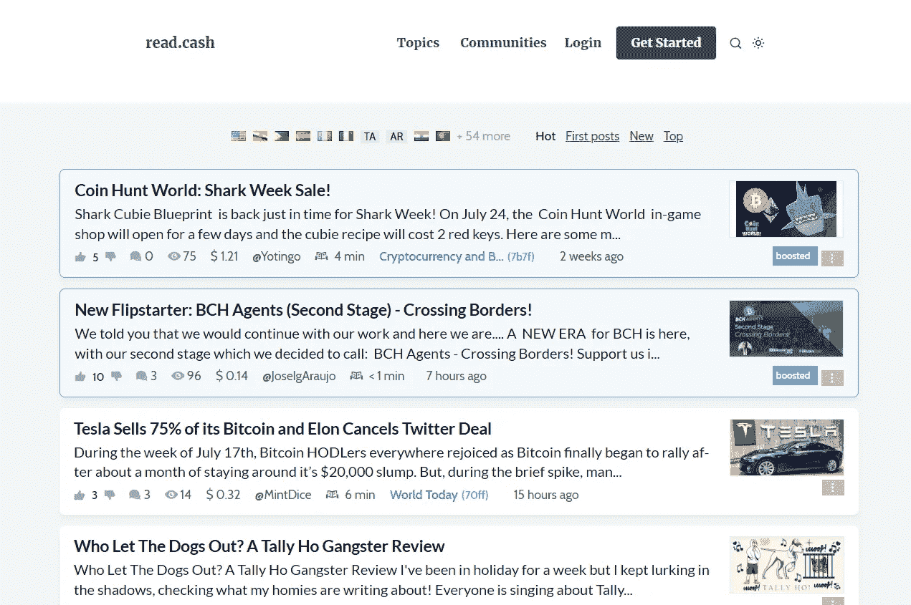
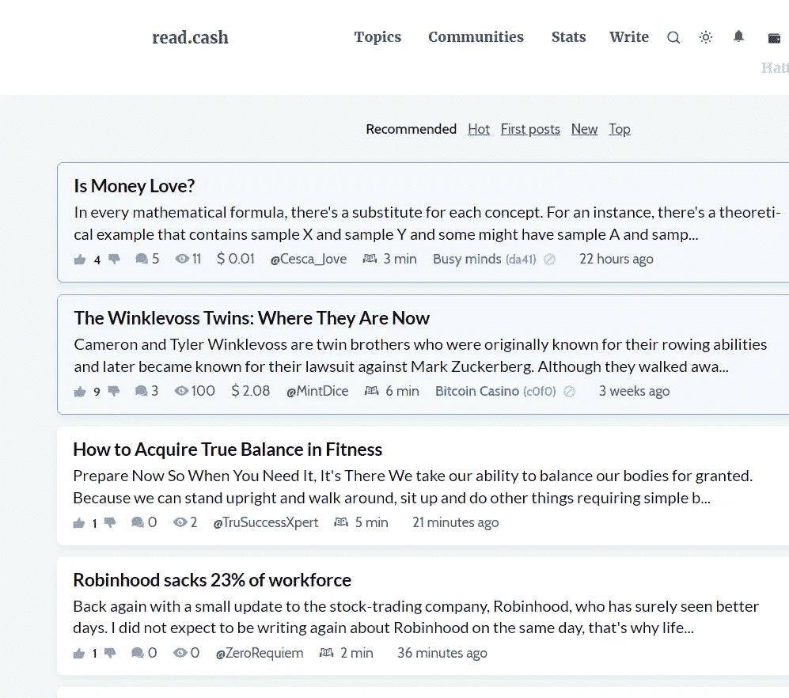
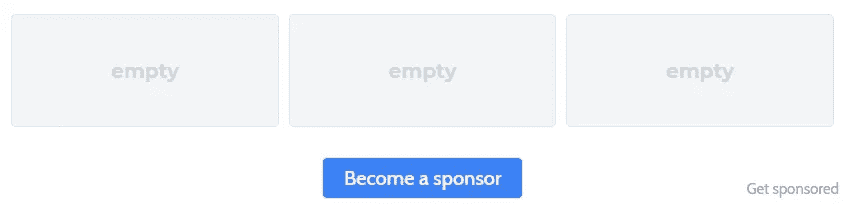
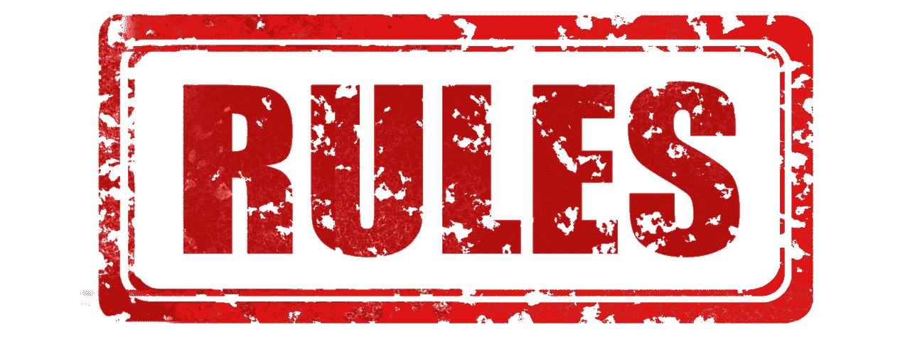

# 赚取 BCH 博客

> 原文：<https://medium.com/coinmonks/earn-bch-blogging-630d60784bac?source=collection_archive---------17----------------------->

我已经写了一段时间了，我很惊讶我从来没有写过我最喜欢的博客网站。我想没有比现在更好的时机了。我要告诉你的这个网站是我开始写博客的第一个网站，也是我用来发布所有原创内容的网站。这是报酬最高的网站之一，也是开启你博客之旅的最佳网站之一。还有更多令人惊叹的加密博客和社交网站，但这是我开始使用的网站，也是让我走到今天这一步的网站。我不在我想去的地方，但因为这个网站，我肯定离那里更近了。在这篇文章中，我将分享我使用的几个其他网站，我的下一篇文章将是关于另一个我喜欢用来传播我的内容并与其他志同道合的人联系的伟大网站，请继续关注。

[read.cash](https://read.cash/r/HattyHats)

[read.cash](https://read.cash/r/HattyHats) 是目前最好的加密博客网站之一。你可以通过发布内容来获得 BCH。我想说实话，让你知道你可能不会一开始就开始赚钱，但你需要继续发帖并与他人互动。这将让你的名字在那里，你将立即开始赚取 BCH。

我知道很多人已经听说过这个网站，但对于少数没有这篇文章是给你的。我想让人们知道开始写博客是多么容易。很长一段时间，我认为开始写作和赚钱是不可能的，直到我看到这个网站。然后我开始慢慢了解其他博客和赚钱网站，比如[publishax](https://www.publish0x.com/?a=YQdJrqJdOG)、 [Torum](https://www.torum.com/?referral_code=hattyhats) 、 [LeoFinance](https://leofinance.io/@hattysnewz/feed) 和 [Medium](https://hattyhats.medium.com/) 。有些人比其他人更容易赚钱。比如 PublishOX。你可以通过阅读帖子马上开始赚钱，但那是另一篇文章了。

当你第一次到达 [read.cash](https://read.cash/r/HattyHats) 时，它看起来会像上面的图片。这是一个简单的网站，但提供了这么多。read.cash 有一个易于使用的界面，可以让你轻松找到你要找的东西。

当你注册时，你必须创建一个钱包。在这个过程中，你会得到一个种子短语，我建议把它写下来，放在安全的地方。这将保持你的帐户安全，使它没有人可以访问你辛苦赚来的 BCH。一旦你这样做了，你的主页就会看起来像上面的图片。你可以点击“写作”按钮开始写作，你可以选择写一篇短文或一篇完整的文章，你可以从这两者中获利。我注意到你从一篇真实的文章中赚得更多，所以不要太关注那些小文章。你也可以找到你感兴趣的帖子并阅读它们，然后对你阅读的帖子发表详细的评论。你有机会从你的评论中赚一小笔。

**赞助商**

一旦你已经写了一段时间，你将能够获得一些赞助商。当你发帖时，你会在你的编辑栏中看到一个$号，你需要点击它来允许人们赞助你。说服人们赞助你取决于你自己。如果他们喜欢你的内容，最终会有人赞助你。

[赞助商区块(？)](https://read.cash/@Read.Cash/get-sponsors-a2b66c10)

发起人块看起来类似上面的块。这是每月从支持你的人那里赚钱的好方法。目前我只有一个赞助商，但我正在努力争取更多。我一周发两次帖子，看起来如果你发的不多，赞助商就不会呆太久。但是我不会让它影响到我。我会继续前进，希望一切顺利。也许我需要改变我的内容，开始写一些关于秘密新闻的事情。我必须改进我的方法。这是一个学习的过程。我已经写了一年多了，我仍在学习并试图找到最好的成长方式。伟大的事情需要时间。坚持下去，尽你最大的努力，最终，有人会来到你身边，喜欢你的内容并赞助你。

**规则**

read.cash 有几条你可能想要遵守的规则。这些规则会让你赚得最多，并让你不被禁止。

1.  不要发布大量的链接。这将使你的帖子被更少的人看到，你将不会赚到钱，并有可能被禁止，这取决于你做了多少和多久。
2.  不要在多个帖子上发表相同的评论。这只能表明你没有完全阅读和享受这些文章。你只是在评论，希望得到提示。
3.  这是个大问题，所以听好了。不要让人们关注你，并说你会在你的帖子和评论中关注他们。这可能会导致你被禁赛。
4.  不要抄袭别人的作品。
5.  不要复制和粘贴，除非你发布了你得到它的来源。

这些是我建议你遵守的基本规则，否则你就有可能被封禁或者无法从你的帖子中获利。

我很惊讶我还没有写关于 read.cash 的文章。这是我见过的最好的加密博客网站之一。你可以从别人的帖子中学到很多东西，你也可以从评论和发帖中获利。保持参与是关键，因为你使用这个平台的次数越多，你的收入就会越多。至少这是我注意到的。

我希望每个人都喜欢这篇文章。 [read.cash](https://read.cash/r/HattyHats) 是开启你博客之旅的绝佳方式。如果你已经是一个博客作者/作家，那么这是一个从你的作品中赚取密码的好方法。

如果你喜欢这篇文章，请喜欢并关注更多内容。

我所有的内容都在我的网站[hattyshack](https://hattysshack.com/)上。我也分享了大量的盈利网站、加密游戏和加密新闻。检查一下，让我知道你的想法。

请继续关注，因为我的下一篇文章将是关于另一个伟大的网站，你可以赚取密码，并会见了很多伟大的人。

[上的原创文章 read.cash](https://read.cash/@HattyHats/earn-bch-blogging-782595f4)

直到下次我的朋友们。

> 交易新手？尝试[加密交易机器人](/coinmonks/crypto-trading-bot-c2ffce8acb2a)或[复制交易](/coinmonks/top-10-crypto-copy-trading-platforms-for-beginners-d0c37c7d698c)