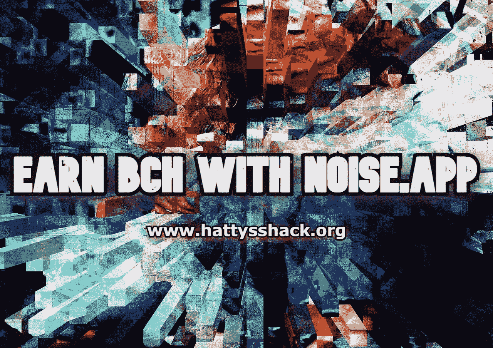

# 用 noise.app 赢取 BCH

> 原文：<https://medium.com/coinmonks/earn-bch-with-noise-app-b6139e8799b2?source=collection_archive---------4----------------------->

我相信社会区块链项目是未来。允许内容创作者从他们的帖子中获利，并从他们在网上所做的事情中带来真正的价值。我已经分享了几个我认为值得一试的区块链社会项目，但我没有分享一个我认为值得一提的项目。

**什么是** [**noise.app**](https://noise.app/invite/bmfq8st4)

noise.app 是一个相当新的平台，是 noise.cash 的升级和更新版本。在这里你可以通过发帖和互动赚取 [BCH](https://bitcoincash.org/) 。你也有机会赚到[以太坊](https://ethereum.org/en/)、[智能 BCH](https://smartbch.org/) 、[比特币](https://bitcoin.org/en/)、 [PayPal](https://www.paypal.com/us/home) 但是到目前为止我只赚到了 BCH。

这个区块链项目是我遇到的最好的社交区块链项目之一。还有其他一些很棒的社交平台，比如 DeSo、Ecency、Torum 和 Uhive。他们都有自己的优点。如果你没有听说过这些社交平台，看看我以前的一些文章，了解一下它们是如何运作的。在不久的将来，我会写关于紧急事件的文章。关注我的页面，这样以后我发帖的时候你会收到通知！

[**DeSo 区块链—去中心化社交区块链**](https://read.cash/@HattyHats/deso-blockchain-the-decentralized-social-blockchain-c4567234)

[**Uhive —真实的元宇宙**](https://read.cash/@HattyHats/uhive-the-true-metaverse-1b1c0270)

[**Torum —社交区块链的未来**](https://read.cash/@HattyHats/torum-the-future-of-social-blockchain-80f6d469)

**[**noise . app**](https://noise.app/invite/bmfq8st4)**如何工作****

**noise.app 是一个社交区块链项目，你可以通过发帖和与其他人互动来赚钱。人们可以向你的帖子或评论捐款，你赚的钱会直接进入你在设置中添加的钱包。**

**你需要有人邀请才能使用这个 [noise.app](https://noise.app/invite/bmfq8st4) 。没有邀请是不能注册平台的。**

**发帖简单明了。你可以在文章中贴上图片，这将有助于你的文章脱颖而出。**

**你只能对你关注的人的帖子发表评论，他们也会关注你。你仍然可以看到每个人的帖子，但你不能与他们互动，除非你们是平台上的朋友。**

**[noise.app](https://noise.app/invite/bmfq8st4) 是一个新的、仍在成长的应用，未来将会增加新的功能。随着时间的推移，我认为这个平台将成为最好的区块链社交平台之一。**

**每个平台都有优点和缺点。我将讨论这些利弊，以便您可以决定该平台是否适合您。**

****noise . app 的优点****

**noise.app 简单易用，让你只为发帖和互动赚取密码。你可以从平台上的任何人那里获得提示，即使你们没有互相关注。**

**[noise.app](https://noise.app/invite/bmfq8st4) 干净、人性化。这使得在使用该平台时有一段有趣且有益的时间。**

**你可以从你的帖子和评论中获得多种不同类型的密码。**

**这个平台正在成长，在不久的将来还会有更多的平台出现。**

****noise . app 的弊端****

**[noise.app](https://noise.app/invite/bmfq8st4) 在你的帖子上没有编辑按钮。这使得你在发帖时不可能修复你可能弄糟的任何东西。**

**你只能评论别人跟你的帖子，你跟回来。我敢肯定这是为了不允许垃圾邮件，但它仍然是有时加重。这可能是一个职业，因为它使你只允许你认为值得花时间来评论你的帖子的人。**

**平台上没有实现标签。这使得你无法搜索不同类型的有趣主题。根本没有搜索功能，这使得你很难找到你感兴趣的帖子。**

****结论****

**noise.app 仍在增长，随着时间的推移，将会有新的功能。我喜欢使用这个平台，但如果它想像 DeSo (Diamond)、Ecency、Torum 和 Uhive 这样的平台一样大而易用，它还有很长的路要走。**

**[noise.app](https://noise.app/invite/bmfq8st4) 无疑比 noise.cash 更上一层楼，我相信一旦一切就绪并开始运行，它将会令人惊叹。现在它是一个很好的平台，让你仅仅通过与他人联系和交流就可以获得密码，这是我相信区块链社会中的每个人都在寻找的，但要被更广泛地采用，我认为还需要做更多的工作。**

**如果你没有听说过 [noise.app](https://noise.app/invite/bmfq8st4) ，那么我建议你去看看它，看看它能做什么。即使有缺点，这也是我用过的最好的区块链社交项目之一。**

**如果你有机会尝试 [noise.app](https://noise.app/invite/bmfq8st4) 或者已经在使用它，请留下评论，让我知道你的想法。**

**我分享的 [noise.app](https://noise.app/invite/bmfq8st4) 的链接只适用于 25 个人，所以可以的话就去看看吧。最初的帖子有 25 个推荐点击链接，这个也是。所以总共有 50 个人可以用我的链接注册。如果您不能使用该链接注册，请留下评论并要求一个注册链接。**

**查看我的网站，了解更多赚取、学习和投资 Crypto 的方法。**

**[哈蒂的小屋](https://www.hattysshack.org/)**

**关于 [read.cash](https://read.cash/@HattyHats/earn-bch-with-noiseapp-4de2d889) 的原文**

> **交易新手？尝试[加密交易机器人](/coinmonks/crypto-trading-bot-c2ffce8acb2a)或[复制交易](/coinmonks/top-10-crypto-copy-trading-platforms-for-beginners-d0c37c7d698c)**
> 
> **加入 Coinmonks [电报频道](https://t.me/coincodecap)和 [Youtube 频道](https://www.youtube.com/c/coinmonks/videos)获取每日[加密新闻](http://coincodecap.com/)**

## **另外，阅读**

*   **[复制交易](/coinmonks/top-10-crypto-copy-trading-platforms-for-beginners-d0c37c7d698c) | [加密税务软件](/coinmonks/crypto-tax-software-ed4b4810e338)**
*   **[网格交易](https://coincodecap.com/grid-trading) | [加密硬件钱包](/coinmonks/the-best-cryptocurrency-hardware-wallets-of-2020-e28b1c124069)**
*   **[密码电报信号](/coinmonks/top-3-telegram-channels-for-crypto-traders-in-2021-8385f4411ff4) | [密码交易机器人](/coinmonks/crypto-trading-bot-c2ffce8acb2a)**
*   **[最佳加密交易所](/coinmonks/crypto-exchange-dd2f9d6f3769) | [印度最佳加密交易所](/coinmonks/bitcoin-exchange-in-india-7f1fe79715c9)**
*   **[开发人员的最佳加密 API](/coinmonks/best-crypto-apis-for-developers-5efe3a597a9f)**
*   **最佳[密码借贷平台](/coinmonks/top-5-crypto-lending-platforms-in-2020-that-you-need-to-know-a1b675cec3fa)**
*   **[免费加密信号](/coinmonks/free-crypto-signals-48b25e61a8da) | [加密交易机器人](/coinmonks/crypto-trading-bot-c2ffce8acb2a)**
*   **杠杆代币的终极指南**