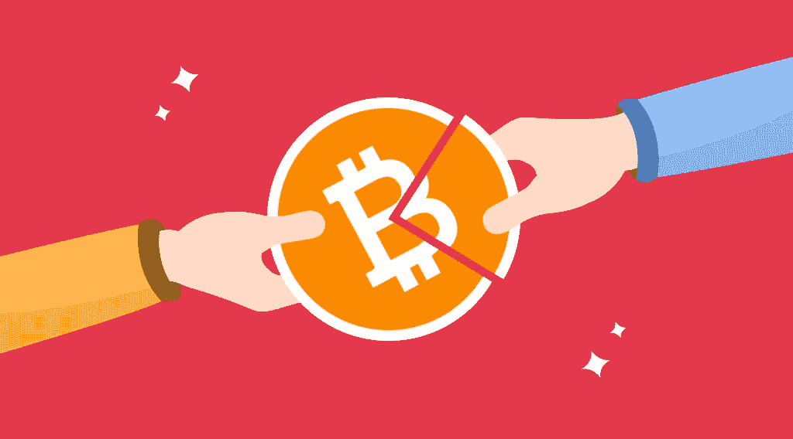
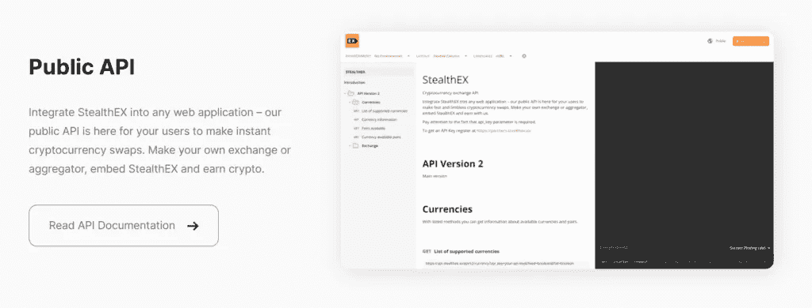
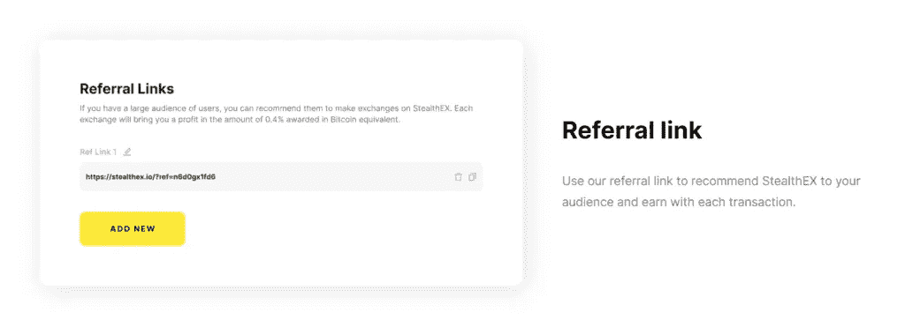
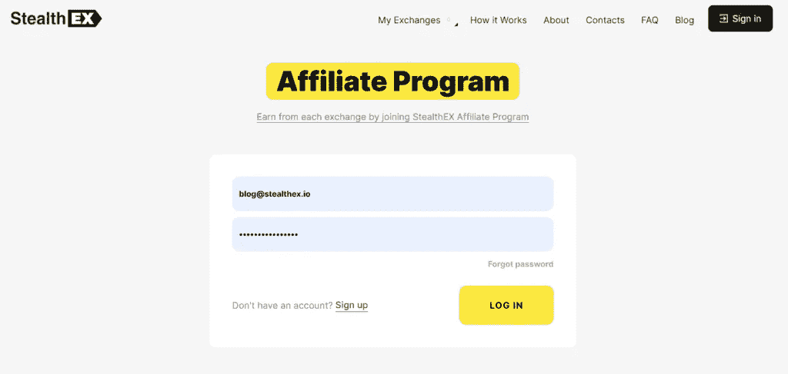

# 通过 StealthEX 附属计划获得加密

> 原文：<https://medium.com/coinmonks/earn-crypto-with-stealthex-affiliate-program-d5ab290d010f?source=collection_archive---------11----------------------->

没有多少人知道这一点，但从加密货币中赚钱的方式不止一种。你可以继续使用你的密码，同时还可以从中赚取可观的利润——许多服务都为你提供了一系列的推荐项目。加密货币行业正在蓬勃发展，许多不同的公司正在举办联盟项目，以覆盖更广泛的受众。更重要的是，潜在的利润是巨大的；当今存在的一些最大的公司都是围绕加密货币建立的。最佳加密货币联盟计划将取决于你的需求和偏好，如果你正在寻找现有在线项目的新盈利方式，你绝对应该看看 StealthEX 联盟计划。

# 我将从哪里赚钱？

StealthEX 的主要产品是一种即时加密货币交易所，自 2018 年以来一直存在。这种非托管的交换平台为加密爱好者提供了一个无需注册或创建账户即可进行加密货币互换的机会。StealthEX 的重点是隐私和安全，因此选择了免注册和免托管的方法来促进交换和保护用户的资金和数据。该平台与许多加密货币合作——StealthEX 提供了一系列丰富的硬币——从比特币和以太坊到 ZCash 和 Monero 等隐私币，以及用借记卡和信用卡购买加密货币的选项。

以下是 StealthEX 提供的内容:

*   交换超过 450 项数字资产。
*   用菲亚特购买加密货币。
*   选择浮动或固定利率互换。固定汇率可用于转账或规避市场波动。
*   从各种著名的供应商处收集的有竞争力的价格。
*   这项服务是透明的，不需要注册，同时保护你的个人隐私。

> 交易新手？试试[加密交易机器人](/coinmonks/crypto-trading-bot-c2ffce8acb2a)或者[复制交易](/coinmonks/top-10-crypto-copy-trading-platforms-for-beginners-d0c37c7d698c)

# StealthEX 联盟计划是如何运作的？

除了 StealthEX 引以为傲的 B2C 服务，该平台还与企业、内容创作者和那些愿意将他们对加密的热情转化为稳定收入的人合作。这正是 StealthEX 联盟计划的目的。

根据个人需要，有几种附属工具可供选择。

如果你是一个产品所有者，并且想要扩展你的平台，在交换中获得额外的利润，并且允许你的用户在你的界面中交换加密资产，API 集成正是你正在寻找的东西。将 StealthEX 集成到任何 web 应用程序都很简单——公共 API 通过 Postman 对每个人开放，并且很容易构建到现有产品中。

或者，如果您正在博客上工作，或者是社交媒体的影响者，您可以使用我们的推荐链接向您的受众推荐隐形 x，同时从他们的每次交换中获得加密。可以在个人文件柜中检查进度—所有交易和收入都记录在那里。

在这两种情况下，个人文件柜都将成为您的助手——使用它注册会员计划，生成您需要的任意数量的链接和应用编程接口密钥，跟踪统计数据，并请求利润分红。

我们已经完善了我们的会员计划，使其成为加密市场上的最佳选择之一，以下是它必须提供的:

*   与成熟可靠的服务机构合作。
*   大量的硬币可以交换——超过 450 种资产被列出。
*   无需注册即可利用主要供应商的流动性。
*   API 经常更新。
*   新功能正在不断开发中。
*   24/7 支持:我们与合作伙伴一起创建支持渠道，以立即解决票证问题(电报、Slack、电子邮件)。
*   个人橱柜即时赔付。
*   联合营销:潜行 x 团队将很乐意支持您的活动并参与促销活动。

在 CMO Maria Carola 的 Supernova Hackathon Workshop 视频中了解更多关于[交换服务集成的信息。](https://youtu.be/nfgf3oS9W6Q)

# 新发展

我们已经听到了社区的需求，现在正积极致力于添加一个 exchange 小部件，您可以将其集成到您的网站中。

全新的小部件可以根据您的喜好和品味进行调整。您可以将其嵌入您的网站，并从其生成的每个掉期交易中扣除一定比例。该工具将证明对影响者、网站所有者和评论平台有益。

此外，您将很快能够在窃盗 x 个人橱柜中管理额外的费用——这将为那些整合我们 API 的人提供设置他们自己的收入百分比的可能性。该功能在密码钱包和其他主要通过交易所赚钱的产品中尤其有用。

# 成为隐形 x 合作伙伴，享受加密之旅！

潜行会员计划是免费的，任何人都可以使用——不管你做什么，有一个工具可以为你服务。

在个人文件柜中创建一个帐户，选择您想走的路，然后开始用潜行赚钱。这就是您需要的一切，让我们的服务为您服务。

在 [Medium](https://stealthex-io.medium.com/) 、 [Twitter](https://twitter.com/Stealthex_io) 、 [Telegram](https://t.me/StealthEX) 、 [YouTube](https://www.youtube.com/channel/UCeES_XBesX76ge7xf1meuSw) 和 [Reddit](https://www.reddit.com/user/Stealthex_io) 上关注我们，了解关于 [StealthEX.io](https://stealthex.io/) 和其他加密世界的最新消息。

在购买任何密码之前，不要忘记做自己的研究。本文表达的观点和意见仅代表作者个人。

*原载于 2022 年 6 月 29 日*[*https://stealthex . io*](https://stealthex.io/blog/2022/06/29/more-crypto-benefits-with-stealthex-affiliate-program/)*。*