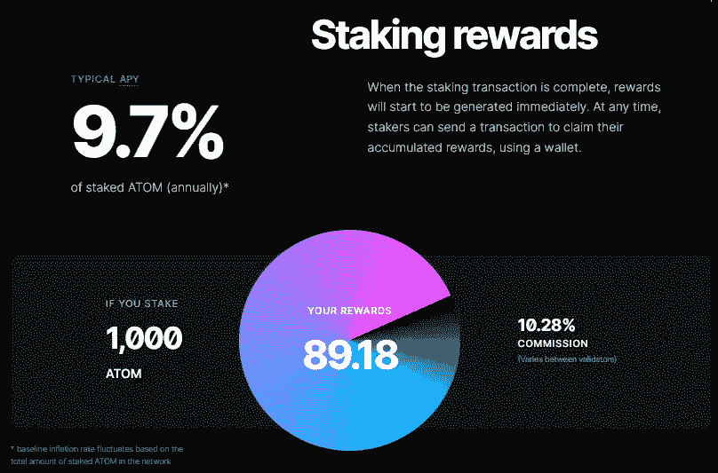
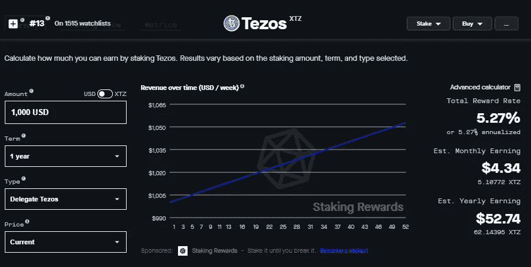
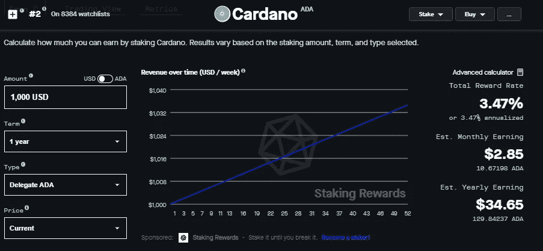

# 用赌注赚取被动收入:初学者指南

> 原文：<https://medium.com/coinmonks/earn-passive-income-with-staking-a-beginners-guide-aa147f7658?source=collection_archive---------9----------------------->

Image created with [**DALL·E**](https://labs.openai.com/) **AI**

您是否正在寻找一种方法来利用您持有的加密货币赚取被动收入？如果是这样，你可能会对赌注感兴趣。

什么是赌注？

赌注是个人可以通过参与区块链网络的操作和维护来获得奖励的过程。它涉及在钱包中持有一定数量的令牌，并使用它们来验证网络上的交易，类似于矿工在工作证明(PoW)系统中的方式。

**优势**

打桩的主要优势之一是，它需要的能源和资源远少于动力开采，使其更加环保和经济。它还允许更分散的网络，因为进入门槛较低，拥有少量代币的个人可以参与。

在赌注证明(PoS)系统中，验证者(也称为“赌注者”)是根据他们持有的代币数量选择的，并且愿意作为抵押品“下注”。赌注者持有的令牌越多，被选为验证者的可能性就越大。当一个赌注者被选中验证一批交易时，他们会以新代币或交易费的形式获得奖励。

**风险**

然而，也有与赌注相关的风险，因为赌注者可能会失去他们的赌注令牌，如果他们恶意行为或不遵守协议。为了激励良好的行为，大多数 PoS 系统还具有适当的惩罚机制，如果投注者恶意行为或不遵守协议，可能会导致他们失去部分或全部的投注代币。

**安全**

除了赚取报酬之外，赌注者在网络安全中也起着至关重要的作用。通过标记它们的令牌，它们有效地为有效的交易块“投票”,并对网络的整体共识做出贡献。这有助于确保网络是安全的，并且防止了双重花费(相同的令牌被花费不止一次)。

有几种不同类型的 PoS 系统，每一种都有自己的规则和机制来选择验证者并奖励他们。一些流行的 PoS 系统包括委托股权证明(DPoS)、流动股权证明(LPoS)和纯股权证明(PPoS)。

现在，让我们来看看三个流行的赌注项目:

1.  宇宙是一个由独立的平行区块链组成的分散网络，由宇宙中枢提供动力。Cosmos Hub 使用 PoS consensus 算法，这意味着令牌持有者可以通过下注 ATOM 令牌并参与交易验证来获得奖励，目前提供慷慨的 **9.7% APY** 。Cosmos 由 Interchain 基金会于 2014 年创建，目标是支持创建可扩展和互操作的区块链应用程序。

[https://cosmos.network/learn/staking/](https://cosmos.network/learn/staking/)

你可以在这里了解更多关于 Cosmos staking 的信息:[https://Cosmos . network/learn/staking/](https://cosmos.network/learn/staking/)

2. **Tezos** : Tezos 是一个自我修正的区块链，它使用了一种 PoS 共识算法，称为“流动性风险证明”(LPoS)。代币持有者可以通过下注 XTZ 代币并参与交易验证来获得奖励，目前提供安全的 5.27% APY。Tezos 于 2014 年由 Arthur Breitman 和 Kathleen Breitman 创建，目标是创建一个更加灵活和自治的区块链平台。

[https://www.stakingrewards.com/earn/tezos/](https://www.stakingrewards.com/earn/tezos/)

3. **Cardano** : Cardano 是一个智能合约平台，使用一种叫做“Ouroboros”的 PoS 共识算法代币持有人可以通过下注他们的 ADA 代币并参与交易验证来获得奖励，下注您的 ADA 可以额外授予您 3.47%的 APY。Cardano 由 Charles Hoskinson 和 Jeremy Wood 于 2017 年创建，目标是为去中心化应用程序(DApps)的开发创建一个更加安全和可扩展的区块链平台。

[https://www.stakingrewards.com/earn/cardano/](https://www.stakingrewards.com/earn/cardano/)

你可以在这里了解更多关于押艾达的信息:[https://cardano.org/stake-pool-delegation/](https://cardano.org/stake-pool-delegation/)

**更高的 APY%**

虽然赌注回报因项目而异，但一些加密货币项目为赌注提供了非常高的年收益率(APYs)。例如，一些项目可能提供 50%或更高的 APYs，这可以转化为利益相关者的可观回报。然而，值得注意的是，这些高 apy 可能伴随着更高的风险，因为它们可能由更新或不太成熟的项目提供。

**免责声明**

如果你有兴趣通过赌注赚取额外的加密货币，重要的是要做好研究，选择一个声誉良好、有良好记录的项目。以安全可靠的方式进行你最喜欢的投资是一种在持有你的资产的同时赚取额外加密的好方法。分散你的赌注投资组合也是一个好主意，而不是把所有的代币都押在一个项目上。这有助于降低风险，增加你获得长期稳定回报的机会。所以，在投资任何项目之前，做彻底的研究总是更好的。

感谢您的阅读，请务必在下面评论您最喜欢的赌注项目！

> 交易新手？尝试[加密交易机器人](/coinmonks/crypto-trading-bot-c2ffce8acb2a)或[复制交易](/coinmonks/top-10-crypto-copy-trading-platforms-for-beginners-d0c37c7d698c)

*   [Pionex 双投](https://coincodecap.com/pionex-dual-investment) | [AdvCash 审核](https://coincodecap.com/advcash-review) | [秉持审核](https://coincodecap.com/uphold-review)
*   [面向开发者的 8 个最佳加密货币 APIs】](https://coincodecap.com/best-cryptocurrency-apis)
*   [7 个最佳零费用加密交易平台](https://coincodecap.com/zero-fee-crypto-exchanges)
*   [最佳网上赌场](https://coincodecap.com/best-online-casinos) | [期货交易机器人](/coinmonks/futures-trading-bots-5a282ccee3f5)