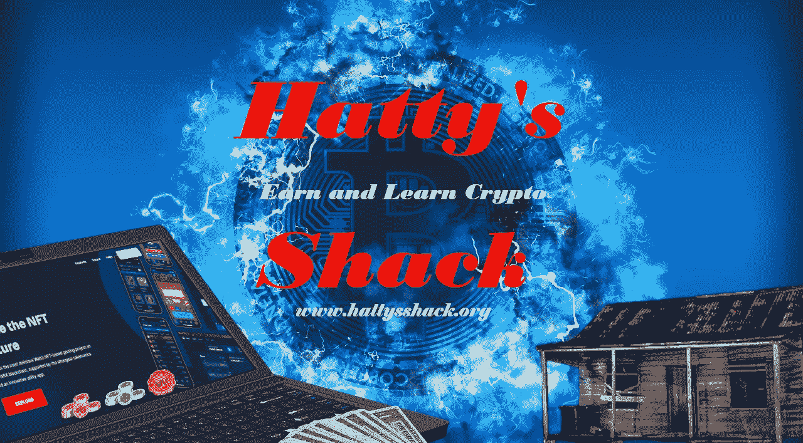
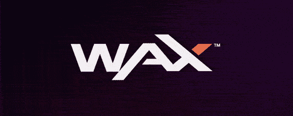
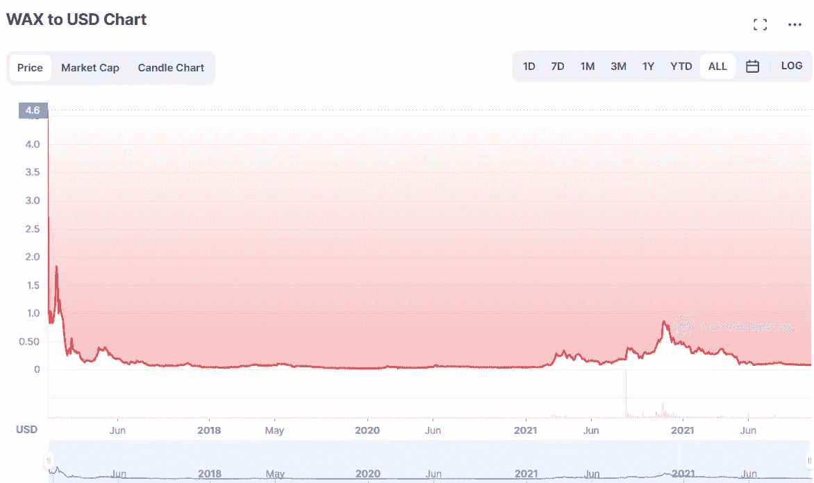
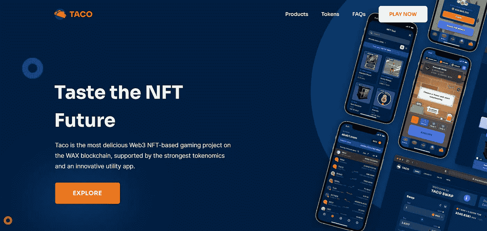
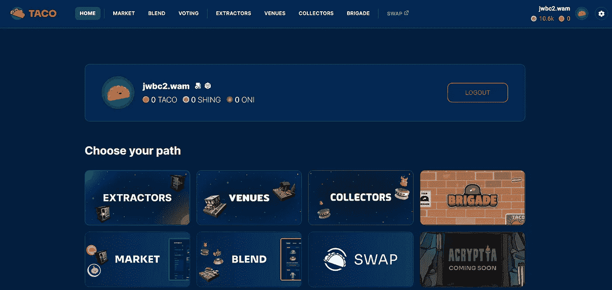
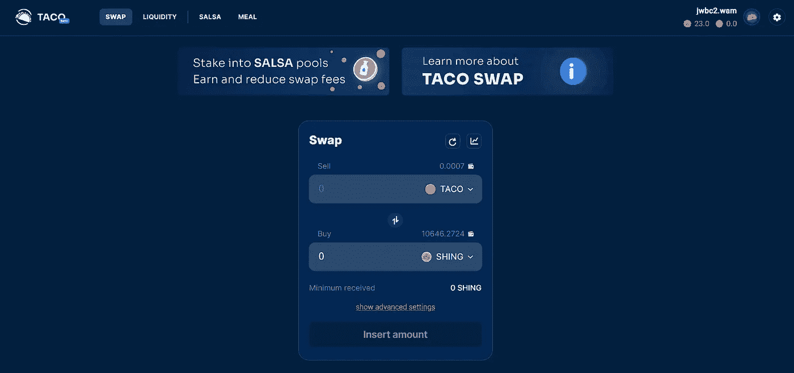
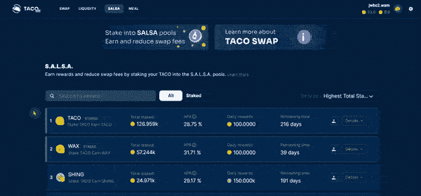
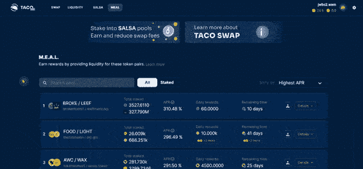

# 使用玉米卷交换赚取蜡

> 原文：<https://medium.com/coinmonks/earn-wax-using-taco-swap-1d08f09ec5f3?source=collection_archive---------18----------------------->

我有一个项目想和大家分享一下，这个项目使用了 [WAX](https://on.wax.io/wax-io/) 区块链。在我进入这个项目之前，我想分享一点关于 WAX 区块链的信息，让每个人都知道我认为这个项目的利弊。

[WAX](https://on.wax.io/wax-io/) 使用委托股权证明(DPoS)并向后兼容 EOS 区块链。委托利益证明是利益证明的一个演化版本，其中用户对将验证下一个块的下一个委托人进行投票。WAX 的汽油费很低，交易几乎是即时的。这使得它成为一个易于使用的区块链。这也让它成为游戏和 NFT 的一个好选择。

在写这篇文章的时候，[蜡](https://on.wax.io/wax-io/)的价格在 0.08 美元左右，ATH 在 4 美元左右。历史最高点是在硬币首次发行时，所以你不能真的把这个项目的实际价值建立在它的 ATH 上。

正如你所看到的，该项目首次发布时价格非常高，但随后出现了大规模抛售，价格稳定在 0.03 美元至 0.06 美元之间。从 2021 年 3 月到 2021 年 5 月，我们有一个很大的峰值，然后价格稳定在 0.07 美元到 0.10 美元左右。这表明人们开始再次对这个项目感兴趣，但我们已经很长时间没有任何大的投资者了。我不是看图表的专业人士，所以这些只是我对蜡的价格的想法。如果我以任何方式离开，请留下评论，让我知道你的想法。

WAX 成立于 2017 年，一直在成长。使用 WAX 区块链有多种游戏和盈利方式。我将介绍 WAX 区块链上发展最快的项目之一 TACO。

# [TACO](https://read.cash/@HattyHats/earn-wax-using-taco-swap-84980a9b#taco)

TACO 是蜡像区块链上的一种象征。一个墨西哥玉米卷价值 2.00461054 蜡，价值约 0.16 美元。TACO 是 WAX 区块链上增长最快的项目之一。我将简单介绍一下 TACO，但我将重点介绍一个主要项目，即他们的 DEX(分散式交换)。我会检查项目的这一部分的权利后，我给你一个 TACO 是怎么回事的想法。

[TACO](https://read.cash/@HattyHats/earn-wax-using-taco-swap-84980a9b#bad-link) 有许多不同的赚取和玩的方法。TACO 是一个基于 NFT 的游戏项目，允许你从他们的游戏中赚取 TACO 和 Shing。有很多内容需要回顾，所以我将只向您介绍他们必须提供的产品，并重点介绍他们的 DEX，正如我前面所说的。

TACO 有个游戏叫 TACO 宇宙。你可以使用这个游戏来赚取可用于购买 NFT 的 shin，也可以使用 TACO SWAP 将你的 shin 兑换成其他代币，这是一种分散式兑换，我将在稍后介绍。您将需要购买他们的提取 NFT 之一，以收获玉米卷宇宙的好处。

如果你不想投资他们的 NFT，那么你也可以使用 Brigade。旅让你每小时赚免费成，这是很酷的。你可以为大队购买非战斗单位，这可以让你每小时赚更多，但是你不需要这些非战斗单位来开始赚钱。拥有它们只会让你赚得更多。提取器有点贵，所以你可能想在投资近 100 美元购买这些昂贵的东西之前检查一下。我建议至少检查旅，并开始免费赚取成。你也可以偶尔赢得免费的 NFT。自从我开始玩这个“玩即赚”游戏以来，我已经赢得了一次免费的 NFT。

有很多要看的，我建议查看他们的网站以了解更多细节，并更好地了解我在说什么。

# [玉米卷交换](https://read.cash/@HattyHats/earn-wax-using-taco-swap-84980a9b#taco-swap)

[玉米卷交换](https://swap.tacocrypto.io/)是我非常兴奋谈论的话题。TACO SWAP 是 WAX 区块链上的一个去中心化交易所，允许你以极低的费用交换 WAX 区块链上的任何代币。你不仅可以交换代币，还可以为你最喜欢的项目提供流动性。如果你使用蜡或 EOS，那么我肯定你听说过 Alcor Exchange。TACO SWAP 甚至比 Alcor 还要好。有一个主要方面的玉米卷交换，使它更好，这是所谓的萨尔萨。你可能会问自己，萨尔萨究竟是什么？

# [美国航空公司](https://read.cash/@HattyHats/earn-wax-using-taco-swap-84980a9b#salsa)

[SALSA](https://swap.tacocrypto.io/salsa) (单一资产流动性单独下注)是 TACO 掉期的一个领域，允许您下注 TACO 并赚取多种不同类型的代币。

如果很难看到上面的 GIF，那么我会解释一下它是如何工作的。你可以下注你的玉米卷，赚取高达 75%的 APY，这取决于你决定从下注中获得哪些代币。现在，你可以入股 TACO，获得 APY 28.75%的 TACO。你可以用 31.82%的 APY 入股 TACO，收到蜡。现在最大的赌注机会是赌 TACO，以 75.22%的 APY 赢得 TMG。当我第一次使用 TACO SWAP 时，大多数代币的 APY 都非常高，但随着时间的推移，数量会下降，所以在 APYs 仍然很高的时候买入。

# [中东航空公司](https://read.cash/@HattyHats/earn-wax-using-taco-swap-84980a9b#meal)

[餐](https://swap.tacocrypto.io/meal)(多收益资产流动性)是一种您可以通过配对代币提供流动性并获得一到多奖励的方式。

餐食是 TACO 的流动资金领域。如果你曾经提供过流动性，那么你就知道这会给你带来的回报和风险。如果你以前没有提供流动性，那么让我给你一个快速的解释，它是如何工作的。

对于流动性，你提供两个等值的代币。假设你为 WAX/TACO 提供流动性。如果你要提供 2o 份蜡，那么你也需要提供 10 份玉米卷。当你提供流动性时，你就为交易所提供了这两个代币，这将有助于交易所的分散化。当有人提供流动性时，他们会获得由这两种代币交换产生的费用。

TACO 的交易所有多种不同的货币对供你选择，所以如果你决定提供流动性，我建议你在选择货币对之前做一些研究。

提供流动性带来的风险被称为非永久性损失。这是当你提供的任何一种代币的价格发生显著变化时的流动性。这可能会导致你失去你已经投资的资金。这当然是你为了高回报和赚取被动收入而必须承担的风险。提供流动性可能是有风险的业务，但也可能是赚钱的好方法。我建议对你计划提供流动性的代币做大量的研究。这样你就可以在选择什么代币和愿意投资多少上做出最好的选择。这不是财务建议，这只是我从个人经历中学到的信息。

# [结论](https://read.cash/@HattyHats/earn-wax-using-taco-swap-84980a9b#conclusion)

[TACO](https://read.cash/@HattyHats/earn-wax-using-taco-swap-84980a9b#bad-link) 是 WAX 区块链上最大的项目之一，它只是随着时间的推移而不断增长。如果你正在使用 WAX Blockchain，那么我建议你去看看 TACO，看看它到底是怎么回事。TACO 是一个很好的项目，你可以从中获得回报和乐趣。

如果你已经使用了这个项目，然后留下评论，让我知道你的想法。我很想听听其他人的意见，以及他们对墨西哥玉米卷和蜂蜡的未来的看法。

我希望每个人都喜欢这篇文章。如果你有任何问题或者只是想打个招呼，请留下你的评论。我会尽我所能尽快回答问题。我使用 WAX 已经快 2 年了，并且一直享受着游戏和我所获得的回报。

查看我的网站，了解我的所有内容、不同的获取和学习 Crypto 的方法，以及更多内容。我一直在努力改进我的网站，如果你有任何想法，我很乐意在评论中听到。我乐于接受建设性的批评。

[哈蒂的小屋](https://www.hattysshack.org/)

我一直在寻找新的赚钱和投资方式。当我发现新的东西时，我会把它贴在我的网站上，并写一篇关于它的文章。喜欢并关注更多内容，并在我再次发帖时得到通知！

我的下一篇文章将是关于一家基于区块链技术(Algorand)的房地产投资公司，它允许你投资房地产的一小部分。我将为下一篇文章制作一个视频，这样我可以给你一个这个惊人项目的演示，并向你展示为什么我认为这是一个很好的投资机会。

感谢您花时间阅读我的文章。

下次见，我的朋友们！

[上的原创文章 read.cash](https://read.cash/@HattyHats/earn-wax-using-taco-swap-84980a9b)

> 交易新手？尝试[加密交易机器人](/coinmonks/crypto-trading-bot-c2ffce8acb2a)或[复制交易](/coinmonks/top-10-crypto-copy-trading-platforms-for-beginners-d0c37c7d698c)