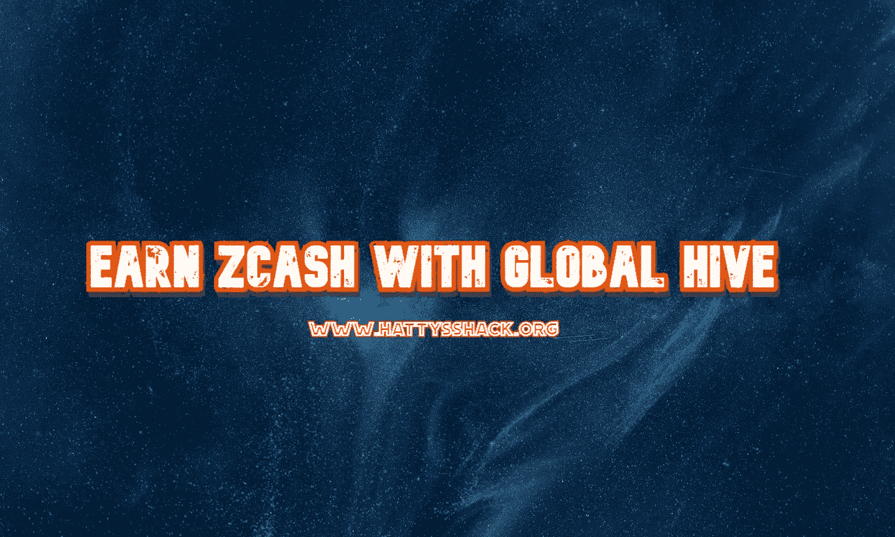
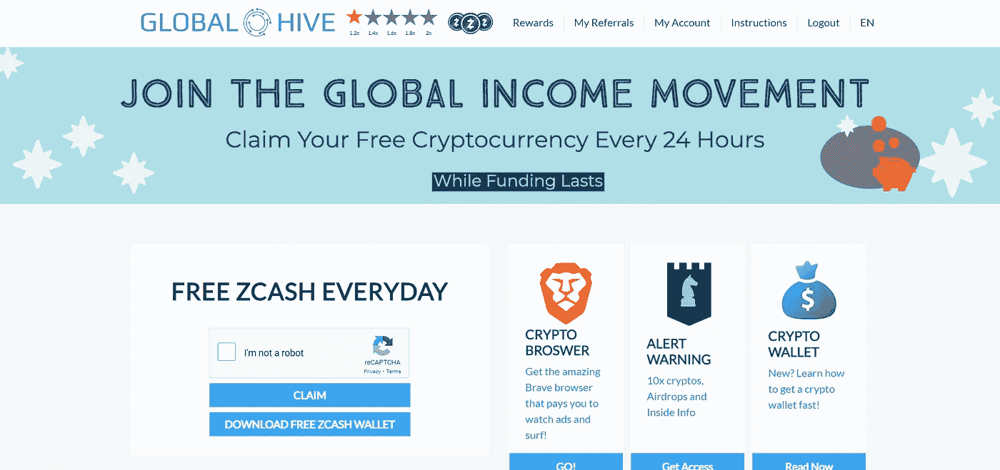

# 通过全球蜂巢赢取 ZEC

> 原文：<https://medium.com/coinmonks/earn-zec-with-global-hive-ca514502ab54?source=collection_archive---------3----------------------->

我总是在寻找值得注意的赚钱网站，我发现了一个我认为每个人都会感兴趣的网站。这个赚钱网站允许你每 24 小时赚一次 ZEC。在我进入这个网站之前，让我先回顾一下 Zcash 是什么以及它是如何工作的。

Zcash 是一种加密货币，于 2016 年发布。它使用零知识证明(zkSNARKS)来创建屏蔽的事务。这些屏蔽交易允许用户在不暴露身份的情况下汇款。它基于比特币协议，但包括一些改进，使其更加安全。Zcash 与 Monero 的相似之处在于它使用 CryptoNote 协议。然而，与 Monero 不同，Zcash 不使用环签名。相反，它使用 zkSNARKS 来隐藏交易金额和发件人地址。

**零知识证明**

零知识证明是一种数学技术，允许双方证明他们共享了数据，同时保持任何信息的私密性。在密码学中，这被称为“零知识”证明。

**屏蔽交易**

屏蔽交易是一种加密交易，其中发送的金额对接收者和公共分类帐都是隐藏的。这意味着没人知道两人之间到底送了多少钱。使用零知识证明创建屏蔽事务

[**全球蜂巢**](https://globalhive.io/r/2447)

[全球蜂巢](https://globalhive.io/r/2447)允许你每 24 小时赚取 Zcash (ZEC)。你所需要的只是一个 Zcash 钱包，记得每天去认领。您连续申请的天数越多，每天获得的奖励就越多。

第一天——没有奖金

第二天—1.2 倍奖金

第三天—1.4 倍奖金

第四天—1.6 倍奖金

第五天——1.8 倍的奖励在这一轮中，您可以赢取高达 0.3 ZEC 的奖励。

第六天-双倍奖金

[Global Hive](https://globalhive.io/r/2447) 是开始赚取 ZEC 和扩大您的加密组合的好方法。没有广告，所有你必须做的是完成验证码，以赚取免费的 ZEC 每天。记住每天申领，否则您的每日奖金将重新开始。从 GlobalHive 申领免费 ZEC 只需大约 1 分钟，所以请利用这个伟大的网站，开始赚取一些免费 ZEC。

全球蜂巢已经运行了大约两年，而且看起来不会很快就有任何进展。该网站说，虽然资金持续，所以我不知道有多少资金和多久的网站将运行，所以检查出来，并赚取，而它仍然有资金。

每笔索赔都会直接发送到您选择的 Zcash 钱包中。我选择了 [Coinomi](https://www.coinomi.com/en/) ，因为它很容易使用，并且可以接收小额付款。你不必使用 GlobalHive 的 Coinomi，但我只是想让你知道这个钱包的工程和易于使用。

你也可以从一个叫做 PipeFlare 的网站上赚取 Zcash。如果您想了解更多关于 PipeFlare 的信息，请查看我的文章。 [**PipeFlare —玩赚**](https://read.cash/@HattyHats/pipeflare-play-to-earn-8d36748c)

查看我的网站，了解更多赚取、学习和投资 Crypto 的方法！

[哈蒂的小屋](https://www.hattysshack.org/)

[read.cash 上的原创文章](https://read.cash/@HattyHats/earn-zec-with-global-hive-0ca05560)

> 交易新手？尝试[加密交易机器人](/coinmonks/crypto-trading-bot-c2ffce8acb2a)或[复制交易](/coinmonks/top-10-crypto-copy-trading-platforms-for-beginners-d0c37c7d698c)