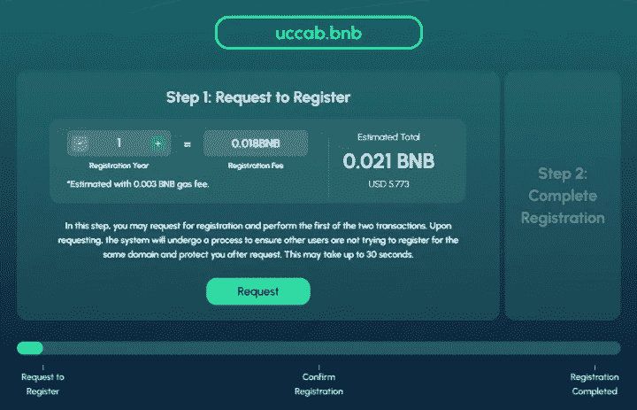
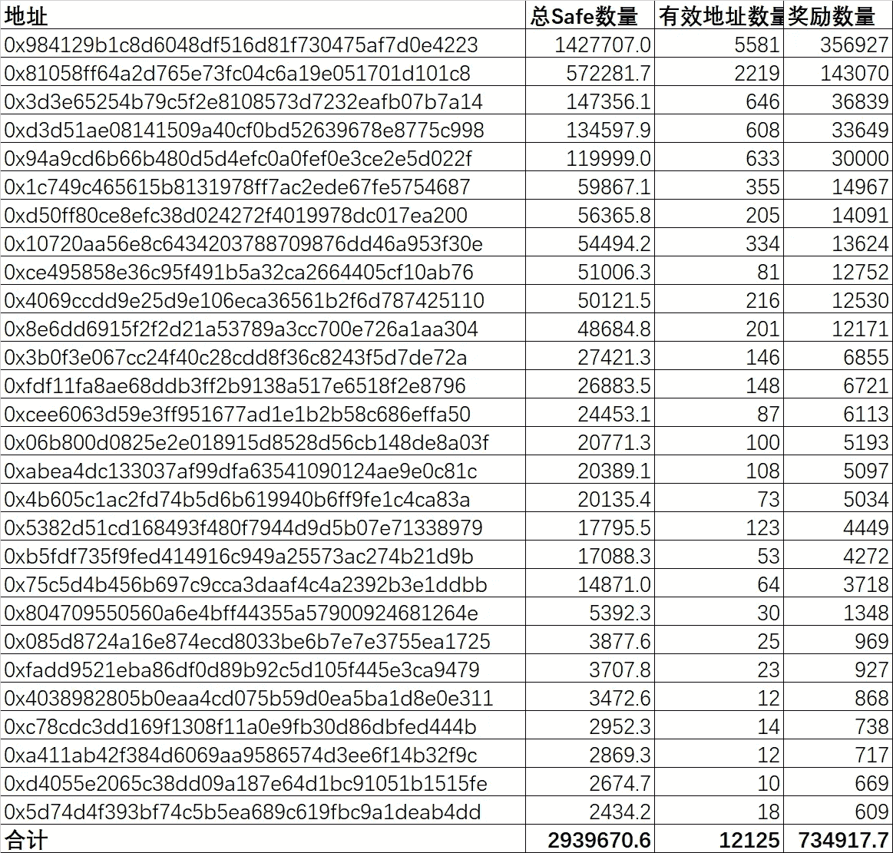
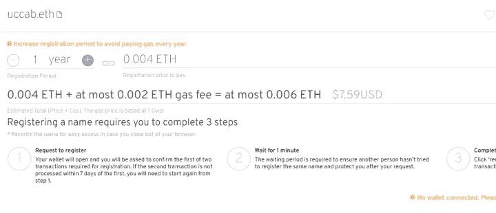
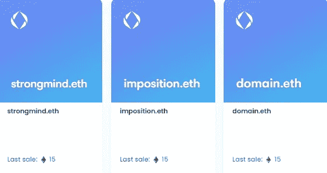

# 在空投上赚了第一笔 6400 美元，如何抓住机会？

> 原文：<https://medium.com/coinmonks/earned-the-first-6-400-on-the-airdrop-how-to-catch-the-opportunity-28a3dd8a0b21?source=collection_archive---------0----------------------->

有玩家问，如何注册一个 web3 域名？我说你可以试试。eth 域名，注册一次就知道怎么操作了。

他回复说现在 ENS 域名没机会了，好域名都注册了，他要攻击. bnb 的机会。

与关心空投的玩家交流。他在这波投机中赚了几个 BNB。bnb 域名。

这位朋友在 2005 年之前就开始关注这个项目了。bnb 内部测试。白名单开放后，他注册了一些 4D 域名，当它们盈利时就出售。

5 digit .bnb domains for less than $6

有些人专门做交互测试，这需要很大的投入。

比如这位朋友注册了 5000 个钱包与某个项目互动，获得了 140 多万的项目代币。但后来被举报，发现交互是批量进行的，钱包空投被重置为零。

空投需要投入，账号交互需要耗费燃气，需要大量的时间和精力。被投项目可能不发空投，或发空投而被举报，或发空投而互动不符合要求等。；但如果交互符合要求，并且创建了大量账号，那将是巨大的回报。

如果不报这个朋友的账，如果代币价格能涨到 0.1U，也是 14 万美元的利润。

新玩家想要空投致富，需要很多基础知识，以及大量的资金和时间投入，门槛相当高。

Made 5000 wallets interacting

币圈老玩家说，这个圈子机会很多。

有低买高卖的，有签约致富的，还有各种 Gamefi，web3。已经开始的人，处处看到机会，但对于新手来说，根本摸不到南北。

一个朋友，去年刚开始加密市场的时候，看到别人玩 gitcoin 捐款，就跟风了。那时，需要注册 ENS 域名，而。eth 域名已注册。

没想到捐赠的项目没有空投消息，却赶上了 ENS 空投，获得了 100 多个 ENS，以 60 多美元卖出，收到了他的第一次空投 6400 多美元。

另一位老玩家表示，他没有花时间做空投，而是继续了解新项目，并与之互动。在这样的操作过程中，反而经常收到项目空投。

文章开头的那位朋友，就算你还没想好怎么注册一个 web3 域名，冲刺一个. bnb 域名机会也比较难。

OP’s interactive airdrop

对于新手来说，学习和参与才是最重要的，如果不知道哪一个才是真正的机会，最好多操作一些。有时专门从事某个项目并不一定会产生结果；相反，它在其他地方出乎意料地收获。

例如，如果有空投教程，请打开项目官方网站了解项目信息，尝试一下，然后按照教程进行尝试。

例如，如果你不知道如何注册一个 web3 域名，你注册后就知道了。

5 digit .eth domains for less than $8

上面的朋友注册了。eth，后来获得了 ENS 空投；现在 bnb 域名是活泼的，你也可以熟悉。bnb 域名注册。

它不是用来炒作 web3 域名的。你可以注册自己的 web3 域名。虽然我不知道它现在是什么，但它也是一个学习和参与的过程。

如果运气好的话，比如你注册了一个类似于强人所难的多位数域名，如果有人需要的话，15ETH 也是个买入的好机会。

Meaningful 10 digit .eth traded for 15ETH

想要从加密圈获益的新手必须付费，他们需要等待机会。

就像目前的 BTC 价格是 19k 美元，没有人知道未来的起伏。人们今天购买可能会回到零，或他们可能有巨大的回报在下一个周期。但持有过程漫长而乏味，有崩盘的可能。

在这个圈子里，确实有许多机会，只给那些有准备的人，而你准备好了吗？

以上只是我个人的看法和总结，没有任何投资建议，读者的任何投资行为与作者无关。

我是楚小莲，我在了解区块链，关注元宇宙、NFT 和 web3。

> 交易新手？试试[加密交易机器人](/coinmonks/crypto-trading-bot-c2ffce8acb2a)或[拷贝交易](/coinmonks/top-10-crypto-copy-trading-platforms-for-beginners-d0c37c7d698c)