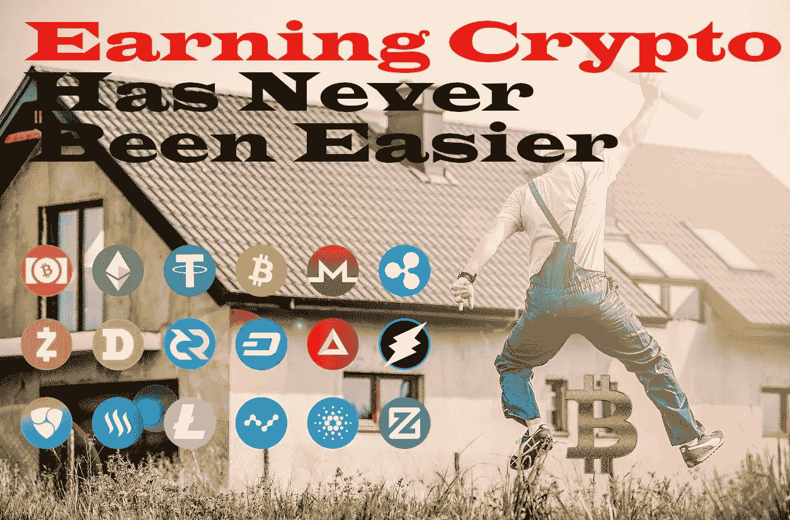
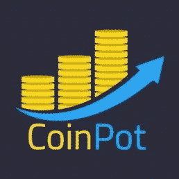

# 赚取加密从未如此简单

> 原文：<https://medium.com/coinmonks/earning-crypto-has-never-been-easier-5c83849cdc0f?source=collection_archive---------35----------------------->

大家好！我希望每个人都有一个轻松的周末，我希望每个人都准备好另一篇学习和赚钱的文章。

Crypto 在成为主流之前还有很长的路要走，但是每一天我们都离它更近了一点。我有一种感觉，我们会看到很多项目失败，但也有很多项目会达到我们从未想过的价格。这就是为什么我们应该一起工作，互相帮助学习和了解各种项目。

赚取加密从未如此简单。我记得当我第一次开始时，只有几个网站是值得的。我记得我试图告诉人们比特币，但没有人愿意谈论它。我相信每个人都记得硬币罐。那是当时最赚钱的网站。每次你声称你考了 100 分。那时候我不能像现在这样挣钱，因为我刚刚重新开始生活，但我希望我能坚持下去，因为我会挣很多钱。我最终挣了一大笔钱，但远不及我现在这样做所能挣的钱。现在，当你去赚钱的网站时，你可以为每一个申请做 1 到 10 个 sat。这就是为什么我试图向人们展示什么网站是最好的。一旦 Crypto 有了下一个大的价格跳跃，赚钱的网站将会以小数的形式给出数量。

没有人相信我之前，加密将会爆炸，但现在我有一个小的声音在线，我想让人们知道，这不是如果，而是当加密价格回升。当价格下降时，这是开始赚取密码的最佳时机。

这是很难的，实际上是不可能的，以找到网站支付以及铸币这些天来，但仍然有很好的赚钱网站，如果你使用他们的权利，然后你可以赚自己一个体面的数额每周投入到你的未来。每一点都很重要。没有人知道 Crypto 的未来，但我有一种感觉，我们将在未来看到一些重大的价格变化。

我分享网站已经有一段时间了，我会尽我最大的努力去寻找目前收入最高和最值得信赖的网站。很容易找到赚钱的网站，但不容易知道他们是否合法和安全。这就是为什么我把寻找和分享最好的网站作为我的目标。

我要和大家分享的下一个网站已经存在一段时间了。这是我用过的最老的网站之一，而且很容易使用。这不是你典型的赚钱网站。这个网站允许你通过写作、阅读和给别人的内容提供小费来赚钱。

> 交易新手？试试[加密交易机器人](/coinmonks/crypto-trading-bot-c2ffce8acb2a)或者[复制交易](/coinmonks/top-10-crypto-copy-trading-platforms-for-beginners-d0c37c7d698c)

在我与你分享这个网站之前，我必须向每个人强调，一定要有像样的病毒软件，并为你所有的盈利网站使用勇敢的浏览器。我不告诉你这些是因为我将要分享的网站是不好的，但是赚取加密会把你带到一些有问题的网站。这就是为什么有好的病毒软件和使用勇敢的浏览器总是安全的。[勇敢的浏览器](https://brave.com/)有一个内置的盾牌，当你从你使用的网站赚钱时，它也允许你赚蝙蝠。如果你不使用 Brave，那么我建议你点击链接查看一下。他们停止了他们的推荐项目，但我仍然认为让人们知道它是值得的，因为它是在线赚取加密的必备工具。

我想和你分享的网站叫做 [PublishOX](https://www.publish0x.com/?a=YQdJrqJdOG) 。这是目前收入最高的网站之一，让你每天通过写作和阅读赚取可观的收入。我在下面做了一个关于这个网站的视频，因为我认为向你展示这个网站比写它更容易。

请在评论中告诉我你的想法。我正在努力使我的视频更好，所以任何想法或想法，你可能会感谢。我知道我有点单调，但我正在努力，并试图让我的视频看起来更有趣。我需要打破我的外壳一点点，但我希望随着时间的推移，我会在镜头前变得更好。

我希望每个人都喜欢这篇文章，如果你有更多的内容，请喜欢和关注。

我的下一篇文章将很快出来，是关于另一个伟大的加密博客网站，你可以通过在网站上写博客和互动来获得加密。

查看我的网站，了解更多内容和其他方式赚取加密。[https://hattysshack.com/](https://hattysshack.com/)

[read.cash 上的原创文章](https://read.cash/@HattyHats/earning-crypto-has-never-been-easier-e9811451)

[#在线](https://read.cash/search?q=%23online)[#比特币](https://read.cash/search?q=%23bitcoin)[#博客](https://read.cash/search?q=%23blogging)[#博客](https://read.cash/search?q=%23blog)[# BTC](https://read.cash/search?q=%23btc)[#加密](https://read.cash/search?q=%23crypto)[#赚](https://read.cash/search?q=%23earn)[#加密货币](https://read.cash/search?q=%23earncryptocurrency)[#赚钱在线](https://read.cash/search?q=%23earnmoneyonline)[#赚钱在线](https://read.cash/search?q=%23earnmoney)[#博主](https://read.cash/search?q=%23blogger)[#加密在线](https://read.cash/search?q=%23earncryptoonline)[#金钱](https://read.cash/search?q=%23money)[#以太坊【以太](https://read.cash/search?q=%23ethereum)

> 加入 Coinmonks [电报频道](https://t.me/coincodecap)和 [Youtube 频道](https://www.youtube.com/c/coinmonks/videos)了解加密交易和投资

# 另外，阅读

*   [OKEx vs KuCoin](https://coincodecap.com/okex-kucoin) | [摄氏替代品](https://coincodecap.com/celsius-alternatives) | [如何购买 VeChain](https://coincodecap.com/buy-vechain)
*   [ProfitFarmers 点评](https://coincodecap.com/profitfarmers-review) | [如何使用 Cornix 交易机器人](https://coincodecap.com/cornix-trading-bot)
*   [如何匿名购买比特币](https://coincodecap.com/buy-bitcoin-anonymously) | [比特币现金钱包](https://coincodecap.com/bitcoin-cash-wallets)
*   [瓦济里克斯 NFT 评论](https://coincodecap.com/wazirx-nft-review)|[Bitsgap vs Pionex](https://coincodecap.com/bitsgap-vs-pionex)|[Tangem 评论](https://coincodecap.com/tangem-wallet-review)
*   [如何使用 Solidity 在以太坊上创建 DApp？](https://coincodecap.com/create-a-dapp-on-ethereum-using-solidity)