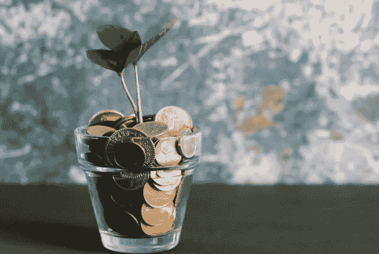
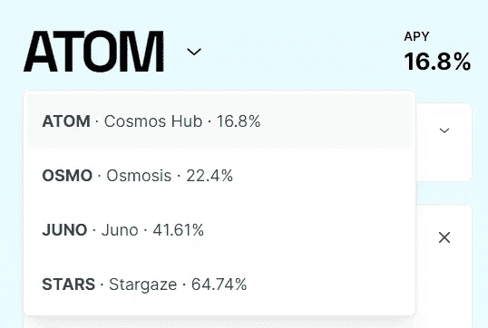
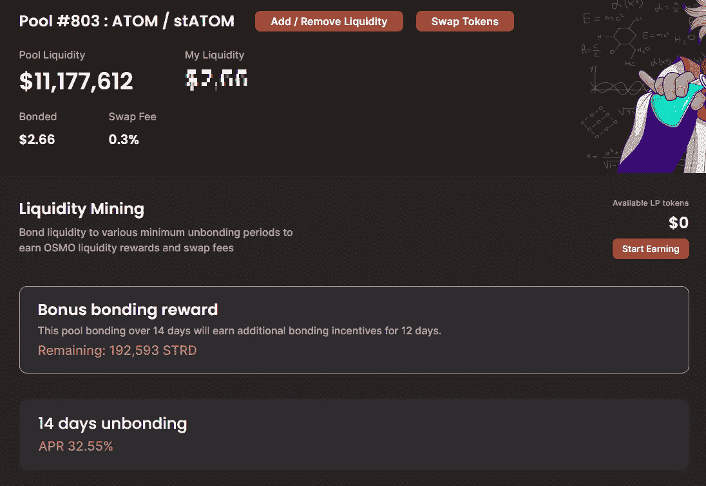
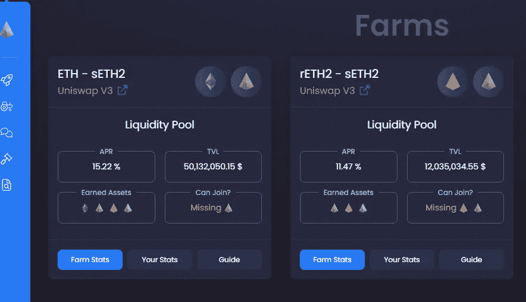
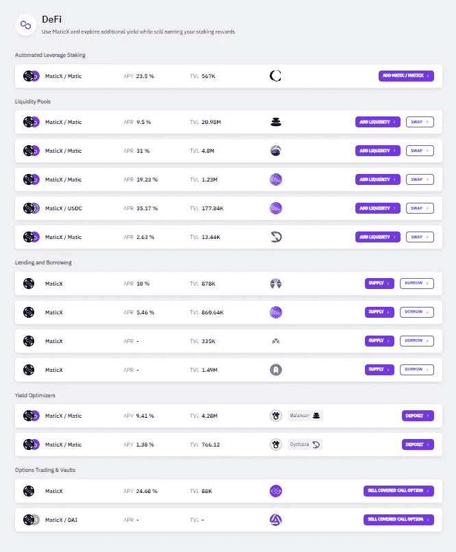
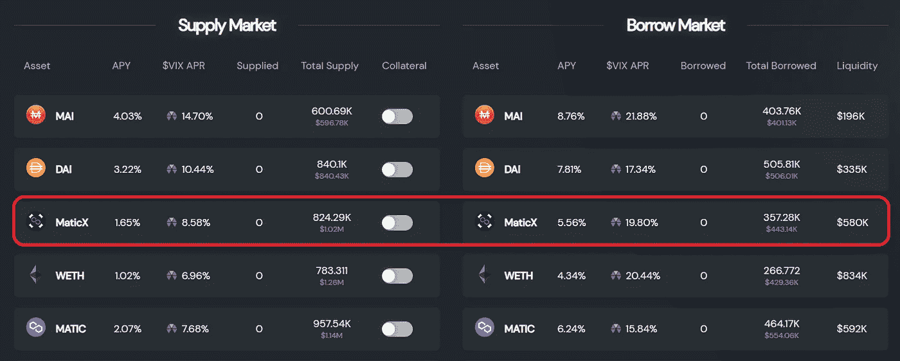

# 在您的流动赌注代币上赚取更高的收益

> 原文：<https://medium.com/coinmonks/earning-higher-yield-on-top-of-your-liquid-staking-tokens-9c25c56a09d?source=collection_archive---------7----------------------->

嘿，伙计们，我过去写过关于流动赌注的文章，但我认为最好开始整合一些我发现的利用你的流动赌注代币的最佳地点，在你的计息代币之外赚取额外收益。

# 液体打桩

首先，如果你不熟悉流动赌注，基本上，当你押一个像$ETH 这样的代币时，根据验证协议，你可以得到一个代币衍生品作为回报，这是一种证明你押了$ETH 的收据。这是一个了不起的概念证明，原因有两个:

1.  你可以用你的代币衍生工具做一些很酷的事情，比如赚取额外的利息，交换等等。
2.  我绝不是税务顾问，但我的理解是，由于代币衍生工具是一种计息资产，它是一种免税事件，因为只要你不出售代币，你就没有实现任何收益。

因为液体赌注，对我来说，只是没有太多的理由做定期赌注了。如果你能让你的赌注随着时间的推移而增加，为什么不呢？

# 从你的流动赌注代币中赚取的最高收益(我发现的)

在 DeFi 的世界里，有越来越多的真正酷的产品在你已经从流动赌注中获得的利息之外产生回报。以下是我整理的列表，但在我开始之前，我认为有必要强调一下最大的风险:

1.  由于市场压力，一些代币衍生品有可能会被套牢，特别是如果代币一旦被套牢(即$ETH)。除了他们的不良贷款，Celsius 崩溃的一个后果基本上是因为$ETH 提款出现挤兑——Celsius 有大量与$stETH 有关的代币，因为他们大量抛售，所以发生了 depeg，导致价格大幅下跌。
2.  对于我要强调的一些策略，兴趣(或至少是部分兴趣)可能是一些低市值替代币，这最终意味着你将通过流动赌注获得令牌之外的价格敞口。

说到这里，让我们深入了解一些不同的选项:

# $ATOM —通过流动性池持有 16.8%的 APY 液体股份+ 32.2%的年利率

如果你查看一下 [Stride](https://app.stride.zone/) ，实际上有几种不同的代币(即$OSMO、$JUNO、$STARS)，你可以应用这种策略并获得更高的 apr，但是作为 Cosmos 上的旗舰，我在这里只讨论$ATOM。

在 Stride 上，您目前可以流动持有您的$ATOM 代币，赚取 16.8%的 APY:

一旦下注，您将获得$stATOM 作为回报，然后您可以通过 ATOM/stATOM 流动性池与[https://frontier.osmosis.zone/](https://frontier.osmosis.zone/)或[https://app.osmosis.zone/](https://app.osmosis.zone/)进行较量，目前额外赚取 32.55%的 APR:

请记住，尽管这种策略对非永久性损失的风险相对较低，但您仍将面临$STRD 的风险。

# $ETH —通过流动投资获得 5.32%的年利率+通过流动性池获得 15.22%的年利率

在 [Stakewise.io](https://app.stakewise.io/farm) 上，用户可以分别以 5.32%和 15.22%的利率入股和出售他们的$ETH 衍生品。可用的衍生产品为＄ret H2 和＄set H2，可通过 Uniswap V3 放入 ETH/sETH2 或 rETH2/sETH2 流动性池:

最近有传言说，他们将不再使用$rETH2 和$sETH2，而是改用单令牌模型，但是，唉，这还没有发生:

# $MATIC —通过流动投资获得 5.76%的年利率+通过杠杆作用获得至少 28.91%的年利率

我不能写一篇关于液体赌注的文章而不谈论 Stader——他已经迅速成为许多最大市值硬币(如$MATIC)的头号赌注。在 [Stader](https://staderlabs.com/) 上，你现在可以将你的$MATIC 以 5.76%的 APY 投资于它们的代币衍生品$MaticX。从这里开始，你可以使用大量选项来借款或贷款、杠杆(借款和贷款)、收益率优化器、金库或流动性池——所有这些都有一些非常好看的收益率:

我个人最感兴趣的，也可能是回报最高的，是 app.0vix.com 相对较新的策略。尽管美元 VIX 价格敞口存在很大的风险(这是一个尚未完全定价的象征)，但目前你可以通过借贷获得非常高的美元 VIX 年利率，这意味着你可以利用杠杆获得相当高的回报:

# $AVAX —通过流动资产获得 7.20%的年利率+通过流动资产池获得 12.54%的年利率

有了$AVAX，目前你可以流动持有[本齐金融](https://staking.benqi.fi/stake)的股份，获得大约 7.20%的年利率，同时获得$sAVAX 作为回报。最近，本齐和 [Echnida Finance](https://app.echidna.finance/) 加入了一项联合激励计划，该计划提高了 Echnida 的 LP 利率:

这种策略需要注意的一个风险是，你的回报没有一笔是以美元萨瓦克斯支付的，所以你对美元齐和美元的替代币有完全的风险敞口。

# 其他液体铆接选项

有相当多的其他主要替代硬币，如$BNB 或$FTM 的其他流动赌注选项，但为了效率起见，我不包括他们在这里。如果你想更多地了解这些选项，并了解如何利用你的收益赚取 20%以上的 APY 回报，[我建议你阅读我几个月前写的关于流动性赌注的文章](/coinmonks/the-best-places-to-stack-your-altcoins-leveraging-your-gains-by-using-liquid-staking-lps-3cab5f1e1c23)，因为在很大程度上，最佳盈利策略并没有改变。

感谢你花时间阅读这篇文章，一定要在推特(【https://twitter.com/CryptosWith】)上关注我，获取我所有的最新消息。

免责声明:最后提醒一下，这不是财务建议，仅用于教育和娱乐目的。请一如既往地做自己的研究，找到最适合你的投资。干杯大家！

> 交易新手？试试[密码交易机器人](/coinmonks/crypto-trading-bot-c2ffce8acb2a)或[复制交易](/coinmonks/top-10-crypto-copy-trading-platforms-for-beginners-d0c37c7d698c)