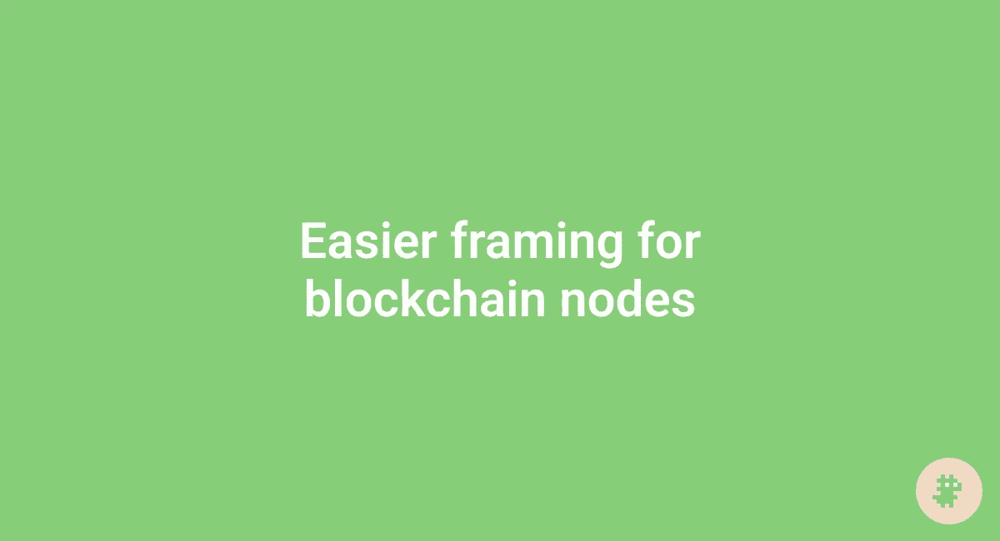
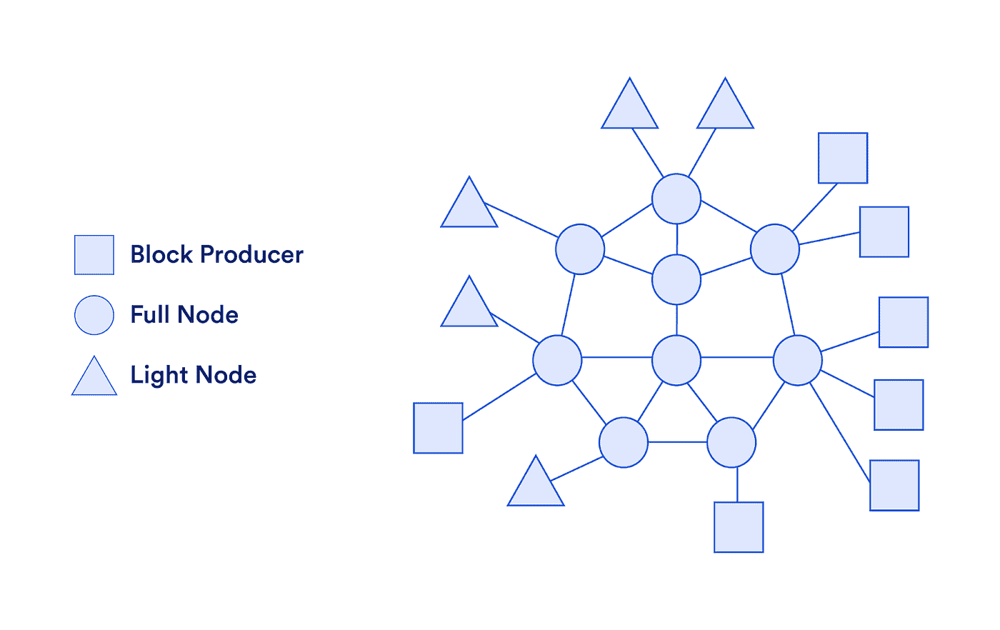
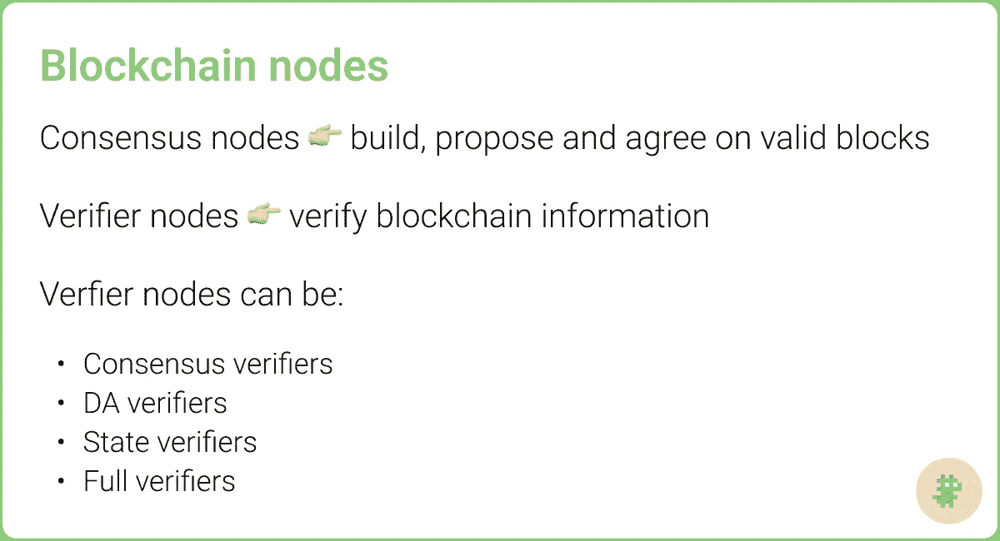

# 区块链节点更容易成帧

> 原文：<https://medium.com/coinmonks/easier-framing-for-blockchain-nodes-f653f7e83172?source=collection_archive---------16----------------------->

在这篇文章中，我概述了不同类型的区块链节点，解释了它们的功能，并提出了一个替代框架。

在我们深入区块链节点的世界之前，我想弄清楚一件事。

我的目标不是决定标准术语或充实精确的技术定义。

我的目标是在综合业内聪明人的想法后，分享一个心智模型。只要有可能，我会尽力表扬那些人。

> 让我们从审阅这篇文章并提供反馈的人开始。感谢你们每一个人:Sreeram Kannan([*@ sreeramkannan*](https://twitter.com/sreeramkannan)*)Toghrul maharamov(*[*@ toghrulmaharam*](https://twitter.com/toghrulmaharram)*)dubeloliu(*[*@ dubbel 06*](https://twitter.com/dubbel06)*)Polynya(*[*@ apolynya*](https://twitter.com/apolynya)*)哈苏()*

# 当前框架

通常，区块链节点被认为是:

*   验证器
*   完整节点
*   轻客户端

📌是的，还有其他类型的节点(例如归档节点)，但这是主要的三种。

我们将借用 [Chainlinkgod](https://twitter.com/ChainLinkGod) 关于区块链信任模型和网络参与者的[精彩文章](https://blog.chain.link/blockchain-trust-model/)中的定义。在这篇文章中，他提到“块生产者”包括 PoW 矿工和 PoS 验证者，但是我们将把重点放在以太广场上，并使用术语“验证者”。

From Chainlinkgod’s article

**验证器**是“负责将交易排序并打包成称为块的离散数据结构的实体，这些数据结构随后被提交给网络进行验证。如果在相同的块高度产生两个有效块，[验证器]负责确定哪个版本的链是规范的。

📌那么 [PBS](https://notes.ethereum.org/@vbuterin/pbs_censorship_resistance) 呢？PBS 是一个计划中的以太坊升级，它将验证者分成两个独立的角色——一个角色(构建者)将订购和打包交易到块中，另一个角色(提议者)将提议和投票到块中。这可能需要几年的时间来实现，并且我认为将它集成到框架中并不困难(很快就会引入)，所以我将把它排除在本文之外。

**全节点**“下载并自我验证【验证者】提出的每一个块。如果发现该块是有效的(即遵守了协议规则)，则将该块添加到完整节点的个人分类帐副本中，并应用状态改变。任何不符合协议规则的无效块都将被忽略，并因此被丢弃，而不会发生任何状态变化。”

**轻型客户端**(又名轻型节点)是“一种有限形式的完整节点，其中仅下载块的标头(即小型唯一加密指纹)。轻型客户端可以验证某个块中是否包含某个事务，但是因为它们不下载或执行块中的所有事务，所以它们隐式地信任大多数块生成者是诚实的。

我觉得这些定义很棒，但是值得向 ELI5 更进一步。

基本上，当轮到验证者时，他们创建并提出块(有序事务的列表),当没有轮到他们时，他们对块进行投票。它们对遵守协议规则的块进行投票，因为不遵守规则的块会被忽略。验证器知道忽略哪些块，因为它们也是完整节点，并且自己验证事务。

验证器需要是完整的节点，但是完整的节点不需要是验证器。如果你的电脑满足[最低要求](https://ethereum.org/en/developers/docs/nodes-and-clients/run-a-node/)，你就可以获得一个完整节点的[好处](https://twitter.com/sassal0x/status/1571054986674712578?s=46&t=4kTltRpQ9xLehUGIRTPrxQ)。不需要押 32 ETH。

为什么将完整节点与验证器分开考虑很重要？

关于这一点，我会让你参考以太坊研究员[丹克拉德](https://twitter.com/dankrad)的[这篇 OG 帖子](https://dankradfeist.de/ethereum/2021/05/20/what-everyone-gets-wrong-about-51percent-attacks.html)。他列举了完整节点如何控制验证器的例子，“有点像自由民主国家的分权”。

轻客户端从何而来？

很明显，大多数用户[不会运行完整的节点](https://twitter.com/VitalikButerin/status/873177382164848641?s=20&t=eV2O4_Y6cvJS78AtrBB7Eg)，所以轻客户端降低了与区块链交互的成本。它们实现了浏览器内置/手机钱包等功能。

轻客户端遵循规范链(大多数验证器都同意这一点)。它们通过下载块头来检查块的摘要信息。

📌如果你想更好地了解轻客户是如何工作的，我推荐来自敌无双波哥大的[埃坦·基斯林的演讲](https://www.youtube.com/watch?v=ZHNrAXf3RDE&list=WL&index=2)。

# 要解决的问题

如果你正在建设空间或经常加密 Twitter (CT)，你可能已经知道一些(或全部)以上。

那么问题是什么呢？

如果你经常看 CT，你可能也会看到术语被质疑的频率。下面是来自 [EigenLayer](https://www.eigenlayer.xyz/) [的](https://twitter.com/seb3point0/status/1589188983098966017?s=46&t=pgmbgD6zwSWtGDmJeoWjng) [Sreeram](https://twitter.com/sreeramkannan) 对术语验证器的质疑，以及来自[卷轴](https://scroll.io/) [的](https://twitter.com/toghrulmaharram/status/1560287322247204865?s=20&t=wARPoqeqAr445Q5UyRbtnQ) [Toghrul](https://twitter.com/toghrulmaharram) 表达对新术语的需求。

如果这对于 CT 来说是有问题的，那么想想对于新人来说该有多难。这里是 [Vitalik 解释](https://twitter.com/VitalikButerin/status/1479815125955715072/photo/1)用户可以连接到区块链的许多方式。好的——密码专家莫邪可能会解决这个问题——但是这太多了！

为什么目前的条款不是最佳的？

分权的双刃剑！新技术和想法在整个生态系统中快速涌现，而且没有区块链营销部门。

相反，我们(社区)必须跨层和跨协议合作，以确保人们不会越过彼此说话。本文旨在促进这种合作。

# 替代框架

当讨论节点时，我们通常关注实现。但是，当实现随着时间的推移而变化时，这是否总是最好的方法呢？我们应该关注核心功能吗？

首先，让我们检查术语验证器。Sreeram 很好地描述了这一点，剥离了今天的实现，并区分了可替代/不可替代的功能。

见证节点和共识节点似乎都比验证器好，但我们将选择后者，因为共识在区块链空间中是一个[更熟悉的术语](https://decrypt.co/91149/ethereum-foundation-kills-eth-2-consensus-layer-rebrand)。

现在我们来讨论全节点和轻客户端。

完整节点是许多争论的中心——关于[人们是否“关心”运行它们](https://moxie.org/2022/01/07/web3-first-impressions.html)，有多少人运行它们，运行它们有多贵，等等。另一方面，轻客户端并没有被太多的讨论，因为他们刚刚在以太世界成为可能。

但是这些节点试图完成什么，人们通常在争论什么？从根本上说，这是关于核实区块链信息的成本。

这是事情变得有点棘手的地方，所以请原谅我。我们可以验证不同类型的区块链信息:

*   共识验证
*   计算/状态转换验证
*   数据可用性验证

📌我将从 Vitalik 的文章中借用后两个定义[。](https://vitalik.ca/general/2021/04/07/sharding.html#improving-sharding-with-better-security-models)

**一致性验证**意味着检查一个块是否包含在规范链中，以及一个事务是否包含在该块中。

**计算/状态转换验证**意味着“检查某些计算是否正确完成，假设你拥有计算的所有输入”。

**数据可用性验证**意味着“检查计算本身的输入是否以某种形式存储，如果你真的需要，你可以下载它们；这种检查应该在不实际下载整个输入本身的情况下进行”。

如果共识验证听起来很熟悉，那是因为我们在前面定义轻客户端时描述了相同的功能。事实上，这就是今天轻客户端所支持的！

然而，我们应该避免将*轻客户端等同于*共识验证(人们经常这么做)。由于 ZK /欺诈证明和数据可用性抽样等技术改进，轻客户端最终将执行所有三种类型的验证。

这将允许轻型客户端实现与完整节点大致相同的安全保证，并将打破当前的思维模式。我们需要新的术语。

📌如果你想更好地理解上面提到的技术改进和它们的信任假设，我推荐 Vitalik 的[这些](https://vitalik.ca/general/2021/04/07/sharding.html#improving-sharding-with-better-security-models) [三个](https://vitalik.ca/general/2021/05/23/scaling.html#its-crucial-for-blockchain-decentralization-for-regular-users-to-be-able-to-run-a-node) [帖子](https://vitalik.ca/general/2020/08/20/trust.html)。

好了，让我们一起来欣赏一个新的画面。如果我们这样考虑区块链节点会怎么样:

验证器→ **共识节点**

验证区块链信息的节点(较少关注全客户端与轻客户端)→ **验证器节点**

验证一致性的节点→ **一致性验证器**

验证计算/状态转换的节点→ **状态验证器**

验证数据可用性的节点→ **DA 验证器**

验证一致性、计算/状态转换和数据可用性(或给定链上可能验证的最大类型数)的节点→ **完全验证器**

这是更清晰的图像。您可以看到有两个高级类别，后者可以分为四个低级子类别。

**📌与[斯瑞拉姆](https://twitter.com/sreeramkannan)、[托格鲁尔](https://twitter.com/toghrulmaharram)和[杜贝洛六](https://twitter.com/dubbel06)交谈中出现的术语。**

# 总结想法

同样，本文旨在提供一个思考区块链节点的框架，目的是使它们更容易理解和讨论。

很可能一些解决方案需要几年的时间来构建(我们将在另一篇文章中讨论具体的实现和时间表)，所以我们能够清楚地传达我们正在构建的目标是很重要的。

这绝对是最好的取景吗？

不确定！可能还有更好的，我希望他们浮出水面。例如，如果你想到一个很好的方法来合并 PBS 或第 2 层节点，我很乐意听听！我们来迭代一下。

如果这篇文章让我们更接近尾声，我会很高兴。

> 交易新手？试试[加密交易机器人](/coinmonks/crypto-trading-bot-c2ffce8acb2a)或者[复制交易](/coinmonks/top-10-crypto-copy-trading-platforms-for-beginners-d0c37c7d698c)