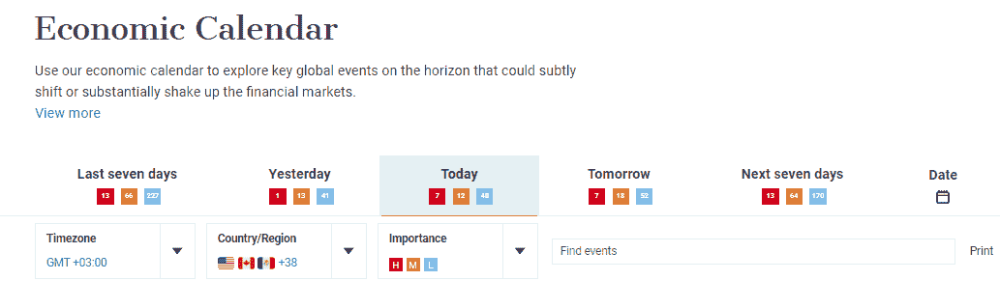
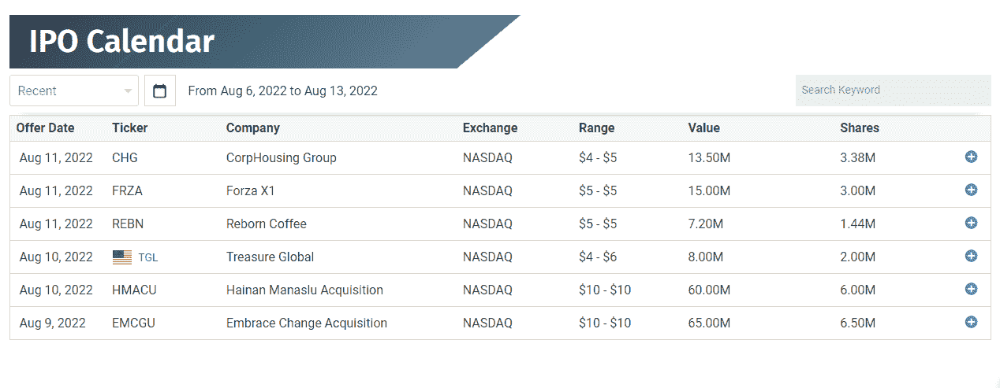
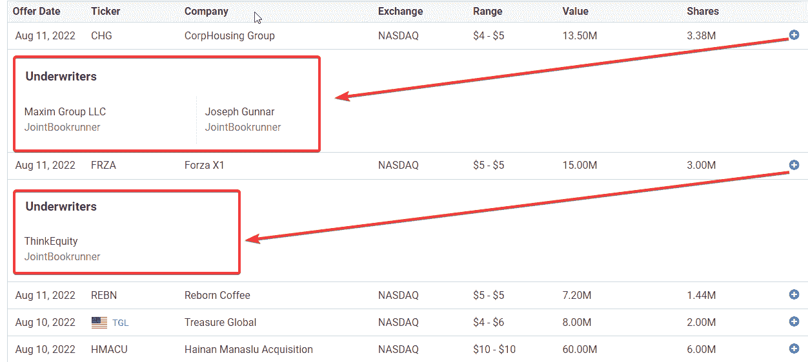
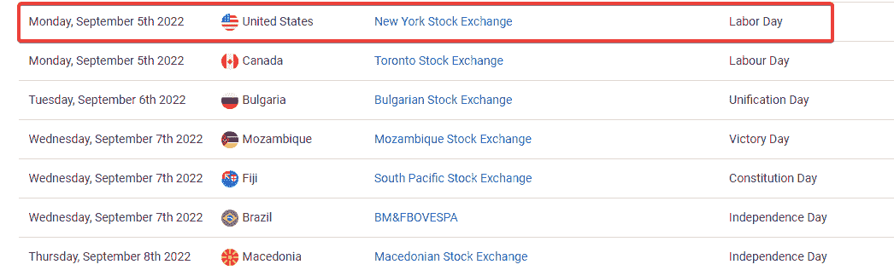

# 交易和投资的经济日历

> 原文：<https://medium.com/coinmonks/economic-calendars-for-trading-and-investments-791aee544c12?source=collection_archive---------19----------------------->

Image by Author

交易者依靠市场信息做出交易和投资决策。

因此，除了深入的市场分析，关注日历和市场周围的关键事件也至关重要。

理想的情况是，用事件日历来处理交易策略为你的基本面分析打下了坚实的基础。

这篇文章将会找到关键的问题，基本的日历，以及你可以在每种类型下寻找什么。

此外，还有一个关于日历关键问题的独家 FAQ。

# 什么是经济日历？

经济日历是一份重大发布或事件的时间表，这些发布或事件极有可能影响股票或货币对的价格。

它有助于预测跨投资时间框架的更好决策。

这些日历在许多网站上都是免费的。

大多数网站会用红色标记高影响力事件。橙色或黄色表示中度影响，绿色表示低度影响。

这些记录是按国家和时区分类的。如果一个事件是数据驱动的，通常有以前的分数和预测。

随着实际结果进入市场，分数会实时更新。

如果你使用像 DailyFX 这样的网站，你会得到一个带有颜色代码的摘要，如下所示。

Image by Author

让我们回顾一下日历的种类。

# 经济日历

通常，经济日历包括分析师认为会影响价格的任何东西。

然而，也有黑天鹅或意外事件——战争、灾难和流行病。没有关于黑天鹅的预言。然而，它们对不同时间段的价格有很大影响。

作为投资者，你对经济日历的了解给你的市场分析带来了更多的洞察力。

与此同时，还有更多种类的日历。然而，根据经济日历工作是好的。

由于投资者寻找更奇特的信息，我们将详细讨论你能找到的更多信息。

# 收入日历

关于收益的准确信息对股东来说是一个重要因素。由于高波动性，这些公告导致了巨大的价格波动。

因此，了解主要公司发布信息的时间表应该是你投资时间表中的一个因素。

公司会在一个季度结束后的一个月公布季度业绩。所以，这里要注意的月份是一月，四月，七月，十月。

此外，一些公司每年都会发布这些信息。

以下是发布公告后需要注意的事项:

●一个是利润增加——对股票的需求上升，价格也上升。

●其次是亏损的结果——投资者对股票失去需求，股价下跌。

# 股息日历

股息日历适用于股东。当你的名字应该在他们的数据库中时，它有助于使记录更加透明，以便你要求分红。

当然，未来的股东可以看到不持有股票的机会成本。

大多数公司每个季度都有分红日历。

股息日历可以说明股票是否会除息出售。

同时分红意味着新的所有者有权获得分红。

相反，除息意味着股票将会转让，而新的所有者无权获得最后一笔股息。

# 拆分日历

当公司增加发行在外的股票数量时，就会发生股票分割。它有一些好处，比如增加基础股票的流动性。

对于大公司来说，股票分割决定和时间表对投资者来说是至关重要的因素。每个人都探索这些信息来帮助他们做出更好的决定。

更详细地说，拆分可能会带来影响股价和收益的重大变化。

因此，清楚地设置有关实际过渡日期的记录是拆分日历的关键组成部分。

# IPO 日历

投资者需要关注首次公开发行(IPO)的时间表，这是另一个关键领域。除了国家上市，时间表和相关信息可能会出现在股票经纪人和交易所等著名的利益相关方。

IPO 日程表中的一些重要信息包括:

●当前日期

●报价日期

●股票代码或官方缩写

●发行公司的名称

●交易所上市

●每只股票的价格范围

IPO 的价值

●可供首次公开募股的股票

下面是 FXEMPIRE 列出的 IPO 日程表的图片

Image by Author

注意:记录右边的加号可以让投资者扩大记录。见下图——显示了承销商。一些 IPO 有不止一个承销商。

Image by Author

# [假日日历](https://www.fxempire.com/tools/holiday-calendar)

假期每隔一个月一次。因此，投资者的假日日历呈现出一种全球视角。

对于投资者来说，重点是查找可能与他们的投资目标有密切关系的信息。

下面的假日日历图片就是一个例子:

Image by Author

预见到劳动节会影响 NSE。另一种看法是，预计在那一天，北美市场的交易量会有所下降。

性能结果可以在其他领域看到。在外汇市场，假期可能会对主要货币对产生连锁反应。这是因为美国经济的表现会引发与之密切相关的巨大反应。

一个显著的例子是黄金(XAUUSD)与美元兑日元的对比。在价格图表上，当一方看涨时，另一方很可能看跌。

# 中央银行日历

央行日历是投资者关注的另一个重要方面。这些机构负责管理财政和货币政策。

中央银行最感兴趣的是利率的变化。通常，任何变化都会对整个市场的股票和外汇产生巨大影响。

通常情况下，很容易就能看到各国央行的日程表。然而，更复杂的部分是预测跨市场价格确认决策的正确含义。

接下来，下面是央行日历的摘录——显示了关键日期。正如你所看到的，根据 [DailyFX](https://www.dailyfx.com/central-bank-calendar) ，你可以选择查看每个央行的数据，或者缩小到特定月份。

# 临别赠言——经济日历

经济日历是交易者和投资者的重要组成部分。它可以指导他们的日常活动时间表，为他们的计划提供信息。

缩小范围以挑选对你有帮助的信息的需要是特别令人感兴趣的。此外，选择一个最符合你需求的日历。IPO 日程表可以帮助股票投资者寻找即将到来的 IPO。

另一方面，经济日历没有预料到突然的市场效应，也就是黑天鹅。

最后，使用经济日历的交易者和投资者可以对他们的投资周期和策略有更多的了解。

# 经济日历常见问题

## 为什么我们有经济日历？

经济日历就像投资者和交易者的指南针。它包含的数据记录显示了国民经济中各种事件的实际和预测。

交易者利用时间线来帮助他们做出相应的决定和计划。

## 什么是经济日历外汇？

外汇中的经济日历详细列出了所有可能影响货币对价格的预期事件。大多数情况下，分析师根据影响预测将事件分为三类。它可以是高、中或低。

## 下周有哪些经济报告到期？

捕捉未来一周经济事件的最佳方式是将排序限制在未来一周。

## 外汇市场最重要的消息是什么？

外汇市场最重要的消息会影响你交易的货币对。然而，以下几类数据通常会点亮市场:利率、国内生产总值(GDP)、消费者价格指数(CPI)、隔夜利率以及美国非农就业数据(NFP)

> 交易新手？试试[密码交易机器人](/coinmonks/crypto-trading-bot-c2ffce8acb2a)或者[复制交易](/coinmonks/top-10-crypto-copy-trading-platforms-for-beginners-d0c37c7d698c)