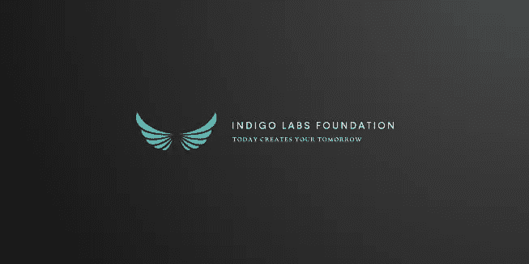
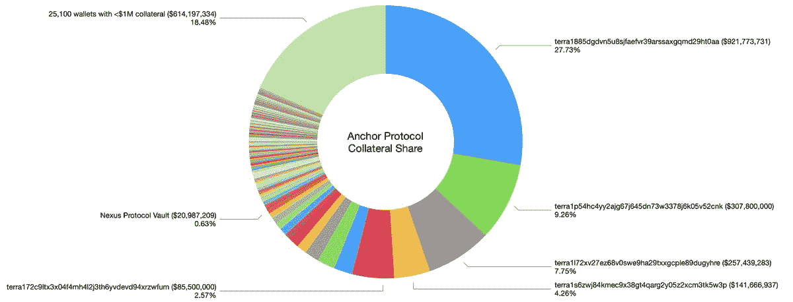
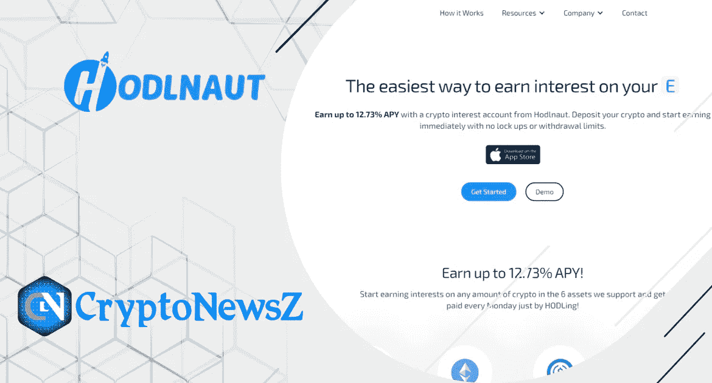
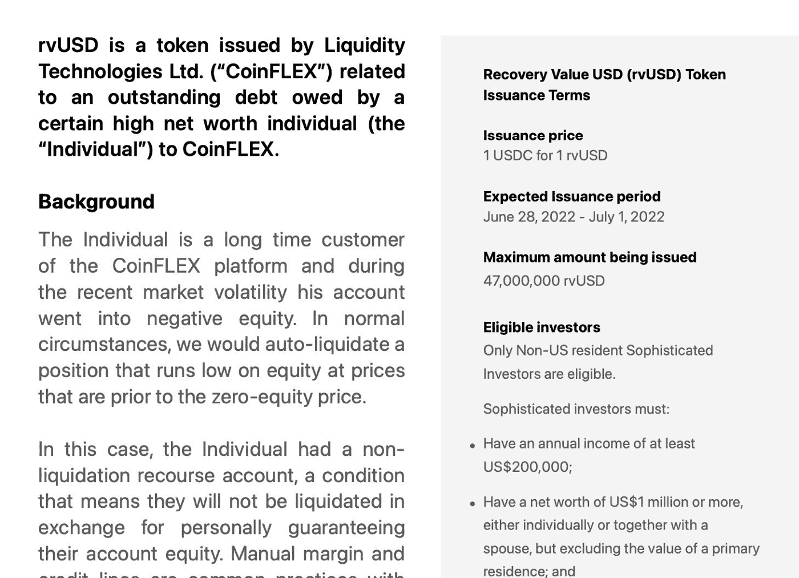
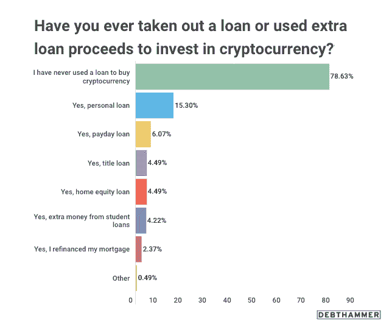

# 经济衰退—2022 年的加密方面

> 原文：<https://medium.com/coinmonks/economic-recession-crypto-side-2022-61e798e34c3a?source=collection_archive---------6----------------------->

‘’Be fearful when others are greedy. Be greedy when others are fearful’’ — Warren Buffet

从 2021 年 11 月 3 万亿的历史最高市值开始，加密货币市场已经收缩了其总价值的 72%以上(更准确地说，超过 2 万亿美元)，这是由当前的宏观经济环境和过度杠杆化的加密投资公司糟糕的风险管理造成的。本文旨在分享一个观点，关于促成当前加密市场环境的核心问题，以及可能在整个加密行业产生新冲击波的即将到来的事件。

# 隐秘的黑天鹅事件:UST 的陷落

在 2022 年 5 月 9 日，泰拉 USD (UST)稳定的货币在 6 小时内从其价值下跌到 0.76。这并不是 UST 第一次偏离其既定的钉住汇率制度，以前每年至少会发生两次。在过去，挂钩将由套利机器人返回，因为无论 UST 价格如何，你都可以用每 UST 价值的 Luna 兑换 1 美元。仲裁机器人:

1.  会购买脱钩的 UST；
2.  烧掉 UST，每个 UST 兑换 1 美元的月神；
3.  出售月神代币；
4.  重复这个过程。

由于 UST 被烧毁，供应将受到限制，推动其价格接近 1 美元。然而，这一次不同。挂钩再也没有回来，UST 和卢娜都崩溃了，同时抹去了惊人的 400 亿美元。

## 为什么 depeg 后 UST 的价格没有被套利机器人返回？

一个不为人知的钱包将 8500 万换成了，与此同时，Terraform Labs 正在将大部分国库资金从 ust 3c VR(UST+USDT+USDC+戴)曲线池转移到一个全新的四池(UST+USDT+USDC+FRAX)的筹备中。这导致了 UST 的一个小的 depeg，因为 ust3Cvr 池中有太多的 UST。通常，这是套利机器人介入的地方，然而，似乎没有人想买 UST。不久，一只不知名的鲸鱼通过币安交易所又卖出了 2 亿 UST，而恐慌的散户投资者在火上浇油，卸载了大量 UST，创造了近年来最大的跌幅。

## 谁是 UST 和露娜坠机事件的幕后黑手？

关于其背后的原因，已经提出了许多理论。第一种猜测是，当 Luna 从 ust3Crv 资金池转移大部分资金以准备 Four 资金池时，Blackrock 和 CitadelT3 通过出售其持有的 Luna 和 UST 代币参与了 depeg。然而，这些指控很快被驳回，因为没有证据支持这些说法。另一种理论包括 [**内幕交易**](https://www.financemagnates.com/cryptocurrency/was-terra-luna-death-spiral-a-result-of-an-inside-job/) 以及在 UST 和露娜破产之前，露娜创始人故意试图将他们的资产清算到个人账户。即使这听起来很疯狂，最近的发现表明，Terraform 实验室可能是这次事故的幕后黑手。为了更好地理解，我们必须深入探究 Terra Luna 及其心脏锚快速增长背后的原因。

## 锚的秘密与幻觉——《大毒蛇》

> “大毒蛇(Ouroboros)是一个希腊单词，意思是“尾巴吞噬者”，是蛇完美对称地吞噬自己身体的古老象征。大毒蛇的形象唤起了自我毁灭反馈循环的无限本质的概念。这个符号出现在各种文化中，是神秘的炼金术传统中的一个重要标志。埃及神秘主义者首先从自然界的真实现象中得到这个符号。在极端高温下，无法自我调节体温的蛇会经历新陈代谢失控的高峰。
> 
> 在狂躁状态下，蛇无法区分自己的尾巴和猎物，会攻击自己，自相残杀直到死亡。在自然和市场中，当随机性自我组织成过于完美的对称时，秩序就成了混乱的源头，而混乱以自身为食。“- ( [**阿耳资本研究论文**](https://artemiscm.docsend.com/view/2b34894bzsaqsbcx) **)**

## Anchor 在 crypto 中是如何工作的？

锚定协议被认为是一个储蓄账户，储户可以将他们的 UST 存入其中，以获得高达 19.5%的 APY。巨大的收益来自三个地方:借款人支付的利息，借款人提供的抵押品通过赌注获得的赌注回报，以及锚的储备。当 Anchor 有盈余时，利润将被存入收益准备金，另一方面，当它赚不到足够的钱时，储户的利息支出将被准备金补足。如果储备下降得太低，收益会下降，但储户的初始付款将一直存在，本质上提供了“无风险”回报。因此，只要收益率来自借款人的有机基础，这种机制看起来就是合法的。此外，正如法特曼指出的，区块链的数据看起来令人满意，因为

> “1 月份，8.78%的收益率来自 bonded LUNA (bLUNA)跑马圈地，7.08%来自借款人利息，0.36%来自 bETH 跑马圈地。只有 3.28%来自收益准备金。区块链的数据描绘了一个故事:通过借贷对 UST 有真实的需求，赌注回报是安全和稳定的，人们通过利息为锚提供收入。这是有机的，即使收益率储备消失，Anchor 也可以持续赚取至少 10%”。

然而，通过深入研究，我们发现超过 50%的借款人的抵押品来自 25，500 名借款人中的 4 个钱包( [Pedro](https://twitter.com/pedroexplore1) )。

最大的鲸鱼借了 4.5 亿英镑，有 4.16 亿英镑就放在那里，没有任何收益，放弃了 LUNA 奖励和 Anchor 奖励，同时为他们没有使用的贷款支付了超过 20%的实际利息。最重要的是，第二大账户用 3 亿美元的 Luna 借了 7700 万美元，支付了超过 40%的实际利率，并放弃了大量的赌注回报。有一些见不得人的事情在进行，正如[安德斯·赫尔塞斯](https://docs.google.com/spreadsheets/d/1MBbvXqsNIlqNMwaMviAQwYZFGTUIAPsHs7Sdr_VpnEk/edit#gid=0)和[法特曼](https://twitter.com/FatManTerra/status/1539340072042082314)后来发现的那样——最大的账户被追踪到 Terraform Labs，而第二个账户被追踪到 Hashed，一家韩国风险投资基金，他们是 LUNA 的种子前投资者。

两个鲸鱼钱包都清楚地表明，像[大毒蛇](https://en.wikipedia.org/wiki/Ouroboros)一样，Anchor 从其储备中支付了大部分“无风险”收益，本质上是“吃掉自己”并创造了一个有机借贷需求的假象，从而欺骗散户投资者“全押”所谓的“无风险”收益。Terraform Labs、Anchor、Mirror 和 UST 计划可能是我们这一代最大、最复杂、执行得最好的大规模金融欺诈。

# 过度杠杆化的加密投资公司和糟糕的风险管理

2021 年的加密牛市吸引了多家投资公司考虑加密资产。根据 [CB Insights 的《2021 年区块链状况》报告](https://www.cbinsights.com/research/)，区块链初创公司的风险投资资金去年达到 252 亿美元，比 2020 年的 31 亿美元增长了 713%。此外，普华永道[的加密对冲基金报告](https://www.pwc.com/gx/en/news-room/press-releases/2022/pwc-global-crypto-hedge-fund-report-2022.html)发现，超过三分之一的传统对冲基金现在投资于数字资产，估计全球有 300 家专业加密对冲基金。这种增长极大地推动了加密市场，但巨大的回报和永无止境的历史高点(ATH)使得即使是有经验的人也对风险项目和宏观经济条件视而不见。这种狂热抓住了加密领域一些最大的玩家，他们由于巨大的损失而开始违约。例如， **Three Arrows Capital** (3AC)最近拖欠了一笔价值超过 6.7 亿美元的贷款(USDC 3.5 亿美元和 15 250 个比特币)，此前它在 LUNA 上输掉了 9 位数的钱，并在没有告诉他们的情况下，在 Anchor“Ponzi”上又输掉了 9 位数的钱。

据 FatMan 报道，新加坡金融管理局(MAS)规定 3AC 的管理上限为 1 . 8 亿美元，但通过说服公司以“担保”利率发行无抵押贷款，3AC 的投资组合超过了 3B，因为这种债务成为了专有资本，绕过了上限。由于目前的法律程序已经到位，3AC 的创始人正试图通过他在迪拜的银行账户出售他的房地产资产，方法是将他的资产正式注册在他妻子和 3 岁儿子的名下。为了了解他的财产规模，他 3 岁儿子名下的财产价值约为 4880 万美元。

*去年 12 月以 4880 万美元购买的 Yarwood Avenue 优质平房(摄影:Samuel is AAC Chua/edge prop Singapore)*

# 霍德瑙特—德根策略和永无止境的谎言

乍一看，Hodlnaut 似乎是一个普通的 stablecoins 产量农业平台。客户带来他们的稳定债券(USDC/USDT/UST 和其他)，并锁定 30、60 或 90 天的固定收益。较安全的稳定债券(USDC、USDT)的收益率从 6%到 9%不等，而风险较高的债券(UST)的收益率从 13.5%到 14%不等。霍德瑙特的商业模式很简单:将赌注下的稳定资本借出，或在其他收益率更高的平台上重新下注。最终，客户得到了他们承诺的收益，而溢价则作为利润保留下来。

## 霍德瑙特的产量生成策略

Hodlnaut 声称，它们产生了实物收益，这意味着客户稳定的资本从未被用于交换其他资产。因此，客户认为其管理团队非常出色，因为他们拥有市场上最高的 USDC/USDT 收益率。此外， [Hodlnaut](https://twitter.com/FatManTerra/status/1541101951525560326) 得到了新加坡政府的监管点头，在 Celsius 崩溃之前降低了利率，并拒绝了 3 Arrows Capital 的贷款请求。看起来这个团队采取了所有正确的步骤，但是在 UST·德佩格事件之后，[的胖子](https://twitter.com/FatManTerra/status/1541101947943620609)揭露了对霍德瑙特交易活动的更深入的观察。结果，他们把所有稳定的资本(USDC/USDC 等)都换到了 UST，把所有的钱都投入到 Anchor 的庞氏骗局中，获得了 19.5%的巨大收益，吸引了成千上万的散户投资者，他们认为自己的投资是低风险的。德根战略完美地运作了几个月，为公司赚取了巨额利润，并让所有客户都感到满意。但是，由于 UST 的依赖，霍德瑙特必须找到一种方法来保持漂浮。

> 交易新手？尝试[加密交易机器人](/coinmonks/crypto-trading-bot-c2ffce8acb2a)或[复制交易](/coinmonks/top-10-crypto-copy-trading-platforms-for-beginners-d0c37c7d698c)

## 霍德瑙特在 UST 德佩格之后采取了什么方法？

depeg 之后，零售用户的账户被暂停，防止他们提取或交换他们的加密资产。 [Fatman](https://twitter.com/FatManTerra/status/1541101947943620609) 讨论了 Hodlnaut 团队采取的下一步措施:

> 随着 UST·德佩格期间事情的发展，霍德瑙特团队开始为贝丝·锚提供担保，并借了数百万 UST 寄给币安。他们还开始为露娜烧 UST，并将其送到交易所，大概是为了套利当时的巨大差价。最终，他们以低至 0.40 美元的价格卖出了一些 UST，德根通过 bETH cross-margining 做空，在最好的情况下，他们在交易所进行了大量高风险的做空，在勇敢挑战的滑稽举动中，他们甚至在崩溃后重新进入锚定(小规模)。[https://finder . terra . money/classic/tx/751 B1 DD 1 cf 491 f 97028 ea 9 AE 0 CBF 727 Fe 934 e 3260884 f 77 f1 D3 cf 2875 ADF 8 f 6 f](https://finder.terra.money/classic/tx/751B1DD1CF491F97028EA9AE0CBF727FE934E3260884F77F1D3CF2875ADF8F6F)

## 霍德瑙特的未来会怎样？

这将在很大程度上取决于这些事件后散户投资者对该项目的信心。随着该公司收益率生成方法的巨大谎言和策略被揭露，它在投资者眼中可能看起来很糟糕。Hodlnaut 指出，缺乏透明度和完整性，因此，他们的声誉可能是一项艰巨的工作来重建。公司很有可能在未来一年解散，因为公司已经开始了多次裁员。如果想了解更多，可以在这里阅读**。**

****没有** [**法特曼的**](https://twitter.com/FatManTerra) **发现，霍德瑙特的故事就不可能发生。****

# **潜在的违约**

**加密货币市场仍然只有股票市场规模的十分之一。因此，大多数加密公司都紧密相连，UST 和 3AC 的垮台影响了所有人。例如， **Celcius Network** 在因管理不善而面临流动性危机后，暂停了提款。事实证明，摄氏温度**

> **“没有内部员工，将所有开发和大部分管理工作外包给一家名为 MVP Workshop 的塞尔维亚‘web 3 builder ’,该公司以粗制滥造而闻名”。**

**结果，他们损失了数百万美元，目前正在申请破产保护，因为没有公司愿意救助他们。FTX 曾就收购事宜与 Celsius 进行过谈判，但由于贷方资产负债表上的“20 亿美元缺口”而退出。**

****BlockFi** 贷方也受到 3AC 的影响，因为它是通过超额抵押保证金贷款的交易对手。目前，FTX 正在提供 4 亿美元的循环信贷便利，条件是如果他们决定，让 FTX 以 2 . 4 亿美元收购该公司。根据 [**尤斯科**](https://uk.finance.yahoo.com/news/morgan-creek-trying-counter-ftx-211624374.html) 的说法，FTX 信贷额度的提议对 BlockFi 的现有股东有一个陷阱:**

> **它让 FTX 可以选择以几乎为零的价格购买 BlockFi。如果 FTX 行使上述期权，这将有效地消灭 BlockFi 的所有现有股权股东，包括拥有股票期权的管理层和员工，以及该公司之前几轮风险投资中的所有股权投资者。因此，BlockFi 的股东和管理层正在寻找不会要求与 FTX 相同条件的其他投资者。**

**CoinFlex 最近向一个现在没有能力偿还的人提供了 4700 万美元的无抵押贷款。为了处理其他客户的提款，4700 万美元的贷款被转换为代币，现在提供给投资者 20%的年回报率。一些消息来源表明，这笔贷款是提供给 [**Roger Var** 的。](https://twitter.com/FatManTerra/status/1541553080159830017)**

****

**许多其他公司目前正面临着风险管理不善带来的困难。从 **Vauld** ，由于客户在 3 周内提取超过 2 亿美元的低流动性风险，暂停了平台上的所有活动，到 **Voyager** ，与 BlockFi 类似，受到三箭资本违约的严重影响。多米诺骨牌似乎开始倒塌，这些公司是多米诺骨牌上第一批倒下的部分。**

# **秘密采矿不再有利可图**

**不断上涨的电费和暴跌的加密货币价格让加密采矿公司处境艰难。例如，在北美，私人和公开上市的加密矿工至少有 40 亿美元的债务。根据公开的信息，他们中的大多数已经勉强及时付款。随着采矿利润的大幅下降和利率的快速上升，那些私营和上市的地下矿商将开始 [**违约**](https://www.coindesk.com/business/2022/06/29/crypto-miners-face-margin-calls-defaults-as-debt-comes-due-in-bear-market/#:~:text=The%20private%20and%20publicly%20listed,by%20CoinDesk%20and%20industry%20participants.) 。本文的第二版进一步升级了加密挖掘部分。**

# **潜在零售违约**

**根据统计，仅在美国，大约四分之一的密码投资者使用贷款购买密码。其中 19%的人已经难以偿还贷款，15%的人担心被驱逐、丧失抵押品赎回权或汽车 [**被收回**](https://cryptoslate.com/21-percent-of-crypto-investors-used-a-loan-to-buy-cryptocurrencies/) 。**

****

**最重要的是，美国和其他国家在未来几个月内将于 7 月 26/27 日再次预测加息，这给所有贷款购买 crypto 的投资者带来了额外的压力。**

# **第二部分和外部因素**

**众多外部因素导致了当前的加密市场衰退。由于有多重原因需要考虑，本文的第二部分将涉及新冠肺炎地区、财政和货币政策工具、能源部门、政治稳定等方面。**

****有关 Indigo 实验室基金会的更多信息，请查看我们的社交:****

**[推特](https://twitter.com/IndigoLabsFound) | [媒体](/@indigolabsfoundation)**

> **加入 Coinmonks [电报频道](https://t.me/coincodecap)和 [Youtube 频道](https://www.youtube.com/c/coinmonks/videos)了解加密交易和投资**

# **另外，阅读**

*   **[MXC 交易所评论](/coinmonks/mxc-exchange-review-3af0ec1cba8c) | [Pionex vs 币安](https://coincodecap.com/pionex-vs-binance) | [Pionex 套利机器人](https://coincodecap.com/pionex-arbitrage-bot)**
*   **[我的密码交易经验](/coinmonks/my-experience-with-crypto-copy-trading-d6feb2ce3ac5) | [比特币基地评论](/coinmonks/coinbase-review-6ef4e0f56064)**
*   **[CoinFLEX 评论](https://coincodecap.com/coinflex-review) | [AEX 交易所评论](https://coincodecap.com/aex-exchange-review) | [UPbit 评论](https://coincodecap.com/upbit-review)**
*   **[AscendEx 保证金交易](https://coincodecap.com/ascendex-margin-trading) | [Bitfinex 赌注](https://coincodecap.com/bitfinex-staking) | [bitFlyer 审核](https://coincodecap.com/bitflyer-review)**
*   **[麻雀交换评论](https://coincodecap.com/sparrow-exchange-review) | [纳什交换评论](https://coincodecap.com/nash-exchange-review)**
*   **[拥护卡审核](https://coincodecap.com/uphold-card-review) | [信任钱包 vs MetaMask](https://coincodecap.com/trust-wallet-vs-metamask)**