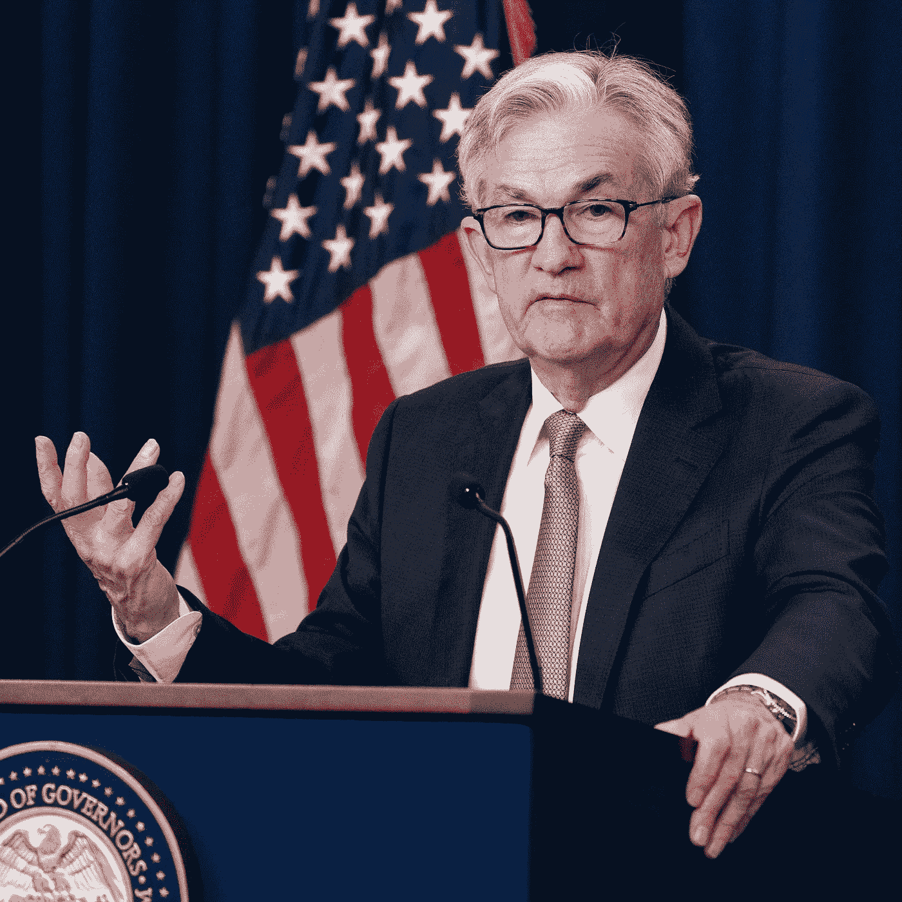
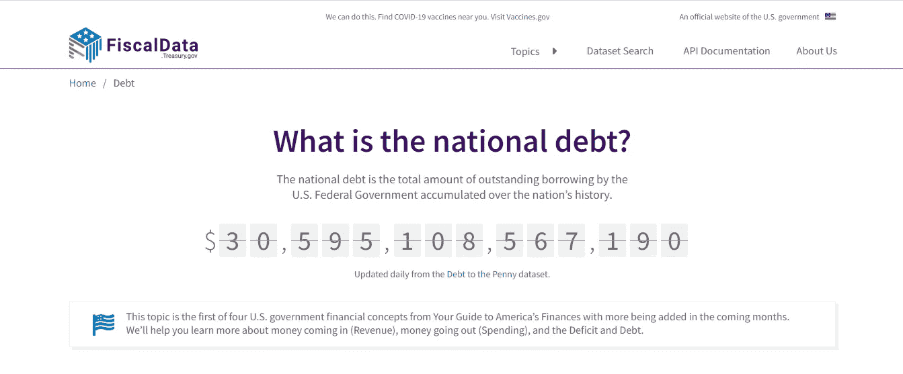
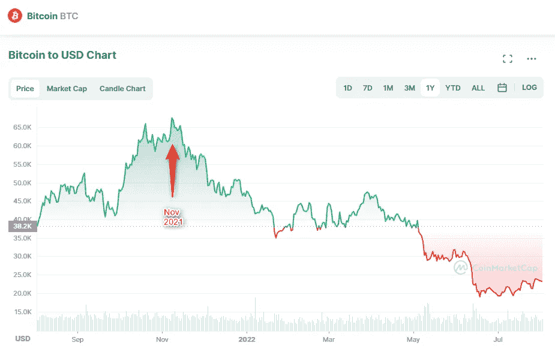

# 经济 101:当美联储提高利率时会发生什么，它会如何影响加密市场

> 原文：<https://medium.com/coinmonks/economy-101-what-happens-when-the-federal-reserve-raises-the-interest-rates-and-how-it-can-affect-fb12aef150d6?source=collection_archive---------33----------------------->

美联储设定的利率对于美国经济和家庭资产负债表的表现非常重要，对于那些已经投资储蓄或正在进行抵押贷款的人来说。在长期将利率保持在历史低点后，美联储似乎希望改变方针。几天前[宣布](https://www.cnbc.com/2022/07/27/fed-decision-july-2022-.html)连续第二次加息 0.75 个百分点。

Jerome Powell, 16th chair of the Federal Reserve

确定的利率代表了个别美国银行从美联储借钱的成本。银行利用这种流动性向客户提供贷款(年轻夫妇想获得抵押贷款买房，工匠需要贷款购买新机器等等)。

利率越高，提供给客户的贷款成本就越高。相反，如果利率较低，融资成本也较低，因此也更方便。这促使企业和家庭更多地寻求投资和负债。这引发了对原材料、商品和服务的极高需求(尤其是在新冠肺炎疫情之后经济重启之后)。当需求超过供给时，价格开始上涨，这种不平衡加剧了通货膨胀。[在截至 2022 年 6 月的 12 个月中，美国的年通胀率](https://www.usinflationcalculator.com/inflation/current-inflation-rates/)为 9.1%，是自 1981 年 11 月以来的最大年度涨幅。美联储在这方面进行了干预。加息会抑制新贷款的发放，因为贷款变得更加昂贵，对商品和服务的需求下降，流通中的货币减少，通胀趋于下降。然而，另一方面，这可能会进一步增加公共债务(仅在美国，迄今为止公共债务已超过 30 万亿美元[)并导致经济衰退。](https://fiscaldata.treasury.gov/national-debt/)

US national debt

**加密货币市场会发生什么？**

由于美联储担心在 2021 年 11 月开始加息，比特币(BTC)的价格已经下跌。

Bitcoin to USD Chart

通常在恐惧的时刻，人们倾向于积累流动性并出售他们持有的资产(包括 BTC 和其他加密货币)。这可能会引发加密货币市场的价格大幅下跌。还有其他因素:

*   能源战线不确定的冬天；
*   乌克兰的冲突没有平息的趋势，而且原材料供应困难；
*   新冠肺炎疫情尚未完全克服世界上一些主要国家(如中国)的封锁；
*   全球的不确定情绪。

所有这些都可能对传统金融市场产生负面影响，因此也会对加密货币产生负面影响。然而，至于比特币，其稀缺性可以在通胀上升时保护其价值。

掉个评论，告诉我你对加密货币和通货膨胀的看法。把这个空间当成一个没有审查的谈话场所。

> 胜利者是永不放弃的梦想家。
> 
> ***免责声明*** *:* 交易加密货币具有很高的风险，并不一定适合所有投资者。在决定交易加密货币之前，你应该仔细考虑你的投资目标和你的经验水平。自己做研究。此处表达的所有观点归各自作者所有，不应被视为任何形式的财务建议。

> 交易新手？尝试[加密交易机器人](/coinmonks/crypto-trading-bot-c2ffce8acb2a)或[复制交易](/coinmonks/top-10-crypto-copy-trading-platforms-for-beginners-d0c37c7d698c)