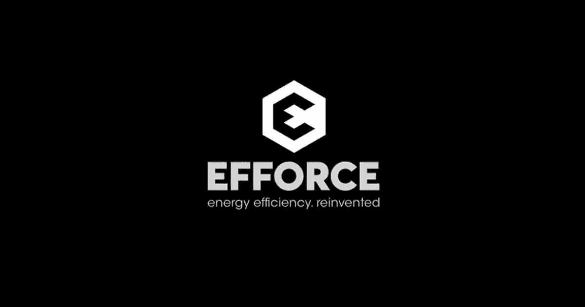
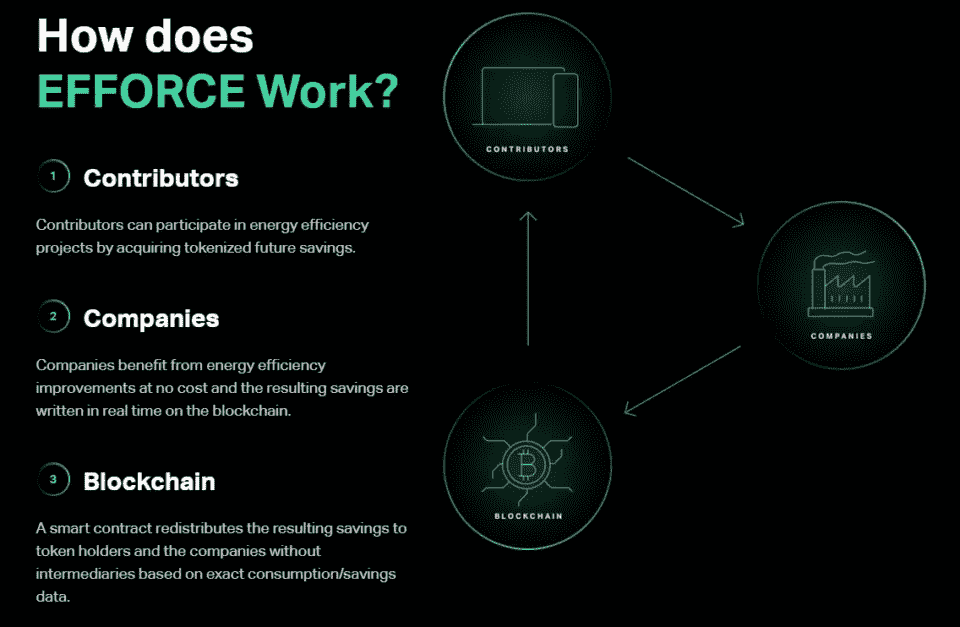
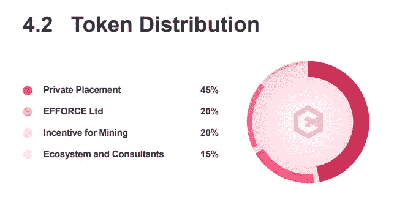

# Efforce:保护环境的绿色加密货币

> 原文：<https://medium.com/coinmonks/efforce-green-cryptocurrencies-for-the-environment-511bf16eed63?source=collection_archive---------22----------------------->

关注环保加密货币的[专栏](https://www.newcoinpost.com/blog/categories/Green%20Cryptocurrencies%20for%20the%20environment)继续，今天我要谈论的是 Efforce (WOZX)，它旨在通过参与重大的能效项目来“塑造人类可持续的未来”，这些项目旨在帮助有道德的公司降低对能源消耗和环境的影响。

Efforce (WOZX)

根据他们的[网站](https://www.efforce.io/)，WOZX 是一个公用事业令牌，允许访问对能源效率项目的贡献。通过持有 WOZX 令牌，您可以参与 Efforce 平台的管理，提出您的建议或为他人的建议投票。WOZX 是多链，目前在以太坊和多边形上。你可以在几个交易所进行交易，比如 T4、Huobi Global、Bithumb 和 Gate.io。作为行业市场的一种形式，Efforce 旨在将这些市场参与者聚集在一起，并使用分散技术来解决当前能效生态系统的问题。Efforce 还充当顾问，在使用该平台的同时，指导项目完成开发和融资的各个阶段。

Efforce 的工作原理很简单:

*   贡献者可以通过在 Efforce 平台上创建 NFT 来参与能效项目
*   公司免费从能效中获益，由此节省的成本象征性地得到了 Efforce 的支持
*   智能合同将由此产生的节约和碳信用重新分配给贡献者，基于准确的消耗/节约数据，将 NFT 作为奖励，无需中介。

How Efforce works

根据[白皮书](https://efforce.io/WP_ENG_V1.pdf?v=3)，总供应量为 10 亿 WOZX，分配如下:

*   私募 45%
*   Efforce 有限公司 20%
*   采矿奖励 20%
*   生态系统和顾问 15%

Token distribution of Efforce (WOZX)

Efforce 成立于 2018 年，由 Efforce Ltd 开发，总部位于地中海中心的小岛国马耳他瓦莱塔。最相关的团队成员是史蒂夫·沃兹尼亚克，硅谷的偶像和苹果公司的联合创始人。

Steve Wozniak

许多电影和纪录片都谈到了他的生活和所有导致他与史蒂夫·乔布斯共同创立这家著名的美国跨国技术公司的事件。Efforce 的其他三位联合创始人 Jacopo Visetti、Jacopo Vanetti 和 Andrea Castiglione 在能效行业拥有超过十年的经验。

Efforce 在 [Coinmarketcap](https://coinmarketcap.com/currencies/efforce/) 上的位置在最大写硬币的第 350 位和第 400 位之间波动。

在下面留下评论，告诉我你是否知道其他值得注意的绿色加密货币。把这个空间当成一个没有审查的谈话场所。

胜利者是永不放弃的梦想家。

***免责声明*** *:我不知道所使用的图片有任何第三方权利。如有任何资料来源，我保证予以引用，如有要求，我将调整立场。*

***免责声明*** *:交易加密货币具有较高的风险，可能不适合所有投资者。在决定交易加密货币之前，你应该仔细考虑你的投资目标和你的经验水平。自己做研究。此处表达的所有观点归各自作者所有，不应被视为任何形式的财务建议。*

*关于作者*

[*CRYPTO _ ALBERT*](https://twitter.com/albertovischio?t=C3Xj9pTm9Q7EZqwjrGHQdA&s=09)

*主编* [*新币帖*](https://www.newcoinpost.com/) *。我帮助人们更好地理解加密货币领域及其目的。*

> 交易新手？尝试[加密交易机器人](/coinmonks/crypto-trading-bot-c2ffce8acb2a)或[复制交易](/coinmonks/top-10-crypto-copy-trading-platforms-for-beginners-d0c37c7d698c)